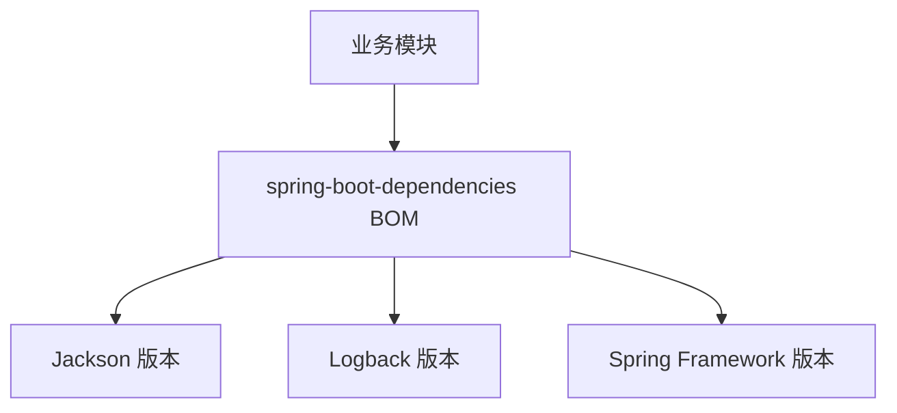

# 第 15 章：依赖 BOM 与版本对齐——Maven、Gradle 与 Spring 生态

> **业务线**：电商 / 订单履约微服务（拟真场景）。本章可独立阅读；与全书案例弱关联。  
> **篇章**：基础篇（全书第 1–18 章；核心概念、单机、简单 API、初级实战）

> **定位**：把 **BOM（Bill of Materials）** 讲透——**`spring-boot-dependencies`**、**`spring-framework-bom`**、公司 **父 POM** 如何通过 **`dependencyManagement` / `platform`** 统一 **传递依赖版本**；配合 **`mvn dependency:tree`**、**Enforcer** 与 **排除冲突** 的实操；与 **第 10 章 Boot 起步** 互补（第 10 章偏自动配置，本章偏 **坐标与版本治理**）。

## 上一章思考题回顾

1. **`/topic` 与 `/queue`**：**`/topic`** 适合 **主题广播**（多订阅者）；**`/queue`** 常用于 **点对点**（常配合 **用户前缀** `/user/queue/...`）。  
2. **迁 WebFlux**：**线程模型**（event loop vs servlet thread）、**WebSocket API**（`WebSocketHandler` vs STOMP）、**安全与消息**配置类全换；**业务消息模型**可复用。

---

## 1 项目背景

「鲜速达」从 **单模块** 扩成 **二十余个 Maven 子模块**：**订单、库存、营销、网关** 各引 **Spring、Netty、Jackson、驱动** 等。没有 **BOM** 时，`spring-core` 与 `spring-webmvc` **间接**拉入的 **Jackson 小版本** 不一致，线上出现 **`NoSuchMethodError`**；有人手工 **写死** 几十个 `<version>`，**升级 Boot** 时漏改一处又炸。

**痛点**：

- **不知道 BOM 从哪来**：以为 **`spring-boot-starter-parent`** 只「定了插件版本」，忽略 **import 型 BOM** 管 **传递依赖**。  
- **Gradle 与 Maven 两套心智**：**`platform()`** vs **`dependencyManagement`**。  
- **「只引本公司 BOM」**：未覆盖 **驱动/工具**，仍会产生 **第二套版本源**。

**痛点放大**：若 **安全补丁** 要求 **统一升级 Jackson**，没有 BOM 聚合点，只能 **全文搜索版本号**，**遗漏即漏洞**。



---

## 2 项目设计（剧本式对话）

**角色**：小胖 / 小白 / 大师。  
**结构**：BOM 是什么 → import 与 parent → 冲突排查。

**小胖**：BOM 不就是个 `pom` 吗？我每个依赖手写版本，心里踏实。

**大师**：BOM 的价值是 **一处升级、全局对齐**；手写版本在 **三个模块** 时尚可，**三十个模块** 必翻车。BOM **不增加运行时 jar**，只是 **Maven 元数据**。

**技术映射**：**`dependencyManagement`** 提供 **默认版本**；子模块 **不写 `<version>`** 即继承。

**小白**：**`spring-boot-starter-parent`** 和 **`spring-boot-dependencies`** 啥关系？

**大师**：**Parent** 继承 **打包约定、插件、资源过滤**，并 **import** 或 **内嵌** 对 **依赖版本** 的管理；**纯 BOM** 常用 **`scope=import`** 只拿 **版本表** 不要 **parent 插件**。多模块父工程常 **`dependencyManagement` 里 import `spring-boot-dependencies`**。

**技术映射**：**`<scope>import</scope>`** + **`type>pom`** = **仅 BOM**。

**小胖**：我 `tree` 里怎么还是两个 Jackson？

**大师**：**直接依赖** 与 **传递依赖** 可能 **解析出不同版本**；用 **`dependency:tree -Dverbose`** 看 **被谁覆盖**，再用 **`exclusions`** 或 **对齐到 BOM 版本**。

**技术映射**：**Maven 最近路径 / 第一声明** 等解析规则；**Gradle** 用 **`resolutionStrategy`** 强制。

---

## 3 项目实战

### 3.1 环境准备

| 项 | 说明 |
|----|------|
| 构建 | Maven 3.9+ |
| JDK | 17+（与 Boot 3.x 对齐） |

### 3.2 Maven：仅导入 `spring-boot-dependencies` BOM

**`pom.xml`（父工程节选）**

```xml
<dependencyManagement>
  <dependencies>
    <dependency>
      <groupId>org.springframework.boot</groupId>
      <artifactId>spring-boot-dependencies</artifactId>
      <version>3.2.5</version>
      <type>pom</type>
      <scope>import</scope>
    </dependency>
  </dependencies>
</dependencyManagement>
```

**子模块**引入 starter **不写版本**：

```xml
<dependency>
  <groupId>org.springframework.boot</groupId>
  <artifactId>spring-boot-starter-web</artifactId>
</dependency>
```

### 3.3 使用 `spring-framework-bom`（非 Boot 或混合场景）

```xml
<dependencyManagement>
  <dependencies>
    <dependency>
      <groupId>org.springframework</groupId>
      <artifactId>spring-framework-bom</artifactId>
      <version>6.1.14</version>
      <type>pom</type>
      <scope>import</scope>
    </dependency>
  </dependencies>
</dependencyManagement>
```

**说明**：**Boot 应用**通常以 **`spring-boot-dependencies`** 为主；**纯 Framework** 多模块可用 **`spring-framework-bom`** 对齐 **`spring-*`**（第 1 章风格）。

### 3.4 排查冲突

```text
mvn -q dependency:tree -Dverbose
```

**期望（文字描述）**：能看到 **Jackson**、**Spring** 等 **解析路径**；若出现 **omitted for conflict**，按 **BOM 期望版本** 调整 **直接依赖** 或 **`exclusion`**。

### 3.5 Gradle（简述）

```groovy
dependencies {
  implementation platform("org.springframework.boot:spring-boot-dependencies:3.2.5")
  implementation "org.springframework.boot:spring-boot-starter-web"
}
```

**技术映射**：**`platform()`** ≈ Maven **import BOM**。

### 3.6 可能遇到的坑

| 现象 | 原因 | 处理 |
|------|------|------|
| **子模块版本仍飘** | **未继承**父 `dependencyManagement` | 检查 **`<parent>`** 或 **重复 import** |
| **与 Boot BOM 双 BOM 冲突** | **重复 import** 不同版本 | **只保留一个**主 BOM，或 **显式覆盖** |
| **CI 与本地不一致** | **私服**缓存旧 BOM | **刷新**依赖；锁定 **CI 镜像** |

### 3.7 测试验证

**目标**：**`mvn -q validate`** 后 **`dependency:tree`** 中 **Spring/Jackson** 与 **BOM 表**一致（允许 **patch** 在 BOM 规定范围内）。

---

## 4 项目总结

### 优点与缺点

| 维度 | 使用 BOM | 手写每依赖版本 |
|------|----------|------------------|
| 升级成本 | **低**（改一处） | **高** |
| 可控性感知 | **弱**（需 tree） | **强**（显式） |
| 一致性 | **高** | **低** |

### 适用场景

1. **多模块企业父 POM**。  
2. **Spring Boot / Cloud** 全家桶对齐。  
3. **安全审计**要求 **可复现依赖闭包**。

### 注意事项

- **第 4、10、32 章** 已分散提及 BOM；本章是 **系统化操作手册**。  
- **第三方 BOM**（如 **Netty**）与 **Spring BOM** 叠加时，注意 **覆盖顺序**。

### 常见踩坑经验

1. **现象**：**`NoSuchMethodError`** 在 **`jackson.databind`**。  
   **根因**：**传递依赖** 拉入 **旧 Jackson**。  

2. **现象**：**Gradle** **resolution** 与 **Maven** 不一致。  
   **根因**：**平台**与 **`enforcedPlatform`** 差异。  

---

## 思考题

1. **`spring-boot-starter-parent`** 作为 **`<parent>`** 与 **`import` spring-boot-dependencies** 在 **插件管理**上的主要差别是什么？  
2. 你会如何在 **CI** 中 **失败构建** 当 **依赖树** 出现 **禁止的版本**？（下一章：**AspectJ** 与 **织入方式**。）

---

## 推广协作提示

| 角色 | 建议 |
|------|------|
| **架构师** | 发布 **公司 BOM** 聚合 **Spring + 内部 starter**。 |
| **安全** | **SBOM** 与 **BOM 版本**联动。 |

**下一章预告**：**AspectJ**——**编译期 / 类加载期织入** 与 **Spring AOP 代理** 的边界。
