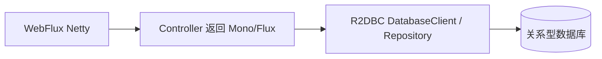

# 第 33 章：R2DBC——响应式关系型访问与 WebFlux 协同

> **业务线**：电商 / 订单履约微服务（拟真场景）。本章可独立阅读；与全书案例弱关联。  
> **篇章**：中级篇（全书第 19–35 章；架构与分布式、性能、可观测性）

> **定位**：系统讲解 **`spring-r2dbc`** 与 **Spring Data R2DBC**：**`ConnectionFactory`**、**`DatabaseClient`**、**`R2dbcEntityTemplate`**、**响应式事务**；强调 **禁止在 Reactor 线程上阻塞 JDBC**（第 31 章 WebFlux 的落地）；与 **阻塞式 JdbcTemplate**（第 9 章）**二选一** 或 **隔离线程池** 迁移。

## 上一章思考题回顾

1. **`exposeProxy=true`**：仍在 **代理语义**内暴露 **当前代理**；**LTW** 是 **字节码层**织入，**调用点** 未必再经 Spring 代理。  
2. **CTW 模块边界**：仅对 **含切面/切入点** 的 **核心模块** 启用 **ajc**；**API 模块** 保持 **纯 Java 编译**。

---

## 1 项目背景

「鲜速达」网关层采用 **WebFlux**（第 31 章）承接 **高并发只读查询**：若底层仍用 **阻塞 JDBC**，**事件循环线程** 被占满，**延迟雪崩**。团队引入 **R2DBC**——**非阻塞** 访问 **PostgreSQL/MySQL/H2** 等，使 **I/O 与线程模型** 一致。

**痛点**：

- **混用 JDBC + WebFlux**：**一请求一线程** 的 JDBC **堵住** **Netty worker**。  
- **误以为 R2DBC = JDBC 换驱动**：**API** 为 **`Publisher`**（**Mono/Flux**），**事务** 模型不同。  
- **连接池**：需 **r2dbc-pool** 等，**配置项** 与 **HikariCP** 心智不同。

**痛点放大**：**报表/复杂 SQL** 若强依赖 **JDBC 生态**（某些驱动特性），**硬上 R2DBC** 可能 **功能缺口**，需 **读写分离**（第 18 章思路）到 **阻塞栈**。



---

## 2 项目设计（剧本式对话）

**角色**：小胖 / 小白 / 大师。  
**结构**：为何不是 JDBC → 事务 → 与 JPA 关系。

**小胖**：我把 `JdbcTemplate` 包进 `Mono.fromCallable` 行不行？

**大师**：**能跑但不治根**：**阻塞** 仍在 **elastic** 线程池里排队，**高负载** 下 **池耗尽**；**正确路径**是 **R2DBC** 或 **专用数据服务**（**CQRS**）。

**技术映射**：**非阻塞 I/O** 需 **驱动与 API** 全链路配合。

**小白**：**JPA + R2DBC** 能混吗？

**大师**：**Spring Data R2DBC** 是 **独立栈**；**JPA/Hibernate** 以 **阻塞 Session** 为主，**不要**在同一 **WebFlux 请求线程**里混 **阻塞 ORM**。**读模型** 可 **R2DBC**，**写模型** 仍可 **命令侧** 用 **JDBC/JPA**（**不同服务**）。

**技术映射**：**架构拆分** > **单进程硬混**。

**小胖**：**事务** 还能 `@Transactional` 吗？

**大师**：**响应式事务** 用 **`TransactionalOperator`** 或 **响应式 `TransactionManager`**；**注解驱动**在 **部分版本/场景**支持，需查 **当前 Boot/R2DBC** 文档；**核心**是 **传播** 在 **Reactive 流**上 **语义一致**。

**技术映射**：**`ConnectionFactoryTransactionManager`（R2DBC）**。

---

## 3 项目实战

### 3.1 环境准备

| 项 | 说明 |
|----|------|
| JDK | 17+ |
| Boot | 3.2.x |
| 依赖 | **`spring-boot-starter-data-r2dbc`** + **驱动**（如 **`r2dbc-h2`** 演示） |

**`pom.xml`（节选）**

```xml
<parent>
  <groupId>org.springframework.boot</groupId>
  <artifactId>spring-boot-starter-parent</artifactId>
  <version>3.2.5</version>
</parent>

<dependencies>
  <dependency>
    <groupId>org.springframework.boot</groupId>
    <artifactId>spring-boot-starter-webflux</artifactId>
  </dependency>
  <dependency>
    <groupId>org.springframework.boot</groupId>
    <artifactId>spring-boot-starter-data-r2dbc</artifactId>
  </dependency>
  <dependency>
    <groupId>io.r2dbc</groupId>
    <artifactId>r2dbc-h2</artifactId>
    <scope>runtime</scope>
  </dependency>
  <dependency>
    <groupId>com.h2database</groupId>
    <artifactId>h2</artifactId>
    <scope>runtime</scope>
  </dependency>
</dependencies>
```

### 3.2 配置（`application.yml` 示例）

```yaml
spring:
  r2dbc:
    url: r2dbc:h2:mem:///orderdb;DB_CLOSE_DELAY=-1
    username: sa
    password:
  sql:
    init:
      mode: always
```

**`src/main/resources/schema.sql`（示例）**

```sql
CREATE TABLE orders (
  id BIGINT AUTO_INCREMENT PRIMARY KEY,
  sku_id VARCHAR(64) NOT NULL,
  qty INT NOT NULL
);
```

### 3.3 分步实现：实体 + Repository

```java
package com.example.r2dbc;

import org.springframework.data.annotation.Id;
import org.springframework.data.relational.core.mapping.Column;
import org.springframework.data.relational.core.mapping.Table;

@Table("orders")
public class OrderRow {
    @Id
    private Long id;
    @Column("sku_id")
    private String skuId;
    private int qty;

    public Long getId() { return id; }
    public void setId(Long id) { this.id = id; }
    public String getSkuId() { return skuId; }
    public void setSkuId(String skuId) { this.skuId = skuId; }
    public int getQty() { return qty; }
    public void setQty(int qty) { this.qty = qty; }
}
```

```java
package com.example.r2dbc;

import org.springframework.data.repository.reactive.ReactiveCrudRepository;

public interface OrderReactiveRepository extends ReactiveCrudRepository<OrderRow, Long> {
}
```

### 3.4 WebFlux 控制器

```java
package com.example.r2dbc;

import org.springframework.web.bind.annotation.GetMapping;
import org.springframework.web.bind.annotation.RestController;
import reactor.core.publisher.Flux;

@RestController
public class OrderReadController {

    private final OrderReactiveRepository orders;

    public OrderReadController(OrderReactiveRepository orders) {
        this.orders = orders;
    }

    @GetMapping("/api/orders")
    public Flux<OrderRow> list() {
        return orders.findAll();
    }
}
```

### 3.5 可能遇到的坑

| 现象 | 原因 | 处理 |
|------|------|------|
| **阻塞调用** 警告 | **`JdbcTemplate`** 混入 | **移除** 或 **boundedElastic** 隔离（权宜） |
| **事务不生效** | **错误 TransactionManager** | 使用 **R2DBC 专用** 事务管理器 |
| **驱动能力** | **方言/类型** 映射差异 | 查 **R2DBC 方言** 文档 |

### 3.6 测试验证

**`WebTestClient`** 订阅 **`/api/orders`**，断言 **JSON 数组**；**集成测试** 可用 **Testcontainers R2DBC**（**进阶**）。

---

## 4 项目总结

### 优点与缺点

| 维度 | R2DBC + WebFlux | JDBC + MVC |
|------|-----------------|------------|
| 线程模型 | **一致非阻塞** | **阻塞可预测** |
| 生态成熟度 | **弱于 JDBC** | **强** |
| 学习成本 | **高** | **中** |

### 适用场景

1. **高并发 IO 密集**、**读多写少** API。  
2. **网关/BFF** 聚合 **下游响应式** 服务。

### 注意事项

- **`spring-r2dbc`** 在仓库中为 **核心模块**；业务多通过 **Boot Starter**。  
- **第 31 章** 为 **WebFlux 总览**；本章为 **数据层专章**。

### 常见踩坑经验

1. **现象**：**CPU 不高但延迟大**。  
   **根因**：**隐藏阻塞**（DNS、JDBC）。  

2. **现象**：**连接泄漏**。  
   **根因**：**未 subscribe** 或 **流未正确终止**。  

---

## 思考题

1. **`DatabaseClient` 与 `ReactiveCrudRepository`** 各自适合什么 **SQL 复杂度**？  
2. 若 **写路径** 必须 **强一致事务** 且 **存储过程**，你会坚持 **R2DBC** 还是 **拆服务**？（下一章：**JMS**。）

---

## 推广协作提示

| 角色 | 建议 |
|------|------|
| **DBA** | 评审 **R2DBC 驱动** 对 **类型/锁** 的支持。 |
| **运维** | **连接池** 指标与 **JDBC** 不同，**告警阈值**重设。 |

**下一章预告**：**JMS**——**`JmsTemplate`**、**`@JmsListener`** 与 **传统 MQ**。
