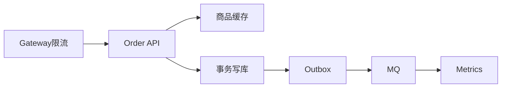

# 第 35 章：中级篇综合实战——高并发下的下单链路

> **业务线**：电商 / 订单履约微服务（拟真场景）。本章串联中级篇能力。

> **篇章**：中级篇（全书第 19–35 章；架构与分布式、性能、可观测性）

## 上一章思考题回顾

1. **限流**：**网关**（全局限流、IP 防刷）+ **应用内**（用户/商品维度细粒度）；二者互补。  
2. **热点防护**：**本地缓存** + **随机 TTL** + **互斥重建**（singleflight）；库存用 **分段** 或 **Redis Lua**。

---

## 1 项目背景

「鲜速达」秒杀频道上线，**瞬时 QPS** 冲击下单接口。团队需串联 **缓存、事务、消息、指标、安全**，做一次 **端到端压测与演练**。

**目标**：在 **可观测** 前提下，验证 **降级**（熔断库存 RPC）、**异步化**（通知）、**幂等**（下单请求）。



---

## 2 项目设计（剧本式对话）

**角色**：小胖 / 小白 / 大师。  
**结构**：压测目标对齐业务 → 故障注入 → 复盘模板。

**小胖**：压测不就是多开线程狂点下单吗？

**大师**：要先定义 **SLO**（比如 P99 < 500ms、错误率 < 0.1%），再决定 **并发模型**（阶梯、脉冲、混合读写）。狂点只会得到「**我们扛不住**」但不知道**卡在哪**。

**小白**：为啥要故障注入？我压测只想看 happy path。

**大师**：生产没有 happy path：下游会超时、缓存会穿透、MQ 会堆积。演练是为 **Runbook** 与 **告警阈值** 找证据。

**小胖**：降级返回「系统繁忙」，用户会不会骂？

**大师**：比 **504 + 资金异常** 好；文案与 **重试策略**（幂等键）要产品一起定。

---

## 3 项目实战

### 3.1 演练清单

1. **基线**：无缓存 vs 有缓存 RT 对比。  
2. **故障注入**：下游 WMS **超时**，观察 **熔断** 与 **降级文案**。  
3. **消息堆积**：人为放慢消费者，观察 **队列告警**。

### 3.2 分步实现

- **Micrometer** 记录 `order.place` 直方图（`Timer`/`DistributionSummary`）。  
- **Resilience4j**（可选）`@CircuitBreaker` 包裹外部调用。  
- **Prometheus** 抓取 + **Grafana** 面板（RED 指标）。

**步骤 4 — 目标（k6 片段）**

```javascript
import http from 'k6/http';
import { check, sleep } from 'k6';

export const options = { stages: [
  { duration: '1m', target: 50 },
  { duration: '2m', target: 200 },
  { duration: '1m', target: 0 },
]};

export default function () {
  const res = http.post('http://localhost:8080/api/orders', JSON.stringify({ skuId: 'HOT-1', qty: 1 }), {
    headers: { 'Content-Type': 'application/json' },
  });
  check(res, { '2xx': (r) => r.status >= 200 && r.status < 300 });
  sleep(1);
}
```

**运行结果（文字描述）**：Grafana 中 **P99** 与 **错误率** 随阶段变化；熔断触发时错误率应被**限制在可控区间**（并伴随 **fallback** 计数）。

### 3.3 完整代码清单与仓库

`chapter25-load`。

### 3.4 测试验证

k6 或 JMeter **阶梯加压**；事后 **复盘** 延迟分解（GC、池等待、下游 RT）。

**命令**：`k6 run script.js`（或等价工具）。

**可能遇到的坑**

| 现象 | 原因 | 处理 |
|------|------|------|
| 压测机先瓶颈 | 本地 CPU 打满 | 分布式压测 |
| 数据热点 | 同一 SKU | 参数化 SKU |

---

## 4 项目总结

### 常见踩坑经验

1. **压测数据** 与 **生产索引** 不一致。  
2. **测试环境** 网络与生产差异。  
3. **忽略 GC** 与 **JIT** 预热。

---

## 思考题

1. **`DefaultListableBeanFactory`** 与 **`ApplicationContext`** 关系？（第 26 章。）  
2. **三级缓存** 解决什么？（第 27 章。）

---

## 推广协作提示

| 角色 | 建议 |
|------|------|
| **全员** | 演练记录归档为 Runbook。 |

**下一章预告**：容器源码、`BeanFactory` 体系。
