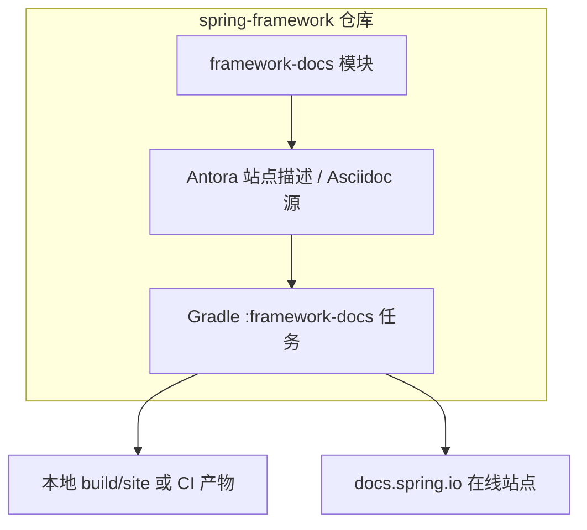

# 第 44 章：`framework-docs`——本地构建与文档贡献管线

> **业务线**：电商 / 订单履约微服务（拟真场景）。本章可独立阅读；与全书案例弱关联。  
> **篇章**：高级篇（全书第 36–50 章；源码、极端场景、扩展、SRE）

> **定位**：理解 **`spring-framework`** 仓库中 **`framework-docs`** 模块的职责——它是 **Antora + Asciidoc** 驱动的 **Spring Framework Reference** 文档**源码**与**生成管线**，**不会**作为依赖打进业务 jar；掌握「本地预览 / 参与勘误」的基本路径。

## 上一章思考题回顾

1. **OXM 与 Jackson**：JSON 主路径用 **Jackson**（`HttpMessageConverter`）；与遗留 **SOAP/XML**、**报文落盘** 或与 **JAXB** 强绑定时，用 **`spring-oxm`** 的 **Marshaller** 抽象（见第 45 章）。  
2. **Indexer 生效**：编译产物中存在 **`META-INF/spring.components`**，且启动日志/Profiler 中 **组件扫描耗时**下降（见第 42 章）。

---

## 1 项目背景

「鲜速达」团队在排查 **Spring MVC 行为**时，经常需要对照 **官方 Reference** 的章节（例如 **`DispatcherServlet`**、**内容协商**）。有人习惯只看在线 HTML，但当需要 **核对某一版本的表述是否过时**、或希望 **提交文档 PR** 时，就必须回到 **`spring-framework`** 仓库里的 **`framework-docs`**。

**痛点**：

- **把 `framework-docs` 当成运行时依赖**：在业务 `pom.xml` 里误引，**不会**获得任何业务 API，只会困惑。  
- **找不到本地预览方式**：不知道文档由 **Antora** 聚合，本地需跑 **Gradle 文档任务**（具体任务名随 **Gradle 插件版本**略有差异）。  
- **贡献门槛**：Asciidoc 片段、模块目录、`spring-version` 属性注入等与「写 Java 业务」不同，需要**最小心智模型**。

**痛点放大**：若团队要 **对内发布镜像版 Reference**（例如内网只开放旧版 Framework），没有本地构建能力，只能依赖第三方转载，**与官方章节锚点不一致**，排障时容易**指错文档版本**。



---

## 2 项目设计（剧本式对话）

**角色**：小胖 / 小白 / 大师。  
**结构**：「不是依赖」→ Antora 管线 → 与业务文档分工。

**小胖**：我 `pom` 里能不能引 `framework-docs`，这样 IDE 就能提示官方文档？

**大师**：**不能、也不该**。`framework-docs` 是 **文档工程**，产出是 **HTML/Antora 站点**，不是 **classpath 上的 jar API**。业务工程应引 **`spring-context`** 等 **`spring-*`** 模块；查 API 用 **Javadoc** 与 **Reference 在线版**。

**技术映射**：**`framework-docs`** = **Reference 源码 + 生成任务**；**Maven 坐标**若存在也是**构建用**，与 **`spring-context`** 完全不同。

**小白**：那仓库里一坨 Asciidoc，跟「写 README」有啥区别？

**大师**：Antora 把多 **模块（component）**、**版本分支**、**交叉引用** 管起来；`framework-docs` 里会 **依赖各 `spring-*` 模块**（用于文档中的 **代码示例编译**、**片段抽取** 等），保证**示例与源码同步**。你本地改一句文档，跑生成任务才能看到**最终站点效果**。

**技术映射**：**Antora** = **文档即代码**；**`generateAntoraYml`** 等任务注入 **`spring-version`** 等属性（见该模块 `*.gradle`）。

**小胖**：我就想改个错别字，流程很重吗？

**大师**：**轻量路径**：在 GitHub 上 **Fork → 改 Asciidoc → PR**；**本地路径**：克隆仓库，使用仓库要求的 **JDK/Toolchain**（见根目录 **`gradle.properties` / 构建说明**），执行 **`framework-docs`** 子项目上的 **文档生成任务** 做自检。具体任务名请用 **`./gradlew :framework-docs:tasks`** 查看（常见与 **Antora** 插件相关）。

**技术映射**：本地命令形态为 **`./gradlew :framework-docs:<任务名>`**；**不要**把「构建 Spring 全家源码」当成日常业务前置。

---

## 3 项目实战

### 3.1 环境准备

| 项 | 说明 |
|----|------|
| 仓库 | 克隆 **`spring-framework`** 官方仓库（或 Fork）。 |
| JDK | **以仓库当前 `build.gradle` / toolchain 为准**（若构建提示需 **Java 25** 等，请按 Gradle toolchain 配置安装或使用自动供给）。 |
| 构建 | 仓库根目录 **`gradlew.bat`**（Windows）或 **`./gradlew`**（Unix）。 |

**说明**：因 Spring 主仓库 **toolchain 版本随主线升级**，本节**不硬编码** JDK 小版本；以你本地执行 **`./gradlew`** 时的提示为准。

### 3.2 分步实现

**步骤 1 — 目标**：确认 **`framework-docs`** 在 **`settings.gradle`** 中已 **include**，且存在 **`framework-docs.gradle`**。

**步骤 2 — 目标**：列出文档模块可用任务。

```text
./gradlew :framework-docs:tasks
```

**期望（文字描述）**：在输出中能看到与 **Antora**、**文档站点** 或 **generate** 相关的任务（具体名称随插件版本变化）。

**步骤 3 — 目标**：执行 **文档生成任务**（任务名以步骤 2 为准，下文用占位名 **`antora`** 表示「Antora 站点打包类任务」）。

```text
./gradlew :framework-docs:antora
```

若任务名不同，请改用 **`tasks`** 输出中的实际名称。

**步骤 4 — 目标**：在 **`framework-docs`** 目录下浏览 **Asciidoc 源**（如 **`modules/ROOT/pages`** 等，以仓库实际结构为准），尝试做一次**极小修改**（例如修正笔误），再重复步骤 3，确认生成无报错。

### 3.3 可能遇到的坑

| 现象 | 原因 | 处理 |
|------|------|------|
| **Toolchain 找不到 JDK** | 本机未安装 **构建要求的 Java 版本** | 安装对应 JDK，或按 Gradle 文档配置 **toolchain 下载** |
| **任务名不存在** | 插件升级后任务改名 | 使用 **`tasks`** 列出可用任务 |
| **网络拉依赖失败** | 文档工程依赖 **Kotlin/Antora** 等 | 配置镜像或使用 **offline** 前先成功构建一次 |

### 3.4 测试验证

**目标**：验证「**文档工程可独立构建**」，而非运行业务服务。

- **成功标准**：对应 Gradle 任务 **`BUILD SUCCESSFUL`**，且生成目录（若有）中出现 **站点文件**（具体路径以任务输出为准）。  
- **curl**：本章产物为**静态站点**，非业务 HTTP 服务；若本地起了静态服务器，可用 `curl` 拉首页做冒烟。

### 3.5 完整代码清单与仓库

- 本章**无独立业务仓库**；练习直接在 **`spring-framework`** 仓库的 **`framework-docs`** 上进行。  
- **附录占位**：可将你的 Fork 与 PR 链接记入团队 Wiki。

---

## 4 项目总结

### 优点与缺点

| 维度 | 维护 Reference（`framework-docs`） | 仅在业务项目写 README |
|------|--------------------------------------|-------------------------|
| 与版本同步 | 与 **`spring-*` 源码**同仓，示例可随版本演进 | 易与真实行为脱节 |
| 上手成本 | 需 **Antora/Asciidoc/Gradle** | 低 |
| 适用人群 | **贡献者、写规范的技术写作者** | 全员 |

### 适用场景

1. **核对官方行为**与**章节锚点**（如事务传播、WebFlux 线程模型）。  
2. **提交文档 PR**（笔误、示例过时、链接失效）。  
3. **内网镜像**官方文档站点（合规与离线环境）。

**不适用场景**：把 **`framework-docs`** 当 **业务依赖**；在 **业务 jar** 中打包文档资源（应使用自有静态资源方案）。

### 注意事项

- **版本对齐**：在线 **docs.spring.io** 的 **Framework 版本**要与生产依赖 **BOM** 一致。  
- **构建资源**：全量文档构建可能 **耗时较长**，适合在 **CI** 或本地**非热路径**执行。

### 常见踩坑经验

1. **现象**：按旧博客执行 **`asciidoctor`** 任务失败。  
   **根因**：主线已迁移 **Antora**，任务名与目录结构变化。  

2. **现象**：IDE 报红但 Gradle 能通过。  
   **根因**：文档模块依赖 **多模块源码**，IDE 未导入完整工程。  

---

## 思考题

1. **`framework-docs`** 与 **`spring-context`** 在 **Maven 坐标 / 职责**上的本质区别是什么？  
2. 若你要为 **`@ControllerAdvice`** 增加一段官方示例，你会在仓库中**先搜什么关键词**定位 Asciidoc？（下一章：**Gradle 构建源码**时常用任务。）

---

## 推广协作提示

| 角色 | 建议 |
|------|------|
| **开发** | 排障以 **Reference + Javadoc** 为准；重大行为以 **集成测试**（第 41 章）互证。 |
| **技术写作** | 学习 **Asciidoc 交叉引用**与 **Antora 组件版本**。 |
| **运维** | 内网文档镜像需 **与运行时 BOM 版本**同步更新。 |

**下一章预告**：**`gradle/`** 与 **根 `gradlew`**——从源码构建 **Spring Framework** 的常用任务与 **toolchain** 心智。
