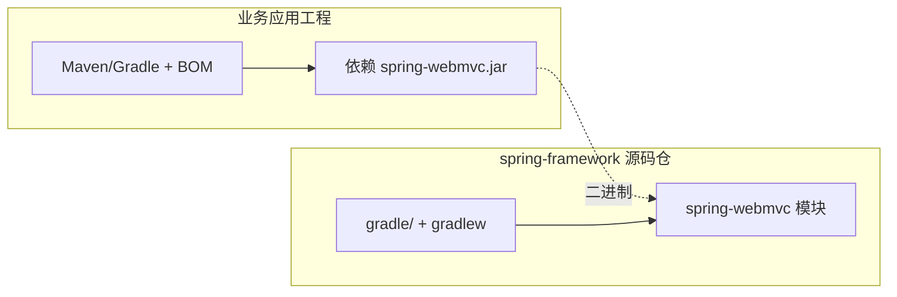

# 第 45 章：`gradle/`——构建 Spring Framework 源码与常用任务

> **业务线**：电商 / 订单履约微服务（拟真场景）。本章可独立阅读；与全书案例弱关联。  
> **篇章**：高级篇（全书第 36–50 章；源码、极端场景、扩展、SRE）

> **定位**：弄清仓库根目录 **`gradle/`** 目录与 **`gradlew`** 的角色——它们是 **构建 Spring Framework 自身** 的 **Gradle 封装与包装器**，与业务应用「用 Maven 引 `spring-context`」是两条线；掌握 **常用 Gradle 任务**、**toolchain** 与 **单模块编译** 的入门姿势，便于 **读源码、跑测试、提 PR**。

## 上一章思考题回顾

1. **`framework-docs` vs `spring-context`**：前者是 **文档站点工程**；后者是 **运行时 IoC 容器 jar**。业务依赖只引 **`spring-*`**。  
2. **定位 Asciidoc**：在 **`framework-docs`** 下全文搜索 **`ControllerAdvice`** 或 **`modules`** 内 **页面 id**（以仓库目录为准）。

---

## 1 项目背景

团队本地克隆 **`spring-framework`** 后，第一件事往往是：**能编译吗？能只跑 `spring-webmvc` 的测试吗？** 新人常见误区是把 **`gradle/`** 里的脚本当成「要自己拷贝到公司项目」的模板——实际上 **`gradle/`** 多为 **Spring 团队约定**（IDE、发布、文档、多模块约定），**业务微服务**通常仍用 **Maven** 或 **Gradle + Spring Boot 插件**，**不必**复制该仓库的复杂构建。

**痛点**：

- **JDK 版本不对**：主线要求 **较新的 toolchain**（以仓库为准），本机只有 LTS 旧版，**`:compileJava` 配置阶段即失败**。  
- **全量构建太慢**：不知道可用 **`-p` 子项目**、**`--tests`** 等缩小范围。  
- **混淆两条线**：在业务项目里寻找 **`spring.gradle`** 之类文件，**不存在**——那是 **Framework 源码仓**内部用的。

**痛点放大**：若目标是 **给 Spring 提 Bugfix**，不能本地复现 **`:spring-webmvc:test`**，则 **issue 质量**与 **PR 迭代**都会受阻；若目标是 **学 DispatcherServlet**，只需 **IDE 打开模块 + 依赖下载**，**不必**全量 `publish`。



---

## 2 项目设计（剧本式对话）

**角色**：小胖 / 小白 / 大师。  
**结构**：构建对象是谁 → toolchain → 常用任务。

**小胖**：我把公司项目改成跟 Spring 一样的 Gradle，是不是就更「官方」？

**大师**：**不必**。业务工程用 **Boot BOM + 公司父 POM** 即可；**`gradle/`** 是为 **Spring Framework 多模块单体仓库**服务的（**上百模块**、**一致性检查**、**文档与集成测试**）。硬抄只会 **复制复杂度**。

**技术映射**：**`gradle/`** = **本仓库构建逻辑**；**业务构建** = **消费已发布的 `spring-*` 构件**。

**小白**：那我本机到底要装哪个 JDK？

**大师**：看 **Gradle toolchain** 要求：根项目配置会指定 **编译 Java 的语言版本**。若提示 **无法解析 toolchain**，需安装对应 JDK 或在 **`gradle.properties`** 中允许 **自动下载**（按公司安全策略）。**以构建失败信息为准**比死记版本号可靠。

**技术映射**：**Toolchain** = **可重现的编译器版本**；与业务「只装 JDK 17 跑 Boot」**语境不同**。

**小胖**：我就想改 `DispatcherServlet` 一行，怎么测？

**大师**：优先 **`:spring-webmvc:test`** 或 **单测类过滤**；需要全链路再跑 **`integration-tests`**（下一章）。一般**不要**一上来 `./gradlew build` 全仓库。

**技术映射**：**模块路径** `:spring-webmvc`；测试过滤 **`--tests com.example.FooTest`**（语法以 Gradle 版本为准）。

---

## 3 项目实战

### 3.1 环境准备

| 项 | 说明 |
|----|------|
| OS | Windows / macOS / Linux 均可 |
| JDK | **满足仓库 toolchain**（见根构建失败提示） |
| 工具 | 仓库自带 **`gradlew` / `gradlew.bat`** |

### 3.2 分步实现

**步骤 1 — 目标**：在仓库根目录查看 **Gradle Wrapper 版本**（了解是否与文档/博客一致）。

```text
./gradlew.bat --version
```

**步骤 2 — 目标**：列出 **根项目**可用任务（节选感知即可）。

```text
./gradlew.bat tasks
```

**步骤 3 — 目标**：**仅编译** `spring-context` 模块（示例）。

```text
./gradlew.bat :spring-context:compileJava
```

**期望**：`BUILD SUCCESSFUL`；若失败，**优先根据错误安装 JDK 或配置 toolchain**。

**步骤 4 — 目标**：运行 **`spring-context`** 的测试（缩小反馈环）。

```text
./gradlew.bat :spring-context:test
```

**步骤 5 — 目标**（可选）：对 **单个测试类** 缩小范围（类名以仓库内实际为准）。

```text
./gradlew.bat :spring-context:test --tests org.springframework.context.SomeTests
```

### 3.3 可能遇到的坑

| 现象 | 原因 | 处理 |
|------|------|------|
| **Cannot find Java installation** | **Toolchain** 版本本机不存在 | 安装对应 JDK 或配置自动供给 |
| **长时间卡在 dependency download** | 首次构建拉取大量依赖 | 使用稳定网络；必要时配置镜像 |
| **修改了代码但测试仍过** | 跑错模块或 **增量未触发** | **`cleanTest`** 或 **`--rerun-tasks`**（慎用） |

### 3.4 测试验证

**成功标准**：目标模块 **`compileJava` / `test`** 成功；你能在 **IDE** 中 **Debug** 单测断点进 **`spring-webmvc`** 源码。

### 3.5 与「业务项目 Gradle」的边界

业务 **`build.gradle`** 典型只需要：

```groovy
plugins {
    id 'java'
    id 'org.springframework.boot' version '3.2.x'
}
```

与 **`spring-framework`** 根构建 **不是同一套**；第 10 章 **Boot 依赖管理** 仍是业务侧主战场。

---

## 4 项目总结

### 优点与缺点

| 维度 | 在源码仓用 `gradlew` | 仅依赖 Maven Central 的 jar |
|------|-------------------------|-----------------------------|
| 可修改/调试 | **可直接改框架源码** | 只能 **反编译/附加源码** |
| 成本 | **高**（toolchain、全量依赖） | **低** |
| 适用 | **贡献者、深度排障** | **业务交付** |

### 适用场景

1. **阅读/调试** Spring 内部实现。  
2. **提交 PR**、**本地复现** issue。  
3. **学习 Gradle 多模块**最佳实践（观摩，而非照搬）。

### 注意事项

- **不要把 `gradle/` 复制进业务仓库** 作为「标准模板」除非你有同等复杂度。  
- **CI** 中编译 Spring 源码需 **缓存** `.gradle` 与依赖。

### 常见踩坑经验

1. **现象**：Windows 路径过长失败。  
   **根因**：仓库路径过深。  
   **处理**：缩短克隆路径、启用 **长路径** 策略。  

2. **现象**：IDE 索引全仓库卡死。  
   **根因**：多模块体量极大。  
   **处理**：**仅导入关心模块** 或使用 **轻量文本搜索**。  

---

## 思考题

1. **`./gradlew :spring-webmvc:compileJava`** 与 **`mvn compile`** 在你**业务项目**里分别解决什么问题？  
2. **Toolchain** 报错时，你优先读 **哪一段** Gradle 输出定位所需 Java 版本？（下一章：**`integration-tests`** 模块与框架级回归。）

---

## 推广协作提示

| 角色 | 建议 |
|------|------|
| **架构师** | 区分 **「构建框架」**与 **「使用框架」**；团队规范写在**业务父 POM**。 |
| **贡献者** | 本地跑通 **目标模块 test** 再提 PR；大变更配合 **integration-tests**。 |

**下一章预告**：**`integration-tests`**——框架级 **端到端**用例与**回归**思路。
