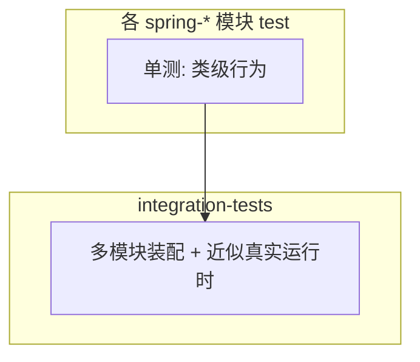

# 第 46 章：`integration-tests`——框架集成测试与回归思路

> **业务线**：电商 / 订单履约微服务（拟真场景）。本章可独立阅读；与全书案例弱关联。  
> **篇章**：高级篇（全书第 36–50 章；源码、极端场景、扩展、SRE）

> **定位**：理解 **`integration-tests`** 模块在 **`spring-framework`** 仓库中的角色——它承载 **跨模块、近真实运行时** 的 **集成测试**（与单模块 `spring-xxx/src/test` 互补），**不是**业务应用要依赖的 jar；学习如何从该目录 **找场景、学写法、理解回归边界**。

## 上一章思考题回顾

1. **`compileJava` 对比**：源码仓里是对 **`spring-webmvc` 模块本身** 编译；业务项目是对 **你的代码** 编译——依赖的 **`spring-webmvc`** 已是 **二进制**。  
2. **Toolchain 报错**：Gradle 会写明 **所需 languageVersion**（如 25），优先看 **`:compileJava` 的 javaCompiler** 失败段。

---

## 1 项目背景

业务团队的 **集成测试**（第 11 章）通常指 **`@SpringBootTest` + Testcontainers**。而在 **Spring Framework 源码仓库**里，**`integration-tests`** 是 **框架自身** 的 **集成层**：把 **`spring-web`**、**`spring-tx`**、**`spring-jdbc`**、**`spring-orm`** 等组合起来，验证 **容器装配、事务、ORM、Web** 等 **协同行为**是否符合预期。

**痛点**：

- **误把 `integration-tests` 当 Starter**：业务 `pom` 不应依赖它。  
- **读不懂测试分层**：不知道 **单测**与**集成测**在仓库中的**边界**，提 issue 时**复现路径**说不清。  
- **回归范围**：修改了 **`spring-tx`**，应跑哪些测试？需要知道 **集成测试里哪些场景**覆盖了 **事务边界**。

**痛点放大**：若你认为「只要 `spring-jdbc` 单测过了就安全」，可能遗漏 **与 Hibernate、Servlet 容器** 组合的 **类加载顺序**问题——这类问题往往落在 **`integration-tests`** 或 **各模块的 `src/integration-test`**（以仓库实际布局为准）。



---

## 2 项目设计（剧本式对话）

**角色**：小胖 / 小白 / 大师。  
**结构**：集成测测谁 → 与业务 IT 区别 → 如何跑。

**小胖**：我们微服务也有集成测试，跟仓库里这个是一回事吗？

**大师**：**目标相似**（多组件一起验），**对象不同**：你们测 **「订单服务 + 真 DB」**；这里测 **「框架模块 + 嵌入式/内存资源」** 的 **框架行为**。你不会把 **`integration-tests`** 打进 **鲜速达** 的镜像。

**技术映射**：**`integration-tests`** = **框架回归资产**；**业务 IT** = **系统级验收**。

**小白**：那我学 Spring 要不要啃完这里所有用例？

**大师**：**不必**。当你遇到 **诡异的多模块交互**（例如 **事务同步** + **ORM Session**）时，把这里当 **「官方怎么拼容器」** 的参考书；日常仍从 **Reference + 第 11 章** 入手。

**技术映射**：**检索关键词**（异常栈、类名）→ **定位测试类** → **对照配置类**。

**小胖**：本地怎么跑？

**大师**：在源码根目录 **`./gradlew :integration-tests:test`**（或按 **Gradle 输出** 的实际任务）；**耗时与资源**高于单模块，适合 **定向过滤**。

**技术映射**：**Gradle 子项目路径** `:integration-tests`；**测试过滤** `--tests ...`。

---

## 3 项目实战

### 3.1 环境准备

| 项 | 说明 |
|----|------|
| 仓库 | 已克隆 **`spring-framework`** |
| JDK | 满足 **toolchain**（见第 34 章） |
| 数据库 | 多数用例 **HSQLDB** 等（见模块依赖，**无需**自建 MySQL） |

### 3.2 分步实现

**步骤 1 — 目标**：打开 **`integration-tests/integration-tests.gradle`**，阅读 **`dependencies`**，建立 **「与哪些 spring-* 耦合」** 的心智图。

**步骤 2 — 目标**：浏览 **`integration-tests/src/test`**（路径以仓库为准），随机打开 **2～3 个** 测试类，观察：

- 是否使用 **`@ExtendWith(SpringExtension.class)`**（JUnit 5）  
- 如何 **装配 `ApplicationContext`**（XML / JavaConfig）  
- **断言**针对的是 **框架行为** 还是业务规则（前者为主）

**步骤 3 — 目标**：命令行运行 **整模块测试**（耗时警告）。

```text
./gradlew.bat :integration-tests:test
```

**步骤 4 — 目标**（推荐）：用 **`--tests`** 跑 **单个测试类**，缩短反馈。

```text
./gradlew.bat :integration-tests:test --tests org.springframework.example.SomeIntegrationTests
```

（将类名替换为仓库中**真实存在**的测试。）

### 3.3 可能遇到的坑

| 现象 | 原因 | 处理 |
|------|------|------|
| **超时 / 极慢** | 集成测 **全量**大 | **过滤单类**、**并行**（若构建支持） |
| **与本机环境冲突** | 极少数 **端口/本地策略** | 查测试 **@Disabled** 条件与 CI 文档 |
| **业务项目抄测试代码失败** | 依赖 **测试基类/fixture** 在 **testFixtures** | **只学思路**，不复制依赖路径 |

### 3.4 测试验证

**成功标准**：**`:integration-tests:test`** 在你关心的 **子集**上 **`BUILD SUCCESSFUL`**。

### 3.5 与第 11 章（业务测试）的对照

| 维度 | 本仓库 `integration-tests` | 业务 `SpringBootTest` |
|------|-----------------------------|------------------------|
| 目的 | **框架回归** | **业务正确性** |
| 依赖 | **各 `spring-*` 源码版本一致** | **BOM 对齐的生产依赖** |
| 读者 | **贡献者** | **应用开发者** |

---

## 4 项目总结

### 优点与缺点

| 维度 | 读 `integration-tests` | 只读 Reference |
|------|-------------------------|------------------|
| 真实度 | **高**（可运行代码） | **中**（依赖读者想象） |
| 成本 | **高**（需构建环境） | **低** |

### 适用场景

1. **准备向 Spring 提 PR**，需 **附加回归用例**。  
2. **排查框架级 Bug**，在 issue 中 **引用**类似测试。  
3. **学习** `ApplicationContext` **高级装配**模式。

### 注意事项

- **不要**在业务项目中 **依赖** `integration-tests`。  
- **许可证**：复制代码到业务工程需注意 **Apache 2.0** 与 **归属说明**（通常 **不复制**，只借鉴模式）。

### 常见踩坑经验

1. **现象**：IDE 无法运行单个测试。  
   **根因**：未以 **Gradle 导入** 完整工程。  
   **处理**：用 **`gradlew test`** 为**准**。  

2. **现象**：与官方 CI 结果不一致。  
   **根因**：**OS/JDK 小版本**差异。  
   **处理**：对齐 **issue 模板**中的环境字段。  

---

## 思考题

1. **`integration-tests`** 与 **`spring-test` 模块**分别解决什么问题？  
2. 若你修改了 **`PlatformTransactionManager`** 相关行为，你会先搜 **哪类**测试名关键词？（下一章：**`spring-context-indexer`** 与 **`META-INF/spring.components`**。）

---

## 推广协作提示

| 角色 | 建议 |
|------|------|
| **开发** | 业务集成测试仍以 **第 11 章** 为主；源码集成测 **仅作深度参考**。 |
| **测试** | 区分 **框架回归**与**业务验收**的 **证据层级**。 |

**下一章预告**：**`spring-context-indexer`**——编译期 **组件索引**与 **启动加速**。
