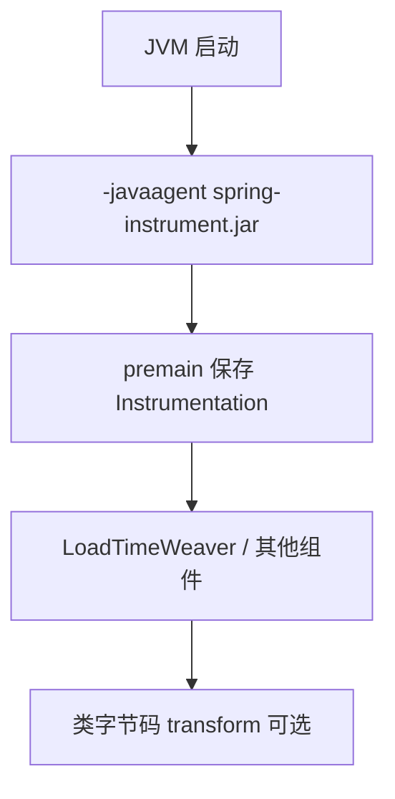

# 第 48 章：`spring-instrument`——Java Agent 与类检测

> **业务线**：电商 / 订单履约微服务（拟真场景）。本章可独立阅读；与全书案例弱关联。  
> **篇章**：高级篇（全书第 36–50 章；源码、极端场景、扩展、SRE）

> **定位**：理解 **`spring-instrument`** 模块提供的 **`InstrumentationSavingAgent`**：在 JVM 启动参数 **`-javaagent:...spring-instrument.jar`**（或 **Attach API** 动态附加）时，**保存 `Instrumentation` 引用**，供 **`InstrumentationLoadTimeWeaver`** 等 **类加载期织入（LTW）** 使用；明确 **与业务代码距离**、**与 APM 探针**的边界。

## 上一章思考题回顾

1. **`SimpleEvaluationContext`**：适合 **只读**、**属性访问**、**受限**场景；**`StandardEvaluationContext`** 功能全，**慎用**于不可信输入。  
2. **SpEL 测试**：对 **Expression** 做 **参数化表驱动**；对 **恶意串** 做 **负向用例**。

---

## 1 项目背景

「鲜速达」架构组评估 **AspectJ 加载期织入（LTW）** 以在 **第三方库** 上增加 **监控切面**，文档要求 JVM 增加 **`-javaagent`**。开发与运维需要知道：**Spring 自带的 `spring-instrument.jar` 做什么**、**与 SkyWalking / OpenTelemetry Java Agent** 是否冲突、**容器/K8s** 里如何注入 **`JAVA_TOOL_OPTIONS`**。

**痛点**：

- **误以为 `spring-instrument` 是业务库**：它是 **极薄**的 **Agent 壳**，核心是 **保存 `Instrumentation`**。  
- **多 Agent 并存**：**顺序**与 **`Instrumentation` 包装** 可能引发 **诡异类加载问题**。  
- **安全**：**任意 Java Agent** 都可 **transform 字节码**，**供应链**需审计。

**痛点放大**：在 **云原生**环境，**镜像**若未 **显式** 加入 agent jar 路径，**预发能跑、生产不能跑**——典型 **环境漂移**。



---

## 2 项目设计（剧本式对话）

**角色**：小胖 / 小白 / 大师。  
**结构**：Agent 做什么 → 与 AOP 区别 → 运维怎么配。

**小胖**：我引了 `spring-instrument`，为啥代码里还是拿不到 `Instrumentation`？

**大师**：**必须**用 **`-javaagent`** 或 **Attach** 安装 Agent，**`premain`/`agentmain`** 才会跑；**单纯 classpath** 引用 **不会**自动启用。

**技术映射**：**`InstrumentationSavingAgent.getInstrumentation()`** 非 null **当且仅当** Agent **已安装**。

**小白**：这和 **Spring AOP 默认代理**有啥关系？

**大师**：**默认 Spring AOP** 是 **运行时代理**（JDK/CGLIB）；**LTW** 在 **类加载**时织入，需要 **Instrumentation**。**场景不同**，**复杂度**更高。

**技术映射**：**`InstrumentationLoadTimeWeaver`**（在 **`spring-context`** 相关包）消费 **`Instrumentation`**。

**小胖**：那我们容器里要加几个 agent？

**大师**：**尽量少**。**APM** 通常一个；若叠加 **LTW**，要按 **厂商文档** 验证兼容性；**冲突**时优先 **换监控方案** 或 **调整织入范围**。

**技术映射**：**`JAVA_TOOL_OPTIONS=-javaagent:/path/to/spring-instrument.jar`**（路径因镜像而异）。

---

## 3 项目实战

### 3.1 环境准备

| 项 | 说明 |
|----|------|
| JDK | 17+ |
| `spring-instrument` | 从 **Maven Central** 下载 **`spring-instrument-6.1.14.jar`**（版本与项目对齐） |

**说明**：本示例 **不写**业务 `pom` 依赖 agent——生产通常 **不把 instrument 当常规依赖**；以下为 **命令行验证**。

### 3.2 分步实现

**步骤 1 — 目标**：本机定位 **`spring-instrument`** 的 **jar 路径**（Maven 本地仓库）。

```text
# 示例：仓库内路径（版本号随你）
%USERPROFILE%\.m2\repository\org\springframework\spring-instrument\6.1.14\spring-instrument-6.1.14.jar
```

**步骤 2 — 目标**：编写 **最小 `main`**，打印 **Agent 是否生效**（**不要**依赖 **premain 类在 classpath** 的假设——见 Javadoc：**可用 `InstrumentationLoadTimeWeaver` 做条件探测**）。

```java
public class AgentCheckMain {
    public static void main(String[] args) {
        // 生产代码请使用 Spring API 的条件探测，而非直接依赖 Agent 类
        System.out.println("started");
    }
}
```

**步骤 3 — 目标**：带 **`-javaagent`** 运行。

```text
java -javaagent:%USERPROFILE%\.m2\repository\org\springframework\spring-instrument\6.1.14\spring-instrument-6.1.14.jar -cp target/classes com.example.AgentCheckMain
```

**期望（文字描述）**：进程正常退出；若需验证 **`Instrumentation`** 非空，应通过 **`org.springframework.instrument.classloading.InstrumentationLoadTimeWeaver.getInstrumentation()`**（需 **`spring-context`** 与 **正确配置**），以 **官方文档**为准。

### 3.3 可能遇到的坑

| 现象 | 原因 | 处理 |
|------|------|------|
| **agent 未加载** | **路径错误** 或 **JVM 参数**未传入容器 | 检查 **ENTRYPOINT** / **`JAVA_TOOL_OPTIONS`** |
| **与其他 agent 冲突** | **重复 transform** | **减少 agent**、调整顺序 |
| **本地能跑、CI 不能** | **沙箱禁止 attach** | 查阅 **CI 镜像**策略 |

### 3.4 测试验证

**集成环境**：在 **预发 Pod** 中 **`echo $JAVA_TOOL_OPTIONS`**，确认 **`-javaagent`** 已注入。

---

## 4 项目总结

### 优点与缺点

| 维度 | 使用 `spring-instrument` Agent | 纯运行时 AOP |
|------|----------------------------------|----------------|
| LTW 能力 | **可**支持 **加载期织入** | **不支持** |
| 运维成本 | **高**（JVM 参数） | **低** |

### 适用场景

1. **AspectJ LTW** 与 **Spring** 集成（按 **官方指南**）。  
2. **需要 `Instrumentation`** 的 **类检测**（高级）。

### 注意事项

- **业务项目默认不需要** 本 Agent；**多数** Spring 应用 **运行时 AOP 足够**。  
- **安全**：**Agent jar** 来源必须 **可信**。

### 常见踩坑经验

1. **现象**：**Tomcat** 外置容器下 **LTW** 失效。  
   **根因**：**类加载器**与 **weaver** 配置不匹配。  

2. **现象**：**Kubernetes** 中 agent 路径 **只读文件系统**失败。  
   **根因**：**emptyDir** 挂载位置与 **镜像路径**不一致。  

---

## 思考题

1. **`premain` 与 `agentmain`** 分别在 **冷启动**与 **Attach** 场景下如何被调用？  
2. 你会把 **`-javaagent`** 纳入 **基础设施即代码** 的哪一层（镜像 vs 编排 vs 启动脚本）？（下一章：**`spring-oxm`**。）

---

## 推广协作提示

| 角色 | 建议 |
|------|------|
| **运维** | **统一** JVM 参数模板；**禁止**未审计 agent 上线。 |
| **开发** | 除非 **架构要求 LTW**，否则优先 **Spring AOP**。 |

**下一章预告**：**`spring-oxm`**——**Marshaller** 与 **XML** 互转。
