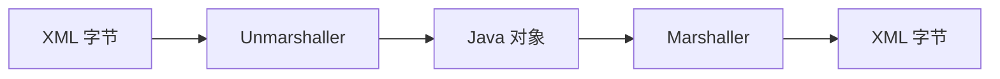

# 第 49 章：`spring-oxm`——XML 与对象映射（OXM）及消息转换

> **业务线**：电商 / 订单履约微服务（拟真场景）。本章可独立阅读；与全书案例弱关联。  
> **篇章**：高级篇（全书第 36–50 章；源码、极端场景、扩展、SRE）

> **定位**：掌握 **`spring-oxm`** 模块的 **统一 OXM 抽象**：**`Marshaller` / `Unmarshaller`**、**`OxmTemplate`**，以及与 **Web MVC** 的 **`MarshallingHttpMessageConverter`** 协作；在 **JSON 为主**的当下，明确 **遗留 SOAP/XML 报文、金融报文、与 JAXB 强绑定** 等 **仍适用**场景，并与 **第 6 章 JSON** 分工清晰。

## 上一章思考题回顾

1. **`premain` / `agentmain`**：JVM **启动时**加载 agent 调 **`premain`**；**运行时 Attach** 调 **`agentmain`**。  
2. **`-javaagent` 治理**：建议 **镜像构建层** 固定 agent **版本与路径**；**编排层** 仅注入 **非敏感** 开关；**启动脚本** 做 **最后拼接**（视团队规范）。

---

## 1 项目背景

「鲜速达」对接 **区域仓 WMS** 时，对方仍使用 **XML 报文**（**订单下发/回传**）。团队已有 **JSON REST**（第 6 章），需要在 **边界层**把 **XML ↔ Java DTO** 互转，并希望 **切换 JAXB / JiBX** 时 **业务代码少改动**。**`spring-oxm`** 正是 Spring 提供的 **OXM 门面**；**`spring-web`** 中的 **`MarshallingHttpMessageConverter`** 可把 **OXM** 接到 **HTTP 消息转换链**。

**痛点**：

- **在 Controller 里手写 DOM/SAX**：**易错、难测**、**编码混乱**。  
- **各处 new JAXBContext**：**性能**与 **线程安全** 处理分散。  
- **与 JSON 混用**：**`Accept` / `Content-Type`** 协商不当导致 **415/406**。

**痛点放大**：若 **同一 DTO** 既暴露 **JSON** 又暴露 **XML**，需在 **`HttpMessageConverter`** 顺序与 **默认媒体类型**上 **显式约定**，否则 **Swagger/OpenAPI** 文档与 **真实行为**不一致。



---

## 2 项目设计（剧本式对话）

**角色**：小胖 / 小白 / 大师。  
**结构**：何时 OXM → 与 Jackson 分工 → Web 层落点。

**小胖**：现在谁还用 XML？我直接 Jackson 一把梭不行吗？

**大师**：**对外集成**由不得你；**监管报文**、**遗留 ES**、**SOAP** 仍在。OXM 的价值是 **统一抽象**，避免业务里 **散落 JAXB**。

**技术映射**：**`OxmTemplate`** = **Spring 风格模板类**（类似 **`JdbcTemplate`** 心智）。

**小白**：**`MarshallingHttpMessageConverter`** 和 **`MappingJackson2HttpMessageConverter`** 会抢吗？

**大师**：由 **`ContentNegotiation`** 与 **媒体类型**决定；通常 **JSON 优先**，**XML 显式** `Accept`/`produces`。**不要**默认两种都 **隐式全开** 除非你真的 **双协议对外**。

**技术映射**：**`@GetMapping(produces = { MediaType.APPLICATION_XML_VALUE })`** 明确边界。

**小胖**：DTO 上的注解 **JAXB** 和 **Jackson** 能共用吗？

**大师**：**可以但易乱**；常见做法是 **边界 DTO** 专用于 XML（**JAXB**），内部模型用 **JSON/领域模型**转换；**不要**让一个类堆满两套注解 **除非**团队规范极强。

**技术映射**：**防腐层（ACL）** 模式。

---

## 3 项目实战

本章 **Maven + Java 17**，引入 **`spring-oxm`** 与 **JAXB 运行时**（**Jakarta EE 9+** 命名空间）。

### 3.1 环境准备

| 项 | 说明 |
|----|------|
| 依赖 | `spring-oxm`、`jaxb-runtime`（**或** Boot **`spring-boot-starter-web` + oxm** 场景） |

**`pom.xml`（节选）**

```xml
<properties>
  <java.version>17</java.version>
  <spring.version>6.1.14</spring.version>
</properties>

<dependencies>
  <dependency>
    <groupId>org.springframework</groupId>
    <artifactId>spring-oxm</artifactId>
    <version>${spring.version}</version>
  </dependency>
  <dependency>
    <groupId>org.glassfish.jaxb</groupId>
    <artifactId>jaxb-runtime</artifactId>
    <version>4.0.5</version>
  </dependency>
</dependencies>
```

### 3.2 分步实现

**步骤 1 — 目标**：定义 **JAXB 绑定** 的 **根元素**（示例 DTO）。

```java
package com.example.oxm;

import jakarta.xml.bind.annotation.XmlRootElement;

@XmlRootElement(name = "order")
public class OrderXmlDto {
    private String id;
    private int qty;

    public OrderXmlDto() {
    }

    public String getId() {
        return id;
    }

    public void setId(String id) {
        this.id = id;
    }

    public int getQty() {
        return qty;
    }

    public void setQty(int qty) {
        this.qty = qty;
    }
}
```

**步骤 2 — 目标**：配置 **`Jaxb2Marshaller`** 与 **`OxmTemplate`**。

```java
package com.example.oxm;

import org.springframework.oxm.jaxb.Jaxb2Marshaller;
import org.springframework.oxm.XmlMappingException;

import javax.xml.transform.stream.StreamResult;
import javax.xml.transform.stream.StreamSource;
import java.io.StringReader;
import java.io.StringWriter;

public class OxmDemoApplication {
    public static void main(String[] args) throws XmlMappingException {
        Jaxb2Marshaller marshaller = new Jaxb2Marshaller();
        marshaller.setClassesToBeBound(OrderXmlDto.class);
        marshaller.afterPropertiesSet();

        OrderXmlDto order = new OrderXmlDto();
        order.setId("O-1001");
        order.setQty(3);

        StringWriter out = new StringWriter();
        marshaller.marshal(order, new StreamResult(out));
        System.out.println(out);

        String xml = """
                <?xml version="1.0" encoding="UTF-8"?>
                <order><id>O-2002</id><qty>1</qty></order>
                """;
        OrderXmlDto parsed = (OrderXmlDto) marshaller.unmarshal(new StreamSource(new StringReader(xml)));
        System.out.println(parsed.getId() + ":" + parsed.getQty());
    }
}
```

**运行结果（文字描述）**：先打印 **带 `<order>` 根元素** 的 XML；再打印 **`O-2002:1`**。

**步骤 3 — 目标**（与 Web 衔接）：在 **Spring MVC** 中注册 **`MarshallingHttpMessageConverter`**（需 **`spring-web`**；**Boot** 可用 **自定义 `WebMvcConfigurer`** 添加 converter），并配合 **`produces/consumes = APPLICATION_XML`**。

### 3.3 可能遇到的坑

| 现象 | 原因 | 处理 |
|------|------|------|
| **`Marshaller` 未初始化** | 未调用 **`afterPropertiesSet()`**（Spring 管理 Bean 会自动） | **手动 new** 时需调用 |
| **命名空间不匹配** | **对外 XSD** 变更 | 用 **XSD → JAXB** 重新生成或手写 **适配器** |
| **编码问题** | **XML 声明与字节**不一致 | **统一 UTF-8** |

### 3.4 测试验证

**JUnit 5**：**marshal → unmarshal** **往返断言**字段一致；**边界**：**空集合**、**特殊字符**。

---

## 4 项目总结

### 优点与缺点

| 维度 | `spring-oxm` + JAXB | 手写 DOM |
|------|---------------------|----------|
| 可维护性 | **高** | **低** |
| 依赖 | **需 JAXB 运行时** | **无** |
| 灵活性 | **受绑定模型限制** | **任意** |

### 适用场景

1. **B2B XML**、**金融报文**、**遗留 SOAP**。  
2. **同一应用**需 **XML 与 JSON** 双协议（**明确 media type**）。

### 注意事项

- **JiBX、Castor** 等 **历史实现** 维护度不同，**新项目**优先 **JAXB** 或 **评估**统一为 **JSON**。  
- **大报文**注意 **内存**与 **流式** API（**StAX** 等）扩展。

### 常见踩坑经验

1. **现象**：**反序列化**字段全 **null**。  
   **根因**：**XML 元素名**与 **JavaBean** 不匹配。  

2. **现象**：**MVC** 返回 **406**。  
   **根因**：客户端 **`Accept`** 不含 **`application/xml`**。  

---

## 思考题

1. **`OxmTemplate` 与 `JdbcTemplate`** 在 **错误处理**与 **重试**上有什么相似设计可借鉴？  
2. 若 **XSD** 由合作方 **频繁变更**，你会如何在 **CI** 中做 **契约测试**？（下一章：**`spring-websocket`**。）

---

## 推广协作提示

| 角色 | 建议 |
|------|------|
| **集成开发** | **对外 XML** 与 **对内 JSON** **分层**；**契约**入库。 |
| **测试** | **Golden file** 对比 XML **归一化**后比较。 |

**下一章预告**：**`spring-websocket`**——**握手**、**SockJS**、**STOMP**。
