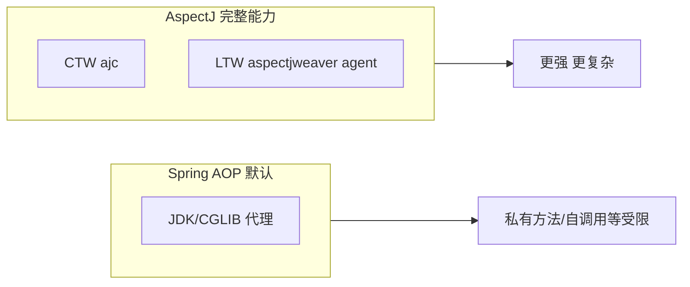

# 第 50 章：AspectJ 织入方式——编译期、类加载期与 Spring AOP 对比

> **业务线**：电商 / 订单履约微服务（拟真场景）。本章可独立阅读；与全书案例弱关联。  
> **篇章**：高级篇（全书第 36–50 章；源码、极端场景、扩展、SRE）

> **定位**：厘清 **AspectJ** 三种织入（**compile-time、post-compile、load-time**）与 **Spring AOP 默认运行时代理**的差异；**`@Aspect` 注解风格** 在 **Spring 管理**下如何用 **AspectJ 表达式**；何时需要 **`aspectjweaver` 作为 javaagent**（**LTW**）或 **Maven AspectJ 插件**（**CTW**）；与 **第 8、15、28 章**（Spring AOP 实战）衔接。

## 上一章思考题回顾

1. **`spring-boot-starter-parent`**：自带 **插件与资源**约定；**仅 import BOM** 通常 **不继承** 默认 **pluginManagement**（需自建）。  
2. **CI 禁止版本**：**Maven Enforcer** `bannedDependencies` / **OWASP** / **Gradle dependency locking**。

---

## 1 项目背景

「鲜速达」在 **订单核心路径** 上加了 **审计切面**：需要 **拦截 `private` 方法**、**第三方 jar 内** 的调用。团队发现 **Spring AOP 默认代理** **切不到** **同类 `this` 调用** 与 **`private` 方法**，查阅资料后遇到 **AspectJ** 术语：**weaver、LTW、ajc**——若分不清，容易 **混配 agent**、**启动参数乱**、**本地能跑 CI 不能跑**。

**痛点**：

- **以为 `@Aspect` = AspectJ 织入**：多数场景仍是 **Spring 用代理实现**，**语义子集**。  
- **LTW 与 `spring-instrument`**：两个 **`-javaagent`** 如何并存（见 **第 44 章**）。  
- **构建变慢**：**CTW** 增加 **编译时间**，需 **只对必要模块**开启。

**痛点放大**：**监控/审计**若强依赖 **全量织入**，**云原生镜像**里 **JVM 参数**漏一项，**生产切面全失效**。



---

## 2 项目设计（剧本式对话）

**角色**：小胖 / 小白 / 大师。  
**结构**：代理 vs 织入 → LTW 何时用 → 与 Spring 集成。

**小胖**：我都写 `@Aspect` 了，不就是 AspectJ 吗？

**大师**：**注解语法**来自 AspectJ **注解风格**；**Spring 默认**仍用 **代理** 实现 **subset**。要 **真·AspectJ 字节码织入**，走 **ajc（CTW）** 或 **LTW（aspectjweaver agent）**。

**技术映射**：**Spring AOP** ≈ **代理 + AspectJ 切点语言**；**完整 AspectJ** = **字节码改写**。

**小白**：**LTW** 和 **第 44 章 `spring-instrument`** 啥关系？

**大师**：**LTW** 需要 **`Instrumentation`**；**`spring-instrument` agent** 负责 **保存 Instrumentation** 供 **`LoadTimeWeaver`**；同时通常还要 **`aspectjweaver.jar` 作为 agent** 做 **实际织入**——**具体组合**以 **Spring 官方 LTW 文档**为准。

**技术映射**：**`-javaagent:.../aspectjweaver.jar`** + **（可选）`spring-instrument`** + **`@EnableLoadTimeWeaving`**。

**小胖**：那为啥不全员 LTW？

**大师**：**运维复杂度**、**启动参数**、**与 APM agent** 兼容性、**构建/排障成本**；多数业务 **Spring AOP + 良好切点** 足够。

**技术映射**：**优先拆类 / 改可见性** 解决自调用，再考虑 **AspectJ**。

---

## 3 项目实战

### 3.1 环境准备

| 项 | 说明 |
|----|------|
| 依赖 | **`spring-aspects`**（AspectJ 切面与集成）、**`aspectjweaver`**（LTW/工具链） |
| 构建 | Maven 3.9+、Java 17+ |

**`pom.xml`（节选，演示依赖）**

```xml
<properties>
  <spring.version>6.1.14</spring.version>
</properties>

<dependencies>
  <dependency>
    <groupId>org.springframework</groupId>
    <artifactId>spring-context</artifactId>
    <version>${spring.version}</version>
  </dependency>
  <dependency>
    <groupId>org.springframework</groupId>
    <artifactId>spring-aspects</artifactId>
    <version>${spring.version}</version>
  </dependency>
  <dependency>
    <groupId>org.aspectj</groupId>
    <artifactId>aspectjweaver</artifactId>
    <version>1.9.22</version>
  </dependency>
</dependencies>
```

### 3.2 分步实现 A：Spring AOP（代理）— 基线

沿用 **第 8 章** 的 **`@EnableAspectJAutoProxy`** + **`@Around`**，确认 **`execution(...)`** 表达式 **在代理语义下** 生效。

### 3.3 分步实现 B：LTW（概念步骤）

1. JVM 增加 **`-javaagent:/path/to/aspectjweaver.jar`**（版本与 **Spring** 兼容矩阵以官方为准）。  
2. 配置 **`@EnableLoadTimeWeaving`**（或在 XML 中启用 **context:load-time-weaver**）。  
3. 提供 **`META-INF/aop.xml`**（**AspectJ LTW** 配置）或在 **Spring** 中注册 **Aspect bean**。  

**注意**：**生产环境**需 **镜像/编排** 同步 **agent 路径**；详见 **Spring Reference「Load-time weaving with AspectJ」**。

### 3.4 分步实现 C：CTW（编译期织入，Maven）

使用 **`aspectj-maven-plugin`** 对 **指定模块** 运行 **ajc**（**配置冗长**，此处给 **最小心智**）：

```xml
<plugin>
  <groupId>org.codehaus.mojo</groupId>
  <artifactId>aspectj-maven-plugin</artifactId>
  <version>1.15.0</version>
  <configuration>
    <complianceLevel>17</complianceLevel>
    <aspectLibraries>
      <aspectLibrary>
        <groupId>org.springframework</groupId>
        <artifactId>spring-aspects</artifactId>
      </aspectLibrary>
    </aspectLibraries>
  </configuration>
</plugin>
```

**说明**：**具体 `executions` 与 `sources`** 需按模块调整；**首次**建议 **只读官方示例**再落地。

### 3.5 可能遇到的坑

| 现象 | 原因 | 处理 |
|------|------|------|
| **切面不生效** | **仅 Spring 代理** 且 **切点不可见** | **改切点** 或上 **LTW/CTW** |
| **双 agent 冲突** | **APM + AspectJ** | 查 **厂商兼容性**、**调整顺序** |
| **CI 失败本地成功** | **未传 `-javaagent`** | **统一启动脚本** |

### 3.6 测试验证

**单元测试**：**代理路径** 用 **Spring Test**；**LTW** 需在 **同 JVM 参数** 的 **集成测试** 中验证（**较重**）。

---

## 4 项目总结

### 优点与缺点

| 维度 | Spring AOP 代理 | AspectJ LTW/CTW |
|------|-----------------|-----------------|
| 能力边界 | **简单、兼容好** | **强、复杂** |
| 运维 | **低** | **高** |

### 适用场景

1. **默认**：**Spring AOP**（第 8、15、28 章）。  
2. **需织入第三方/私有/自调用**：评估 **AspectJ**。  
3. **`@Configurable` 等**：**spring-aspects** 提供的 **特殊切面**（见官方说明）。

### 注意事项

- **`spring-aspects`** 模块与 **`spring-aop`** 分工：**前者**偏 **AspectJ 集成与现成切面**，**后者**是 **AOP 抽象**。  
- **GraalVM Native**：织入与 **代理** 均需 **额外配置**（第 40 章）。

### 常见踩坑经验

1. **现象**：**`this.foo()`** 不走切面。  
   **根因**：**自调用** 无代理。  

2. **现象**：**LTW** 在 **fat jar** 失效。  
   **根因**：**类加载器**与 **weaver** 不匹配。  

---

## 思考题

1. **`exposeProxy=true`** 与 **AspectJ LTW** 解决 **自调用** 的 **本质差异**是什么？  
2. 你会把 **CTW** 限制在 **哪些 Maven 模块** 以降低 **全量编译时间**？（下一章：**R2DBC**。）

---

## 推广协作提示

| 角色 | 建议 |
|------|------|
| **架构师** | **默认代理优先**；**全量 AspectJ** 需 **书面决策**。 |
| **运维** | **JVM 参数表** 纳入 **发布清单**。 |

**下一章预告**：**R2DBC**——**响应式 SQL** 与 **WebFlux** 协同。
