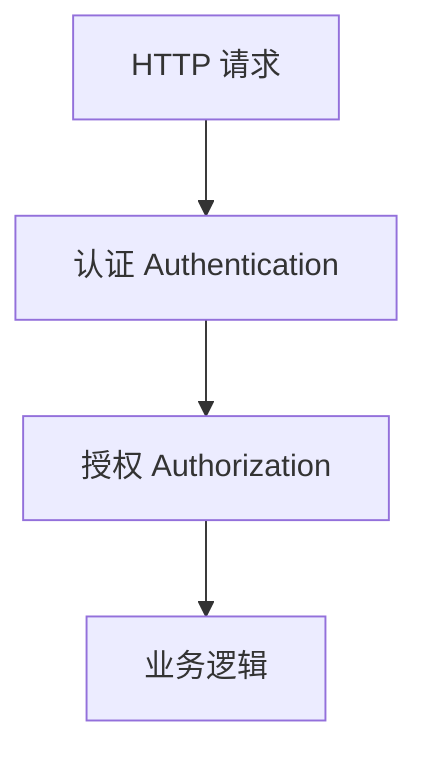

# 第 1 章：企业后台「谁进来了」：认证与授权全景

> 本章对齐 [docs/template.md](../template.md)，建议字数 3000–5000。

---

## 1 项目背景（约 500 字）

### 业务场景

某集团上线「内部运营中台」：客服可查询工单，财务可审批报销，系统管理员可配置角色。产品要求两件事：**知道当前请求是谁发起的（认证）**，以及 **该身份能否执行本次操作（授权）**。所有能力最终都落在 HTTP 请求上，需要与 Spring MVC 无缝协作。

### 痛点放大

若团队把「安全」理解成「登录成功就行」，很快会遇到：有人能登录但越权改数据；匿名访问与已登录访问语义混乱；审计无法回答「谁在什么时间做了什么」。没有统一模型时，业务代码里到处是 `if (role.equals("ADMIN"))`，**规则散落、难以测试、升级 SSO 时全项目返工**。

Spring Security 将 **Authentication（认证）** 与 **Authorization（授权）** 拆成可组合的能力：前者建立「主体是谁」，后者在资源访问点做决策。本章建立 **全景心智模型**，为后续「过滤器链」「UserDetails」「方法级安全」打地基。

### 流程图



**读者只需记住**：认证回答「你是谁」，授权回答「你能不能做这件事」；二者顺序固定，**先认证后授权**（除非显式允许匿名资源）。

---

## 2 项目设计：剧本式交锋对话（约 1200 字）

**场景**：架构评审，白板写满「SSO、RBAC、审计」。

**小胖**

「登录不就是输账号密码吗？搞两个英文单词干啥，我记混了。」

**小白**

「认证失败和未授权（403）返回给前端应该不一样吧？网关和浏览器重定向又怎么统一？」

**大师**

「可以把 **认证** 想成『领访客牌』：牌子上写你是谁、有哪些基础属性。**授权** 想成『进每个房间刷卡』：有牌不等于每个房间都能进。」

**技术映射**：`Authentication` → 访客牌；`GrantedAuthority` / 访问决策 → 房间权限。

**小胖**

「那 Spring Security 里牌子和房间规则存在哪？ThreadLocal？」

**小白**

「多线程、异步、WebFlux 线程切换时，`SecurityContext` 会不会丢？」

**大师**

「Servlet 场景里常见是 **`SecurityContextHolder` + ThreadLocal**；响应式场景要用 **`ReactiveSecurityContextHolder`**。异步任务要显式传递上下文，否则『牌子』留在旧线程。」

**技术映射**：`SecurityContextHolder` → 当前执行线程上的认证快照；响应式 → `Context` 传播。

**小胖**

「懂了，那授权放 URL 上还是注解上？」

**小白**

「粗粒度路由和细粒度领域规则会不会冲突？性能呢？」

**大师**

「URL 层像『大院门口安检』，方法层像『办公室二次核验』。一般 **外粗内细**：路由挡明显非法流量，方法层表达业务规则（如『只能看自己的订单』）。」

**技术映射**：`authorizeHttpRequests` → 请求级；`@PreAuthorize` → 方法级（见第 14–15 章）。

---

## 3 项目实战（约 1500–2000 字）

### 环境准备

- JDK 17+，Spring Boot 3.x，依赖 `spring-boot-starter-web`、`spring-boot-starter-security`。
- 本节不写完整业务，只做一个 **能跑的最小应用**，观察 **默认安全行为**：所有端点需认证，Boot 提供默认登录页。

**`pom.xml` 片段**

```xml
<dependency>
  <groupId>org.springframework.boot</groupId>
  <artifactId>spring-boot-starter-web</artifactId>
</dependency>
<dependency>
  <groupId>org.springframework.boot</groupId>
  <artifactId>spring-boot-starter-security</artifactId>
</dependency>
```

**步骤 1：暴露一个公开接口（理解「未认证」）**

```java
@RestController
public class HelloController {
  @GetMapping("/public/hello")
  public String hello() {
    return "ok";
  }
}
```

默认配置下 `/public/hello` **仍会被保护**（需登录），除非你显式配置 `permitAll`（第 4 章详解）。

**步骤 2：临时放行以观察差异**

```java
@Bean
SecurityFilterChain chain(HttpSecurity http) throws Exception {
  http.authorizeHttpRequests(a -> a.requestMatchers("/public/**").permitAll().anyRequest().authenticated());
  return http.build();
}
```

**测试**

```bash
curl -i http://localhost:8080/public/hello
# 期望 200；去掉 permitAll 时期望 302 登录或 401
```

### 可能遇到的坑

| 现象 | 原因 | 处理 |
|------|------|------|
| 加了 `permitAll` 仍 401 | 另有第二根链或顺序错误 | 检查多 `SecurityFilterChain` 与 `@Order`（第 31 章） |
| 静态资源被拦 | 未匹配 `/css/**` 等 | 放行静态路径 |

### 完整代码清单

业务样例建议放在独立 demo 仓库；源码阅读锚点：`core/.../Authentication.java`、`core/.../GrantedAuthority.java`。

---

## 4 项目总结（约 500–800 字）

### 优点与缺点

| 维度 | Spring Security 统一模型 | 自研拦截器 |
|------|--------------------------|------------|
| 概念清晰度 | 认证/授权分层，文档与社区大 | 依赖个人表达 |
| 扩展 | Provider、Voter、Filter 插拔 | 易写成面条代码 |
| 学习成本 | 概念多 | 上手快、后期难维护 |

### 适用场景

- 企业后台、需要 RBAC 与审计的系统。
- 未来要接 OAuth2、LDAP、多租户扩展的项目。

### 不适用场景

- 极简内网工具且由上游网关完成全部鉴权、应用零校验（风险在网关失守时放大）。

### 注意事项

- 区分 **401 未认证** 与 **403 未授权**，前后端契约写清。
- 异步与定时任务必须传递 `SecurityContext`。

### 常见踩坑

1. 把「登录成功」当成「已完成授权」。
2. 在子线程中丢失 `SecurityContext` 导致 NPE 或匿名身份。
3. 健康检查 `/actuator/health` 被误保护导致 K8s 探针失败。

### 思考题

1. 若匿名用户访问 `permitAll` 接口，`SecurityContext` 中的 `Authentication` 类型是什么？（提示：第 9 章）
2. 网关已校验 JWT，应用层是否还需要授权？边界在哪？（提示：第 20–21 章）

### 推广计划提示

- **开发**：先统一术语表（认证/授权/`SecurityContext`）。
- **测试**：用例区分匿名、已登录、无权限三类。
- **运维**：探针、日志中的主体标识与 TraceId 关联。

---

*本章完。*
