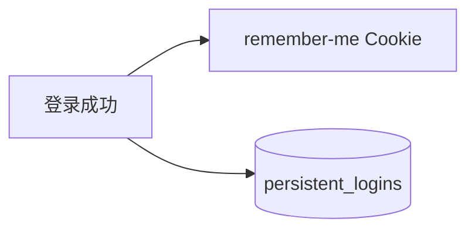

# 第 10 章：记住我：降低登录摩擦与风险平衡

> 本章对齐 [docs/template.md](../template.md)，建议字数 3000–5000。

---

## 1 项目背景（约 500 字）

### 业务场景

用户希望 **两周内免登录**；安全团队要求 **设备被盗可撤销**、**服务端可主动失效**。产品接受 **持久化 Cookie + 服务端存储** 或 **签名 Cookie** 方案。运营还希望：**用户改密后，所有「记住我」会话立即作废**。

### 痛点放大

若把「记住我」做成 **长期 Session**，Session 劫持面大；若 **纯客户端 Cookie 明文用户 ID**，则伪造 trivial。Spring Security **Remember-Me** 使用 **签名 + 可选持久化存储**（`JdbcTokenRepositoryImpl` 等），但 **密钥与 HTTPS** 仍是生死线。

### 流程图



---

## 2 项目设计：剧本式交锋对话（约 1200 字）

**场景**：是否默认勾选「记住我」引发产品与安全争执。

**小胖**

「记住我不就是勾个框吗？和 Session 有啥区别？」

**小白**

「CSRF 与 Remember-Me 同时开时攻击面？Cookie 被偷是不是等于长期登录？」

**大师**

「Remember-Me 在 **独立 Cookie** 里带 **token**，服务端用 **密钥验签** 或 **查库** 恢复登录态；**Session 仍可能并行存在**。风险：**token 窃取 ≈ 长期登录**，所以必须 **HTTPS + HttpOnly + SameSite**，敏感操作 **二次验证**。」

**技术映射**：`RememberMeAuthenticationFilter`；`PersistentTokenRepository`。

**小胖**

「为啥还要落库？只签名不行吗？」

**小白**

「服务端怎么撤销？运维能一键全踢吗？」

**大师**

「**持久化 token**（表 `persistent_logins`）可 **按行删除** 实现撤销；**纯签名** 往往只能靠 **改密钥** 或 **等过期**。选型是 **可撤销性 vs 实现复杂度**。」

**技术映射**：`JdbcTokenRepositoryImpl`；`InMemoryTokenRepository`（仅演示）。

**小白**

「登出时清不干净怎么办？」

**大师**

「`LogoutHandler` 必须 **删 Cookie** + **删持久化行**；前后端分离时还要约定 **调用登出 API**。」

**技术映射**：`LogoutHandler` 链；`TokenBasedRememberMeServices` 参数。

**小胖**

「密钥写代码里行不行？」

**大师**

「**绝对不行**；用 **环境变量 / KMS**，并计划 **轮换**（轮换时要双密钥验签窗口）。」

**技术映射**：`rememberMe().key(...)` → 生产必须外部化。

---

## 3 项目实战（约 1500–2000 字）

### 环境准备

- Spring Boot + Security；本地 **HTTPS** 可用自签证书或 mkcert（演示）。
- 数据库：H2/MySQL，执行 **Remember-Me 表结构**（见官方文档当前 schema）。

### 步骤 1：最小 Remember-Me（内存密钥仅开发）

```java
http.rememberMe(r -> r
    .key(rememberMeKey) // 来自配置
    .tokenValiditySeconds(1209600));
```

`rememberMeKey` 用 `@Value` 从 `SPRING_SECURITY_REMEMBER_ME_KEY` 读取。

### 步骤 2：持久化 Token

```java
@Bean
PersistentTokenRepository tokenRepository(DataSource ds) {
  JdbcTokenRepositoryImpl repo = new JdbcTokenRepositoryImpl();
  repo.setDataSource(ds);
  repo.setCreateTableOnStartup(true); // 仅演示
  return repo;
}

http.rememberMe(r -> r.tokenRepository(tokenRepository).key(rememberMeKey));
```

### 步骤 3：登出联动

```java
http.logout(l -> l.logoutUrl("/logout").deleteCookies("remember-me", "JSESSIONID"));
```

### 步骤 4：验证「撤销」

1. 登录并勾选记住我；2. 查库有 token；3. 登出；4. 再访问受保护资源应需重新登录。

### 测试验证

- 手工：浏览器 Application → Cookies 中 `remember-me` 存在与清除。
- 自动化：`MockMvc` 对 `/login` POST 带 `remember-me` 参数（表单字段名默认 `remember-me`）。

### 截图说明（供插图或评审时对照）

| 编号 | 建议截图内容 | 预期画面（文字描述） |
|------|----------------|----------------------|
| 图 10-1 | 浏览器 Cookie 面板 | 存在 `remember-me`（HttpOnly、Secure、SameSite 按环境配置）。 |
| 图 10-2 | 登录请求 Form Data | 含 `remember-me=on` 或类似字段。 |
| 图 10-3 | 数据库 `persistent_logins` | 登录后新增一行；登出后该行消失或失效（依实现）。 |
| 图 10-4 | 改密或删库后访问受保护 URL | 被重定向登录，证明可撤销性生效。 |

### 可能遇到的坑

| 坑 | 处理 |
|----|------|
| 集群 key 不一致 | 密钥配置中心统一下发 |
| 忘记 HTTPS | 中间人窃取 Remember-Me Cookie |
| 自定义 Cookie 名 | `rememberMe().rememberMeParameter` / Cookie 名配置 |

---

## 4 项目总结（约 500–800 字）

### 优点与缺点

| 维度 | Remember-Me | 仅 Session |
|------|-------------|------------|
| UX | 好 | 一般 |
| 风险 | 需加固 | 相对较低 |
| 撤销 | 可持久化撤销 | 删 Session |

### 适用场景

- 面向浏览器的后台；能接受 HTTPS 与密钥治理。

### 不适用场景

- 高敏资金操作 **禁止长期免登**；或纯 **OAuth2 刷新令牌** 统一托管。

### 常见踩坑经验

1. **密钥泄露** → 全体 Remember-Me 可被伪造。
2. **登出未删 DB 行** → token 仍有效。

### 思考题

1. `key` 轮换策略？双密钥验签窗口如何设计？
2. 与 OAuth2 **refresh token** 的职责边界？（第 20～21 章）

### 推广计划提示

- **安全**：渗透测试重点测 **Cookie 窃取重放**、**CSRF + 登录**。
- **运维**：密钥与证书生命周期纳入变更流程。

---

*本章完。*
