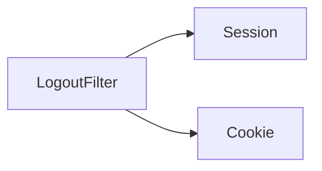

# 第 11 章：登出与会话失效：合规留痕

> 本章对齐 [docs/template.md](../template.md)，建议字数 3000–5000。

---

## 1 项目背景（约 500 字）

### 业务场景

财务系统要求 **用户主动登出**、**管理员强制下线**、**改密后所有会话失效**。审计要求 **登出事件可追踪**（时间、IP、主体、User-Agent）。合规还要求：**仅清浏览器 Cookie 不算完成登出**，服务端 Session 必须失效。

### 痛点放大

若只删客户端 Cookie，**服务端 Session 仍有效**，Session 固定攻击或 stolen cookie 仍可操作。需要 **`LogoutFilter` + `LogoutHandler` 链** 清理 `SecurityContext`、Session、Remember-Me、自定义缓存（如权限缓存）。

### 流程图



---

## 2 项目设计：剧本式交锋对话（约 1200 字）

**场景**：登出接口用 GET 还是 POST？

**小胖**

「登出不就是跳登录页吗？为啥要 Filter 链？」

**小白**

「CSRF：GET `/logout` 会不会被恶意页面 img 标签触发？」

**大师**

「**`LogoutFilter`** 统一处理：**清 `SecurityContext`、invalidate Session、清 Remember-Me、写审计**。历史上 **GET 登出** 导致 **CSRF 登出**（用户被恶意登出），现代默认常倾向 **POST + CSRF token**。」

**技术映射**：`http.logout()`；`LogoutHandler` 列表。

**小胖**

「前后端分离 JSON 登出怎么返回 204？」

**小白**

「`LogoutSuccessHandler` 与 `Authentication` 为 null 时日志怎么打？」

**大师**

「用 **`LogoutSuccessHandler`** 写 JSON；审计可在 **`LogoutHandler`** 里 **在 invalidate 前** 读取 `Authentication`。」

**技术映射**：`logoutSuccessHandler`；`addLogoutHandler`。

**小白**

「管理员踢人怎么实现？」

**大师**

「**`SessionRegistry`**（见第 16 章）找会话 `expireNow`；或 **Redis Session** 直接删 key；SSO 场景要 **通知 IdP 全局登出**。」

**技术映射**：`SessionInformation`；与 OIDC **RP-Initiated Logout** 协同（若接入）。

**小胖**

「登出后浏览器后退键还能看上一页吗？」

**大师**

「**缓存控制**是前端问题；敏感页应 **no-store** + 业务上避免敏感数据留在 DOM。」

---

## 3 项目实战（约 1500–2000 字）

### 环境准备

- 表单登录已可用；可选引入 `spring-session-data-redis` 观察集群登出。

### 步骤 1：默认登出（Servlet）

```java
http.logout(l -> l
    .logoutUrl("/logout")
    .logoutSuccessUrl("/login?logout")
    .invalidateHttpSession(true)
    .clearAuthentication(true)
    .deleteCookies("remember-me"));
```

### 步骤 2：自定义审计 `LogoutHandler`

```java
http.logout(l -> l.addLogoutHandler((request, response, authentication) -> {
  if (authentication != null) {
    audit.info("logout user={} ip={}", authentication.getName(),
        request.getRemoteAddr());
  }
}));
```

### 步骤 3：JSON 登出（SPA）

```java
http.logout(l -> l.logoutSuccessHandler((req, res, auth) -> {
  res.setStatus(HttpServletResponse.SC_NO_CONTENT);
}));
```

### 步骤 4：验证 Session 失效

1. 登录后记录 `JSESSIONID`；2. 登出；3. 用旧 Cookie 访问受保护接口 → 应重新认证。

### 测试验证

```java
mockMvc.perform(logout()).andExpect(status().is3xxRedirection());
```

### 截图说明（供插图或评审时对照）

| 编号 | 建议截图内容 | 预期画面（文字描述） |
|------|----------------|----------------------|
| 图 11-1 | POST `/logout` 的 Form Data | 含有效 CSRF token（如 `_csrf`）。 |
| 图 11-2 | 登出前后 Cookie | `JSESSIONID` 被清除或失效；`remember-me` 被删。 |
| 图 11-3 | 审计日志 / ELK | 一条登出记录含用户名与 IP。 |
| 图 11-4 | Redis Session（若使用） | 登出后对应 session key 消失。 |

### 可能遇到的坑

| 坑 | 处理 |
|----|------|
| 登出后仍能通过旧 Session 访问 | 确认 `invalidateHttpSession` 与集群 Session 同步 |
| API 登出 403 | CSRF：放行 `/logout` 或改用 header/token 方案 |
| SSO 未登出 IdP | 增加 OIDC end_session_endpoint 跳转 |

---

## 4 项目总结（约 500–800 字）

### 优点与缺点

| 维度 | Security 登出链 | 手写 Controller |
|------|-----------------|-----------------|
| 一致性 | 高 | 易漏 Session |
| 灵活性 | Handler 可插拔 | 高 |

### 适用场景

- 需要 **可审计登出** 的金融、政务系统。

### 不适用场景

- 纯 JWT 无服务端会话：撤销模型不同（黑名单/短 TTL）。

### 常见踩坑经验

1. **只清前端 token、服务端 Session 仍有效**。
2. **GET 登出** 被 CSRF 利用。

### 思考题

1. `clearAuthentication` 与 `invalidateHttpSession` 顺序是否敏感？
2. 与 **Spring Session** 的 `SessionRepository` 交互点？

### 推广计划提示

- **合规**：审计字段与留存周期对齐法务。
- **前端**：登出后清理内存中的用户状态与路由守卫。

---

*本章完。*
