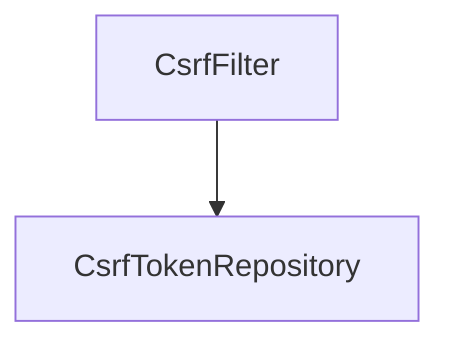

# 第 12 章：CSRF 与同源策略：写操作保护

> 本章对齐 [docs/template.md](../template.md)，建议字数 3000–5000。

---

## 1 项目背景（约 500 字）

### 业务场景

用户已登录网银后台，**恶意站点** 诱导浏览器 **带 Cookie 发起 POST 转账**。同源策略 **不阻止**「跨站发请求 + 带 Cookie」，因此需要 **CSRF Token**、**SameSite Cookie** 或 **自定义请求头** 等额外防护。运营后台同时存在 **Thymeleaf 表单** 与 **内部 Ajax**，两套前端都要能正确带上防护参数。

### 痛点放大

若 REST API 给 SPA 用 **Cookie 会话认证**，CSRF 风险上升；若 **无状态 JWT 放 Authorization 头** 且 **无 Cookie 会话**，经典 CSRF 面会缩小，但 **仍要防 XSS 偷 token**。Spring Security 默认在 **Servlet 场景启用 CSRF**，`CsrfFilter` 与 `CsrfTokenRepository` 协同。

### 流程图



源码：`web/.../csrf/CsrfFilter.java`、`CsrfTokenRequestHandler`（新版本可能拆分）。

---

## 2 项目设计：剧本式交锋对话（约 1200 字）

**场景**：前后端同学争论「为什么 POST /transfer 返回 403」。

**小胖**

「GET 为啥不防 CSRF？我点链接不也能扣款吗？」

**小白**

「如果银行用 GET 转账，问题在 **接口设计**；CSRF 防护主要针对 **浏览器自动带 Cookie 的写操作**。GET 应当是 **幂等** 的。」

**大师**

「**CSRF 攻击模型**是：恶意站利用浏览器 **已存在的会话 Cookie**，冒充用户发请求。**改变状态** 的方法才需要 token；GET 不应承担副作用。」

**技术映射**：`CsrfFilter` 默认保护 **非安全方法**（如 POST/PUT/DELETE，具体以配置为准）。

**小白**

「前后端分离 JSON API 怎么带 token？`X-XSRF-TOKEN` 从哪来？」

**大师**

「常见两种：**Cookie 双提交**（`CookieCsrfTokenRepository` 把 token 放 Cookie，前端读 Cookie 写到 Header）；或 **页面渲染时内嵌 token**。SPA 需注意 **CORS + credentials**。」

**技术映射**：`CookieCsrfTokenRepository.withHttpOnlyFalse()`（若需 JS 读）；`CsrfTokenRequestHandler`。

**小胖**

「`/api/**` 用 JWT 要不要关 CSRF？」

**小白**

「关了会不会被安全审计打回？」

**大师**

「若 **无 Session Cookie**、仅靠 **`Authorization: Bearer`**，**经典 CSRF** 往往不成立；若 **仍混用 Cookie 会话**，则不能随意 `ignoringRequestMatchers`。每个豁免都要有 **书面威胁模型**。」

**技术映射**：`http.csrf(csrf -> csrf.disable())` vs `ignoringRequestMatchers`；**最小豁免**。

**小白**

「`SameSite=Lax` 能替代 CSRF token 吗？」

**大师**

「**缓解跨站 POST** 的一部分场景，但 **不是银弹**；企业内网、旧浏览器、跨站跳转支付等仍要 **组合策略**。」

**技术映射**：Cookie `SameSite` 属性；与 `CsrfFilter` **叠加**而非二选一。

---

## 3 项目实战（约 1500–2000 字）

### 环境准备

- Spring Boot + Thymeleaf 或纯 HTML；浏览器 **Chrome DevTools**。
- `application.properties`：`logging.level.org.springframework.security.web.csrf=DEBUG`（仅本地）。

### 步骤 1：Thymeleaf 表单提交

```html
<form th:action="@{/transfer}" method="post">
  <input type="hidden" th:name="${_csrf.parameterName}" th:value="${_csrf.token}"/>
  <button type="submit">提交</button>
</form>
```

### 步骤 2：Ajax（Fetch）携带 Header

```javascript
const token = getCookie('XSRF-TOKEN'); // 或使用 meta 标签注入
fetch('/api/action', {
  method: 'POST',
  credentials: 'include',
  headers: {
    'Content-Type': 'application/json',
    'X-XSRF-TOKEN': token
  },
  body: JSON.stringify({})
});
```

### 步骤 3：验证「无 token 应失败」

使用 curl **不带** CSRF：

```bash
curl -i -b cookies.txt -X POST http://localhost:8080/transfer
# 期望 403 Forbidden（若 CSRF 启用）
```

### 步骤 4：谨慎豁免 API（示例）

```java
http.csrf(csrf -> csrf.ignoringRequestMatchers("/api/webhook/**"));
```

**必须**：仅对 **HMAC 签名 webhook** 等可证明请求来源的接口豁免。

### 步骤 5：自定义 `CookieCsrfTokenRepository`（跨子域场景）

查阅当前版本文档配置 **Cookie path/domain**；开发环境 localhost 与生产域名策略不同。

### 测试验证

- `MockMvc`：`csrf()` RequestPostProcessor。
- 集成测试：先 GET 页面取 token，再 POST。

### 截图说明（供插图或评审时对照）

| 编号 | 建议截图内容 | 预期画面（文字描述） |
|------|----------------|----------------------|
| 图 12-1 | DevTools → Network → 失败请求 | POST 返回 **403**，响应体可能含 `Invalid CSRF token` 相关信息（视版本）。 |
| 图 12-2 | 成功 POST 的请求头 | 含 `X-XSRF-TOKEN` 或与 Cookie 中 token 配对。 |
| 图 12-3 | Application → Cookies | 存在 `XSRF-TOKEN`（或项目配置名），属性含 `SameSite`。 |
| 图 12-4 | Thymeleaf 渲染源码 | 表单内存在 `_csrf` 隐藏域，`name`/`value` 非空。 |

### 可能遇到的坑

| 坑 | 处理 |
|----|------|
| 自定义子域 Cookie | 调整 `CookieCsrfTokenRepository` 与 CORS |
| 误关 CSRF 导致全站裸奔 | 代码评审 + 威胁建模 |
| 仅后端换端口导致 Cookie 不送 | 统一域名或显式 SameSite/Secure 策略 |

---

## 4 项目总结（约 500–800 字）

### 优点与缺点

| 维度 | CSRF Token + 同站 Cookie | 仅依赖 SameSite |
|------|---------------------------|-----------------|
| 覆盖面 | 广 | 依赖浏览器与场景 |
| 实现成本 | 前后端配合 | 低但不够 |

### 适用场景

- 基于 Cookie 的会话认证；传统服务端渲染 + Ajax 混合。

### 不适用场景

- 纯 Bearer Token 且 **无 Cookie 会话**（仍需防 XSS）。

### 常见踩坑经验

1. **前后端域名不一致** → Cookie 丢失 → 无限 403。
2. **反向代理未透传 Header** → token 到了网关丢了。

### 思考题

1. **双提交 Cookie** 与 Spring 默认实现的对应关系？
2. CSRF 与 **CORS** 错误表现差异？（浏览器控制台提示）

### 推广计划提示

- **前端**：Axios/Fetch 拦截器统一注入；**禁止**手写漏配。
- **测试**：契约测试必须包含 **带/不带 CSRF** 两类用例。

---

*本章完。*
