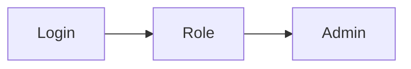

# 第 13 章：基础篇综合实战：最小「管理后台」脚手架

> 本章对齐 [docs/template.md](../template.md)，建议字数 3000–5000。

---

## 1 项目背景（约 500 字）

### 业务场景

从零搭建 **运营后台**：登录、角色（`ADMIN`、`USER`）、受保护页面 `/admin/**`、只读 API `/api/report`、静态资源与错误页放行。要求 **可 curl 验收、可 MockMvc 回归**，并能在 **演示环境** 用内存用户、在 **预发** 切换 JDBC 用户而不改业务代码。

### 痛点放大

单章知识点 **串不起来** 时，团队仍会在集成环境出现 **403/302 混乱**、**CSRF 403**、**错误页被拦截**。本章把 **第 4～12 章** 压成 **一条可运行清单**：链、用户、密码编码、静态资源、CSRF、登出、匿名与匿名无关的受控路由。

### 流程图



---

## 2 项目设计：剧本式交锋对话（约 1200 字）

**场景**：评审「最小脚手架」交付定义（DoD）。

**小胖**

「脚手架要包含哪些才算「最小」？能删 Thymeleaf 吗？」

**小白**

「没有页面纯 JSON，算不算完成本章实验？」

**大师**

「**教学向最小**建议保留 **表单登录 + 一页受保护页面**，否则 CSRF、重定向、Session 的体验在 Postman 里 **失真**。若团队已是 **纯 API**，可改成 **Basic/Resource Server**，但本章目标是 **Servlet 全链路**。」

**技术映射**：`formLogin` + `csrf` + `logout` 的 **浏览器路径**。

**小白**

「演示账号与生产环境如何隔离？」

**大师**

「`spring.profiles.active=dev` 时注册 `InMemoryUserDetailsManager`；`prod` 使用 **数据库 + 禁止默认 user**。**配置中心** 统一下发，镜像 **无明文密码**。」

**技术映射**：`@Profile`；`UserDetailsService` Bean 条件装配。

**小胖**

「测试要覆盖哪些路径？」

**小白**

「健康检查 `/actuator/health` 要不要鉴权？」

**大师**

「至少覆盖：**匿名访问公开资源**、**未登录访问受保护**、**USER 访问 ADMIN**、**ADMIN 访问成功**、**登出后再访问**、**错误页 `/error`**。Actuator 按公司规范 **单独链或 permit**。」

**技术映射**：测试金字塔；`@WebMvcTest` vs `@SpringBootTest`。

**小白**

「`anyRequest().denyAll()` 会不会太狠？」

**大师**

「**默认拒绝** 是安全默认值；新加路径若忘记挂规则会 **失败关闭** 而非 **意外放行**。」

**技术映射**：`denyAll()` → 显式白名单扩展。

---

## 3 项目实战（约 1500–2000 字）

### 环境准备

- Spring Boot 3.x：`web`、`security`、`thymeleaf`（可选 `actuator`）。
- 目录约定：`src/main/resources/templates/admin/dashboard.html`，`static/css/app.css`。

### 步骤 1：统一 `SecurityFilterChain`

```java
http.authorizeHttpRequests(a -> a
    .requestMatchers("/css/**", "/login", "/error").permitAll()
    .requestMatchers("/admin/**").hasRole("ADMIN")
    .requestMatchers("/api/report/**").hasAnyRole("ADMIN", "USER")
    .anyRequest().denyAll());
http.formLogin(withDefaults());
http.logout(l -> l.logoutSuccessUrl("/login?logout"));
```

### 步骤 2：用户与密码编码

```java
@Bean
PasswordEncoder encoder() { return new BCryptPasswordEncoder(); }

@Bean
@Profile("dev")
UserDetailsService devUsers(PasswordEncoder enc) {
  UserDetails admin = User.withUsername("admin").password(enc.encode("admin")).roles("ADMIN", "USER").build();
  UserDetails user = User.withUsername("user").password(enc.encode("user")).roles("USER").build();
  return new InMemoryUserDetailsManager(admin, user);
}
```

### 步骤 3：控制器与页面

- `GET /admin/dashboard` → 返回视图 `admin/dashboard`。
- `GET /api/report/summary` → 返回 JSON。

### 步骤 4：MockMvc 矩阵

| 用例 | 用户 | 路径 | 预期 |
|------|------|------|------|
| A | 匿名 | `/admin/dashboard` | 302/401 |
| B | `USER` | `/admin/dashboard` | 403 |
| C | `ADMIN` | `/admin/dashboard` | 200 |
| D | `USER` | `/api/report/summary` | 200 |

### 步骤 5：curl 验收脚本（节选）

```bash
curl -i -c jar -b jar -X POST -d "username=admin&password=admin" http://localhost:8080/login
curl -i -b jar http://localhost:8080/admin/dashboard
```

> 表单登录需 **CSRF**；实战脚本应先用 GET `/login` 取 token 或使用 `-d` 与 session 配套工具。

### 截图说明（供插图或评审时对照）

| 编号 | 建议截图内容 | 预期画面（文字描述） |
|------|----------------|----------------------|
| 图 13-1 | 登录页 | 默认或自定义 `/login`，登录失败有错误提示（不暴露细节）。 |
| 图 13-2 | `ADMIN` 访问 `/admin/dashboard` | 页面标题/菜单显示管理态。 |
| 图 13-3 | `USER` 访问 `/admin/dashboard` | **403** 或友好错误页（视 `AccessDeniedHandler`）。 |
| 图 13-4 | CI 测试报告 | `MockMvc` 用例绿，附覆盖率截图（可选）。 |

### 可能遇到的坑

| 坑 | 处理 |
|----|------|
| `hasRole` 与 `ROLE_` | `hasRole("ADMIN")` ↔ `ROLE_ADMIN` |
| 忘记 `/error` | `permitAll` |
| curl 登录被 CSRF 拦截 | 使用测试工具或测试环境临时策略 |

---

## 4 项目总结（约 500–800 字）

### 优点与缺点

| 维度 | 一体化脚手架 | 每章单独 demo |
|------|----------------|---------------|
| 集成度 | 高 | 低 |
| 教学负担 | 大 | 小 |

### 适用场景

- 内训、入职实验；作为 **后续 OAuth2/多租户** 的基线。

### 不适用场景

- 已统一网关鉴权、应用 **零会话** 的纯 API（换第 20～21 章模型）。

### 常见踩坑经验

1. **Profile 切错** 导致生产无用户或演示账号泄露。
2. **Actuator 暴露** 未收紧。

### 思考题

1. 若 `/api/**` 给 SPA 且 JWT，本章哪些配置需删改？
2. Playwright E2E：如何 **稳定等待** 登录完成（URL/token/元素）？

### 推广计划提示

- **测试**：CI 跑 `MockMvc` + 一条「冒烟」脚本。
- **运维**：镜像构建时 **注入 Secret**，禁止默认 `admin/admin`。

---

*本章完。*
