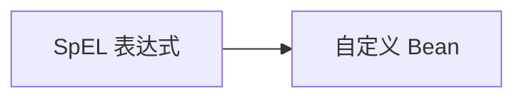

# 第 15 章：@PreAuthorize/@Secured 与 SpEL

> 本章对齐 [docs/template.md](../template.md)，建议字数 3000–5000。

---

## 1 项目背景（约 500 字）

### 业务场景

订单详情接口要求：**订单 `ownerId` 与当前用户一致，或具备 `ROLE_ADMIN`**。规则涉及 **方法参数** 与 **数据库状态**，无法用静态 URL 表达。产品还要求：**运营代客操作** 走审批流，SpEL 里要读 **审批通过标记**。

### 痛点放大

在 Controller 手写 `if` 会 **重复**、难测；SpEL 可把规则 **声明化**，但 **调试困难**、**表达式注入** 需防范。需掌握 **`@PreAuthorize`（前置）与 `@PostAuthorize`（后置，慎防数据泄露）**。

### 流程图



---

## 2 项目设计：剧本式交锋对话（约 1200 字）

**场景**：能否把整段 SQL 嵌进 SpEL？

**小胖**

「SpEL 像写脚本，会不会很难调试？报错只看到 `AccessDeniedException`？」

**小白**

「`#id` 与 `@orderSecurity` 啥关系？`@` 开头是 Bean 吗？」

**大师**

「`@PreAuthorize` 中 **`#参数名`** 绑定方法入参；**`@orderSecurity`** 是 Spring Bean 名，调用 **`@orderSecurity.owns(#id)`** 这类方法。异常信息可在 **`AccessDeniedException`** 中自定义 `AccessDeniedHandler`。」

**技术映射**：`MethodSecurityExpressionHandler`；`DefaultMethodSecurityExpressionHandler`。

**小白**

「`@Secured` 与 `@PreAuthorize` 选哪个？」

**大师**

「**`@Secured`**：简单角色数组；**复杂逻辑、属主判断** 用 `@PreAuthorize`。**JSR-250** 的 `@RolesAllowed` 介于两者之间。」

**技术映射**：`@Secured("ROLE_ADMIN")` 无 SpEL；`@PreAuthorize` 全 SpEL。

**小胖**

「`@PostAuthorize` 干啥用？听起来危险。」

**小白**

「返回对象含手机号，想脱敏能用吗？」

**大师**

「`@PostAuthorize` 能访问 **`returnObject`**，适合 **返回后校验**；但要防止 **日志打印敏感返回值**。更常见是 **在 Service 内脱敏** 或 **DTO 映射**。」

**技术映射**：`@PostAuthorize("returnObject.owner==authentication.name")`；**隐私**优先在数据层控制。

**小白**

「SpEL 注入：用户可控字符串进表达式？」

**大师**

「**绝对禁止**把请求参数拼进 **表达式字符串**；只用 **`#id` 参数绑定**。」

---

## 3 项目实战（约 1500–2000 字）

### 环境准备

```java
@Configuration
@EnableMethodSecurity
public class MethodSecurityConfig {}
```

### 步骤 1：`@PreAuthorize` 基础

```java
@PreAuthorize("hasAuthority('ORDER_READ')")
public OrderDto get(Long id) { ... }
```

### 步骤 2：调用 Bean

```java
@PreAuthorize("@orderAuth.canRead(authentication, #id)")
public OrderDto get(Long id) { ... }
```

### 步骤 3：`PermissionEvaluator`（可选）

```java
@PreAuthorize("hasPermission(#id, 'Order', 'read')")
```

需注册 `PermissionEvaluator` Bean。

### 步骤 4：单元测试

```java
@Test
@WithMockUser(roles = "USER")
void deniedForOtherUser() {
  assertThatThrownBy(() -> svc.get(2L)).isInstanceOf(AccessDeniedException.class);
}
```

### 步骤 5：调试技巧

- 临时打开 `DEBUG`：`org.springframework.security.access.expression`。
- 断点：`MethodSecurityInterceptor.invoke`。

### 截图说明（供插图或评审时对照）

| 编号 | 建议截图内容 | 预期画面（文字描述） |
|------|----------------|----------------------|
| 图 15-1 | IDEA 断点在 `MethodSecurityInterceptor` | 可见 `attribute` 为 `PreAuthorizeInvocationAttribute`。 |
| 图 15-2 | SpEL 表达式在源码中的高亮 | `@PreAuthorize` 行清晰可见 Bean 名与 `#id`。 |
| 图 15-3 | 测试报告 | 拒绝用例失败栈含 `AccessDeniedException`。 |
| 图 15-4 | 自定义 403 JSON | 前后端约定的 `code` 字段（若配置 Handler）。 |

### 可能遇到的坑

| 坑 | 处理 |
|----|------|
| 同类自调用 | 拆类 |
| Kotlin/代理类型 | 确认 `open class` 或 CGLIB |
| `authentication` 为 null | 检查是否方法安全未启用 |

---

## 4 项目总结（约 500–800 字）

### 优点与缺点

| 维度 | SpEL 方法安全 | Controller if |
|------|----------------|---------------|
| 可测试性 | 好（切片/集成） | 重复 |
| 可读性 | 需学习 SpEL | 直观 |

### 思考题

1. `@PostAuthorize` 与 **领域校验** 的边界？
2. 与 OAuth2 `scope` 映射到 `GrantedAuthority` 的实践？

### 推广计划提示

- **Code Review**：禁止字符串拼接 SpEL。

---

*本章完。*
