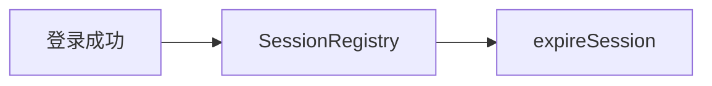

# 第 16 章：多会话与并发控制：踢人、限登

> 本章对齐 [docs/template.md](../template.md)，建议字数 3000–5000。

---

## 1 项目背景（约 500 字）

### 业务场景

金融后台要求 **同一账号仅允许一处登录**（新登录踢旧会话）；或 **允许多端但最多 N 个会话**。需要 **服务端登记会话** 与 **并发策略**，并与 **集群 Session（Redis）** 协同。

### 痛点放大

纯前端提示「异地登录」**不可靠**；必须 **`SessionRegistry` + `ConcurrentSessionControlAuthenticationStrategy`**（或等价机制）。集群若 **每节点独立内存 Registry**，会出现 **漏踢**。

### 流程图



---

## 2 项目设计：剧本式交锋对话（约 1200 字）

**场景**：用户抱怨「刚登录就把我踢了」。

**小胖**

「踢人是不是发 WebSocket 通知？不通知行不行？」

**小白**

「集群 Session 下 `SessionRegistry` 还准吗？Redis 里 Session ID 谁维护？」

**大师**

「**`SessionRegistry` 记录 sessionId ↔ 主体**；`maximumSessions` 超限触发 **expireNow**。**集群**必须用 **可共享的 Session 存储** 且 **Registry 也要一致**（或使用 Spring Session 集成方案，以文档为准）。」

**技术映射**：`SessionRegistry`；`FindByIndexNameSessionRepository`（若用 Spring Session）。

**小白**

「`maxSessionsPreventsLogin(true)` 和 `false` 区别？」

**大师**

「**true**：新登录直接被拒；**false**：**踢掉最旧/旧会话**（策略以文档为准）。产品要文案：**『账号已在别处登录』**。」

**技术映射**：`maxSessionsPreventsLogin`；与 **用户体验** 联动。

**小胖**

「前后端分离，Session Cookie 在子域，算不算同一用户？」

**大师**

「**会话维度**是 **浏览器 Cookie**；子域共享策略要 **显式配置** `Cookie` domain，否则可能 **多会话不算同一账号**。」

**技术映射**：Cookie `Domain`；与 **单点登录** 区分。

**小白**

「只踢同一设备还是踢所有设备？」

**大师**

「Spring 层是 **会话条数**；设备维度要 **业务自己扩展**（设备指纹、refresh token 家庭）。」

---

## 3 项目实战（约 1500–2000 字）

### 环境准备

- `spring-boot-starter-security`；可选 `spring-session-data-redis`。

### 步骤 1：注册 `SessionRegistry`

```java
@Bean
SessionRegistry sessionRegistry() {
  return new SessionRegistryImpl();
}
```

### 步骤 2：会话管理配置

```java
http.sessionManagement(s -> s
    .maximumSessions(1)
    .maxSessionsPreventsLogin(false)
    .sessionRegistry(sessionRegistry()));
```

### 步骤 3：管理端「踢人」（示例）

```java
sessionRegistry.getAllSessions(principal, false).forEach(SessionInformation::expireNow);
```

### 步骤 4：双浏览器验证

1. Chrome 登录用户 A；2. Firefox 再登录 A；3. 回到 Chrome 发请求 → 应失效或按策略被拒。

### 步骤 5：集群注意

使用 Redis Session 时，确保 **所有节点** 使用 **同一 Redis** 与 **session 命名空间**。

### 截图说明（供插图或评审时对照）

| 编号 | 建议截图内容 | 预期画面（文字描述） |
|------|----------------|----------------------|
| 图 16-1 | 两个浏览器窗口 | 同一账号两次登录；旧会话请求返回登录页或 401。 |
| 图 16-2 | Redis 客户端 | `spring:session:*` 或项目前缀下 key 数量变化。 |
| 图 16-3 | 管理端「在线用户」页 | 列表展示 principal 与 sessionId（注意脱敏）。 |
| 图 16-4 | 日志 | 会话过期或并发策略触发相关 DEBUG 行。 |

### 可能遇到的坑

| 坑 | 处理 |
|----|------|
| 未注册 `SessionRegistry` Bean | 配置不生效 |
| 前后端分离无 Cookie | 换 **token 撤销** 模型 |
| LB 无黏性与 Session 不一致 | 上 Redis 或 sticky |

---

## 4 项目总结（约 500–800 字）

### 思考题

1. 与 **OAuth2 refresh token rotation** 的「踢人」类比？
2. `SessionFixationProtectionStrategy` 与并发会话关系？

### 推广计划提示

- **运维**：Redis 内存与 key TTL 监控。

---

*本章完。*
