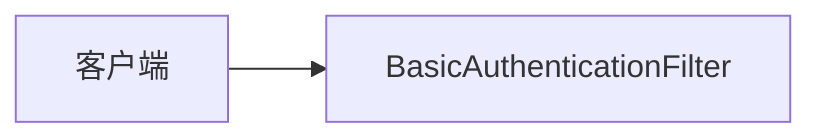

# 第 17 章：HTTP Basic/Digest：脚本与遗留客户端

> 本章对齐 [docs/template.md](../template.md)，建议字数 3000–5000。

---

## 1 项目背景（约 500 字）

### 业务场景

内部运维脚本、老旧设备、嵌入式终端使用 **HTTP Basic** 调 **受保护管理接口**；历史系统曾用 **Digest** 降低「明文密码重复发送」风险（现代环境更推荐 **HTTPS + Basic**、**mTLS** 或 **OAuth2 客户端凭证**）。

### 痛点放大

Basic **Base64 不是加密**；无 TLS 时密码等价裸奔。Digest **挑战-响应** 可减少密码明文传输次数，但 **实现复杂、代理/缓存兼容性差**，新项目慎用。

### 流程图



---

## 2 项目设计：剧本式交锋对话（约 1200 字）

**场景**：是否给 `/actuator/prometheus` 开 Basic？

**小胖**

「Basic 不就是 `Authorization: Basic base64(user:pass)` 吗？我 Postman 里一点就行。」

**小白**

「生产为啥总强调 **TLS**？Base64 和加密差在哪？」

**大师**

「**TLS 保护传输机密性**；Basic 只是把 **用户名密码做编码** 放进头里，**不是密码学保密**。没有 HTTPS，中间人直接 **解码**。」

**技术映射**：TLS → 信道安全；Basic → **简单凭据载体**。

**小白**

「Digest 比 Basic 安全多少？为啥新系统不用？」

**大师**

「Digest **挑战-响应** 减少 **密码明文往返**，但仍要面对 **字典攻击、中间人、弱算法** 等问题；且 **代理/负载均衡** 常破坏 Digest 语义。多数团队转向 **OAuth2 Client Credentials**。」

**技术映射**：`DigestAuthenticationFilter`（若仍使用）；维护成本。

**小胖**

「浏览器弹窗和 SPA 的 Bearer 冲突吗？」

**小白**

「网关已经 Basic 了，应用还 Basic，会不会 **双重认证**？」

**大师**

「**每一跳** 都可有自己的认证：**客户端→网关** Basic，**网关→应用** mTLS 或内部 JWT。**禁止**把同一 `Authorization` 头无意义地叠两次；需 **明确契约**。」

**技术映射**：`http.httpBasic()`；`AuthenticationEntryPoint`。

**小白**

「脚本里明文密码怎么办？」

**大师**

「**环境变量 / Vault**；轮换密码；最小权限账号；**只读** 与 **读写** 分账号。」

---

## 3 项目实战（约 1500–2000 字）

### 环境准备

- Spring Boot + Security；本地 **HTTPS**（自签或 mkcert）再测 Basic。
- 关闭浏览器弹窗干扰时，优先用 **curl**。

### 步骤 1：启用 HTTP Basic

```java
http.authorizeHttpRequests(a -> a.anyRequest().authenticated());
http.httpBasic(withDefaults());
```

### 步骤 2：内存用户（仅开发）

```java
@Bean
UserDetailsService users(PasswordEncoder enc) {
  return new InMemoryUserDetailsManager(
      User.withUsername("ops").password(enc.encode("secret")).roles("OPS").build());
}
```

### 步骤 3：curl 调用

```bash
curl -i -u ops:secret https://localhost:8443/api/health
```

### 步骤 4：验证「无凭据」与「错误凭据」

```bash
curl -i https://localhost:8443/api/health
# 期望 401 + WWW-Authenticate: Basic realm="..."
```

### 步骤 5：Digest（了解即可）

查阅当前 Spring Security 版本是否仍 **推荐** Digest；若维护旧系统，对照官方文档启用 **User 缓存、nonce、密码编码**。

### 步骤 6：与 SPA 共存策略

- 管理接口 Basic；用户接口 **Cookie/JWT**，**路径隔离**（多 `SecurityFilterChain`，第 31 章）。

### 截图说明（供插图或评审时对照）

| 编号 | 建议截图内容 | 预期画面（文字描述） |
|------|----------------|----------------------|
| 图 17-1 | curl 输出 | **401** 时响应头含 `WWW-Authenticate: Basic realm="..."`。 |
| 图 17-2 | 成功响应 | **200** 且 body 为预期 JSON/HTML。 |
| 图 17-3 | Wireshark / mitmproxy（仅实验环境） | **HTTPS** 下应用层密码不可见；**HTTP** 下可见 Basic 头风险（教学用）。 |
| 图 17-4 | Postman Authorization 页 | 选择 Basic Auth，填入用户名密码后自动编码。 |

### 可能遇到的坑

| 坑 | 处理 |
|----|------|
| 浏览器弹窗与 SPA | 路径拆分或改用 Bearer |
| 网关双重认证 | 协调 `Authorization` 转发策略 |
| 明文密码进 CI 日志 | 用 Secret 管理 |

---

## 4 项目总结（约 500–800 字）

### 优点与缺点

| 维度 | Basic + HTTPS | Digest |
|------|----------------|--------|
| 实现 | 极简单 | 复杂 |
| 互操作性 | 好 | 一般 |

### 适用场景

- 内网工具、脚本、紧急运维通道（仍建议 **最小权限 + 审计**）。

### 不适用场景

- 公网用户登录；高敏操作 **无 MFA**。

### 思考题

1. Basic + HTTPS 与 **JWT Bearer** 在 **撤销** 上的差异？
2. Digest 的 **nonce** 如何缓解重放？（仍依赖 TLS）

### 推广计划提示

- **安全**：渗透测试重点测 **弱口令、暴力破解、账号共享**。

---

*本章完。*
