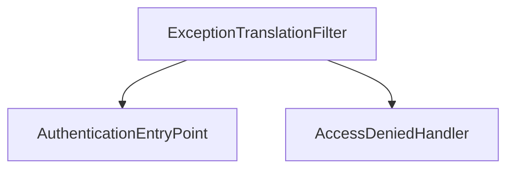

# 第 18 章：异常体系与 i18n：前后端一致错误体验

> 本章对齐 [docs/template.md](../template.md)，建议字数 3000–5000。

---

## 1 项目背景（约 500 字）

### 业务场景

全球化运营后台需 **中英文错误提示**；移动端要 **稳定错误码**（如 `AUTH_1001`）；**浏览器** 访问需 **重定向登录**，**XHR** 需 **JSON 401**。产品要求：**同一类安全事件在不同端形态不同，但错误码一致**。

### 痛点放大

`ExceptionTranslationFilter` 将 **`AuthenticationException` → 401/302**，**`AccessDeniedException` → 403**；若使用默认 **HTML 行为**，SPA 会收到 **整页 HTML** 而非 JSON。需自定义 **`AuthenticationEntryPoint` / `AccessDeniedHandler`**，并结合 **`MessageSource`** 做 i18n。

### 流程图



---

## 2 项目设计：剧本式交锋对话（约 1200 字）

**场景**：前端收到 302，但期望 401 JSON。

**小胖**

「异常还能国际化？用户看得懂 `InsufficientAuthenticationException` 吗？」

**小白**

「怎么区分 **XHR** 与 **普通导航**？看 `Accept`？」

**大师**

「常见做法：**`Accept` 含 `application/json`**、或 **`X-Requested-With: XMLHttpRequest`**、或 **统一 `/api/**` 前缀** 走 JSON。`AuthenticationEntryPoint` 里分支处理。」

**技术映射**：`HttpServletRequest` 判断；`MediaType`。

**小白**

「403 体能不能告诉用户『缺哪个权限』？」

**大师**

「要平衡 **可用性** 与 **信息泄露**（攻击者枚举权限）。可返回 **粗粒度原因** + **统一错误码**。」

**技术映射**：`AccessDeniedHandler`；错误码表。

**小胖**

「i18n：异常类名翻译？」

**大师**

「用 **message key**，如 `error.auth.required`，由 **`MessageSource` + `LocaleResolver`** 解析；**日志**仍用英文 key。」

**技术映射**：`spring.messages.basename`；`LocaleContextHolder`。

**小白**

「OAuth2 Resource Server 的 `invalid_token` 与这里关系？」

**大师**

「Resource Server 有 **BearerTokenAuthenticationEntryPoint** 一类默认行为；**统一风格**可在 **`AuthenticationEntryPoint` 组合** 或 **全局 `@ControllerAdvice`**（注意顺序）。」

---

## 3 项目实战（约 1500–2000 字）

### 环境准备

- `messages.properties`、`messages_zh_CN.properties`。
- 自定义 `AuthenticationEntryPoint`、`AccessDeniedHandler` Bean。

### 步骤 1：JSON Entry Point

```java
@Component
public class JsonAuthenticationEntryPoint implements AuthenticationEntryPoint {
  private final ObjectMapper mapper = new ObjectMapper();
  @Override
  public void commence(HttpServletRequest req, HttpServletResponse res, AuthenticationException e)
      throws IOException {
    res.setStatus(401);
    res.setContentType("application/json;charset=UTF-8");
    mapper.writeValue(res.getOutputStream(), Map.of(
        "code", "AUTH_REQUIRED",
        "message", MessageHelper.get("error.auth.required", req)));
  }
}
```

### 步骤 2：绑定 Security

```java
http.exceptionHandling(e -> e
    .authenticationEntryPoint(jsonAuthenticationEntryPoint)
    .accessDeniedHandler(jsonAccessDeniedHandler));
```

### 步骤 3：403 Handler

```java
res.setStatus(403);
mapper.writeValue(res.getOutputStream(), Map.of("code", "FORBIDDEN", ...));
```

### 步骤 4：验证请求头

用 curl：

```bash
curl -i -H "Accept: application/json" http://localhost:8080/api/me
```

### 步骤 5：切换语言

```bash
curl -i -H "Accept-Language: zh-CN" ...
```

### 截图说明（供插图或评审时对照）

| 编号 | 建议截图内容 | 预期画面（文字描述） |
|------|----------------|----------------------|
| 图 18-1 | Postman 401 响应体 | JSON 含 `code`、`message`，无堆栈。 |
| 图 18-2 | 浏览器普通访问受保护页 | **302** 到 `/login`（或自定义）。 |
| 图 18-3 | `messages_zh_CN.properties` | 存在 `error.auth.required` 等键。 |
| 图 18-4 | 日志 | **无** token 密码明文；仅 traceId + code。 |

### 可能遇到的坑

| 坑 | 处理 |
|----|------|
| 双端行为不一致 | 契约测试 |
| 泄露堆栈/权限细节 | 生产关闭 `debug` |
| 与 `@ControllerAdvice` 冲突 | 理清优先级 |

---

## 4 项目总结（约 500–800 字）

### 思考题

1. `BearerTokenError` 与 Servlet `AuthenticationException` 统一包装？
2. **Problem Details**（RFC 7807）是否采用？

### 推广计划提示

- **前后端**：错误码表纳入 **OpenAPI** 文档。

---

*本章完。*
