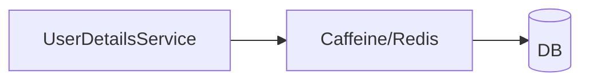

# 第 19 章：自定义 UserDetailsService 与缓存：性能与一致性

> 本章对齐 [docs/template.md](../template.md)，建议字数 3000–5000。

---

## 1 项目背景（约 500 字）

### 业务场景

高 QPS 下 **`loadUserByUsername` 每次查库** 成为瓶颈；同时 **改密、锁号、改角色** 必须 **尽快生效**。缓存策略若不当，会出现 **用户已锁仍能访问** 或 **权限延迟生效** 引发 **越权窗口**。

### 痛点放大

缓存与 **Session 中已缓存的 `Authentication`** 可能 **不一致**；需在 **改密/锁号** 时 **使 Session 失效** 或 **刷新 Authentication**。Spring 提供 **`UserCache`/`CachingUserDetailsService`** 等组合模式（以版本为准）。

### 流程图



---

## 2 项目设计：剧本式交锋对话（约 1200 字）

**场景**：用户改密后「还能用旧页面点一分钟」。

**小胖**

「加 `@Cacheable` 不就完了？Redis 里放整个 `UserDetails`？」

**小白**

「改密后旧 Session 还能用吗？缓存 TTL 五分钟是不是灾难？」

**大师**

「**Session 续存** 与 **DB 权威** 冲突时，以 **业务要求** 为准：金融常 **立即失效所有 Session**；一般站点可 **短 TTL + 事件失效**。**`UserDetails` 缓存**只优化 **加载路径**，不替代 **授权审计**。」

**技术映射**：`SessionInformation.expireNow`；`UserCache.removeUserFromCache`。

**小白**

「`ConcurrentMapCache` 够吗？」

**大师**

「单机够；**集群** 用 **Redis** 并处理 **缓存击穿**（互斥、空值缓存）。」

**技术映射**：Redis；`sync=true`（Spring Cache）。

**小胖**

「权限存在 JWT 里，还缓存 `UserDetails` 吗？」

**大师**

「若 **JWT 自包含角色** 且 **无服务端撤销**，改角色要等 **token 过期**；这是 **模型问题** 不是缓存问题。」

**技术映射**：JWT **撤销** 与 **版本号/黑名单**（第 20～21 章）。

**小白**

「`@Cacheable` 放在 `UserDetailsService` 上还是包装类？」

**大师**

「常用 **装饰器 `CachingUserDetailsService`** 或 **Spring Cache 代理**；注意 **自调用** 不走代理。」

---

## 3 项目实战（约 1500–2000 字）

### 环境准备

- Caffeine 或 Redis；`spring-boot-starter-cache`。

### 步骤 1：基础 `UserDetailsService`

从 JPA/MyBatis 加载用户与权限。

### 步骤 2：缓存装饰（概念）

```java
@Bean
UserDetailsService cachingUsers(UserDetailsService delegate, CacheManager cacheManager) {
  return new CachingUserDetailsService(delegate); // 或 Spring Cache 包装
}
```

（类名以当前版本 API 为准。）

### 步骤 3：改密事件失效

```java
@TransactionalEventListener
void onPasswordChanged(PasswordChangedEvent e) {
  userCache.removeUserFromCache(e.getUsername());
  sessionRegistry.getAllSessions(e.getPrincipal(), false)
      .forEach(SessionInformation::expireNow);
}
```

### 步骤 4：压测

JMeter：**线程数阶梯上升**，对比 **DB QPS** 与 **命中率**。

### 步骤 5：监控

暴露缓存命中率、驱逐次数（Micrometer）。

### 截图说明（供插图或评审时对照）

| 编号 | 建议截图内容 | 预期画面（文字描述） |
|------|----------------|----------------------|
| 图 19-1 | 压测报告 | 开启缓存后 **DB 查询数** 明显下降。 |
| 图 19-2 | Redis 客户端 | `userCache::*` key 在改密后被删除。 |
| 图 19-3 | 应用日志 | 改密后 **Session 失效** 相关审计行。 |
| 图 19-4 | Grafana 面板 | 缓存命中率曲线（若接入）。 |

### 可能遇到的坑

| 坑 | 处理 |
|----|------|
| 缓存穿透 | 空用户短 TTL |
| 集群一致 | Redis Pub/Sub 广播失效 |
| Session 仍持旧权限 | 强制 `expireNow` 或刷新 `Authentication` |

---

## 4 项目总结（约 500–800 字）

### 思考题

1. `UserDetails` 中 **权限列表** 缓存后，角色变更窗口？
2. 与 **Spring Cache `@CacheEvict`** 结合模式？

### 推广计划提示

- **SRE**：把「改密后仍在线」列为 **告警指标**（若业务不允许）。

---

*本章完。*
