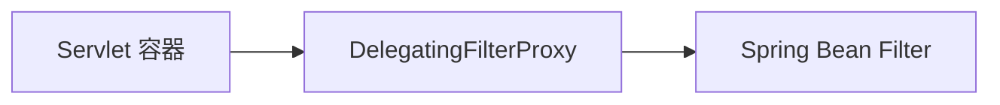

# 第 2 章：DelegatingFilterProxy 与 Security 过滤器链入门

> 本章对齐 [docs/template.md](../template.md)，建议字数 3000–5000。

---

## 1 项目背景（约 500 字）

### 业务场景

老系统已上线多年，Controller 上千个，产品要求 **在不改每个接口的前提下** 接入统一登录与鉴权。技术约束：必须使用 Servlet `Filter`，且希望 **Filter 本身是 Spring Bean**（便于注入 `UserDetailsService`、配置中心等）。

### 痛点放大

若直接在 `web.xml` 注册一堆 Filter，**无法享受依赖注入**，配置与业务割裂；若用 Spring MVC 拦截器，则 **DispatcherServlet 之后** 才生效，静态资源、错误分发等路径容易「漏网」。需要一种机制：**Servlet 容器里只注册一个代理 Filter，把请求委托给 Spring 容器中的真正 Filter**。

### 流程图



**说明**：`DelegatingFilterProxy` 类来自 **Spring Framework**（`org.springframework.web.filter`），Spring Security 通过 **`springSecurityFilterChain`** 这一 Bean 名与 `DelegatingFilterProxy` 对接（见本仓库 `web` 模块集成测试中对过滤器名的断言）。

---

## 2 项目设计：剧本式交锋对话（约 1200 字）

**场景**：老项目改造 POC。

**小胖**

「为啥不直接在 web.xml 写一百个 Filter？一个一个加多直观。」

**小白**

「顺序谁维护？Filter 里要 `@Autowired` 怎么办？」

**大师**

「`DelegatingFilterProxy` 就像 **前台总机**：容器只认识总机号码，真正转分机（Spring Bean）由 Spring 管。这样 **生命周期、依赖注入、Profile** 都在 Spring 一侧完成。」

**技术映射**：`DelegatingFilterProxy` → Servlet 与 Spring 容器的桥；`targetBeanName` → `springSecurityFilterChain`。

**小胖**

「那 Spring Security 的链在哪？总机后面是一根线还是一捆线？」

**小白**

「我听说叫 `FilterChainProxy`，和 `SecurityFilterChain` 啥关系？」

**大师**

「**`FilterChainProxy` 才是 Security 注册的那个 Bean 本体**（概念上），它内部持有 **多条** `SecurityFilterChain`，按请求匹配选一条执行。你配置的 DSL，最终都变成 **排序后的 Filter 列表**。」

**技术映射**：`FilterChainProxy` → 总调度；`SecurityFilterChain` → 一条可匹配子链。

**小胖**

「所以我们业务代码还是写 Controller，安全全在 Filter 里搞定？」

**小白**

「性能呢？每个请求多跑这么多 Filter？」

**大师**

「安全本就有成本；Spring Security 的 Filter 多数 **短路设计**（能尽早拒绝就尽早）。后续章节会讲 **只匹配需要的链**、**无状态 API** 等减耗手段。」

**技术映射**：Filter 顺序 → `Order` / 链内顺序；性能 → 第 35 章。

---

## 3 项目实战（约 1500–2000 字）

### 环境准备

Spring Boot 应用已引入 `spring-boot-starter-security`。Boot 自动向 Servlet 容器注册 `DelegatingFilterProxy`，并指向 `springSecurityFilterChain`。

### 步骤 1：确认过滤器 Bean 名称

在调试日志（`logging.level.org.springframework.security=DEBUG`）中可见 `FilterChainProxy` 初始化。无需手写 `web.xml`。

### 步骤 2：最小 `SecurityFilterChain`

```java
@Configuration
@EnableWebSecurity
public class SecurityConfig {
  @Bean
  SecurityFilterChain chain(HttpSecurity http) throws Exception {
    http.authorizeHttpRequests(a -> a.anyRequest().permitAll());
    return http.build();
  }
}
```

**目标**：理解 **即使没有显式声明**，Security 仍会装配默认 Filter（后续章节逐步收紧规则）。

### 步骤 3：对比 `permitAll` 与默认

注释掉 `permitAll` 后，访问任意 URL 应被保护。

### 测试验证

```bash
curl -i http://localhost:8080/actuator/health
# 视是否引入 actuator 与配置而定；重点观察 302/401 行为变化
```

### 可能遇到的坑

| 坑 | 处理 |
|----|------|
| 自定义 `FilterRegistrationBean` 与 Security Filter 顺序冲突 | 使用 `Ordered` 或 `OncePerRequestFilter` 并查阅 Boot 文档 |
| 非 Boot 环境忘记 `AbstractSecurityWebApplicationInitializer` | 手动注册 `DelegatingFilterProxy` |

---

## 4 项目总结（约 500–800 字）

### 优点与缺点

| 维度 | DelegatingFilterProxy + Security | 纯拦截器 |
|------|-----------------------------------|----------|
| 覆盖范围 | 覆盖整个 Servlet 请求生命周期 | 主要在 MVC 层 |
| DI 支持 | 好 | 需额外桥接 |
| 复杂度 | 概念多 | 上手快 |

### 适用场景

- Servlet 栈 Spring 应用；需要集中安全策略。

### 不适用场景

- 非 Servlet（纯 Netty 协议）需换集成方式。

### 常见踩坑

1. 误以为 `DelegatingFilterProxy` 在 spring-security jar 内（实为 **spring-web**）。
2. 双 Filter 注册导致「重复执行」或顺序错乱。

### 思考题

1. `springSecurityFilterChain` 这个 Bean 的类型实际是什么？（提示：`FilterChainProxy`）
2. 若同一应用有两套 URL 规则，应拆两条 `SecurityFilterChain` 还是一条里写复杂 matcher？（提示：第 31 章）

### 推广计划提示

- **开发**：画一张「容器 Filter → DelegatingFilterProxy → FilterChainProxy」示意图做团队 onboarding。
- **运维**：发布时注意 Session 黏性与 Filter 顺序对链路追踪的影响。

---

*本章完。*
