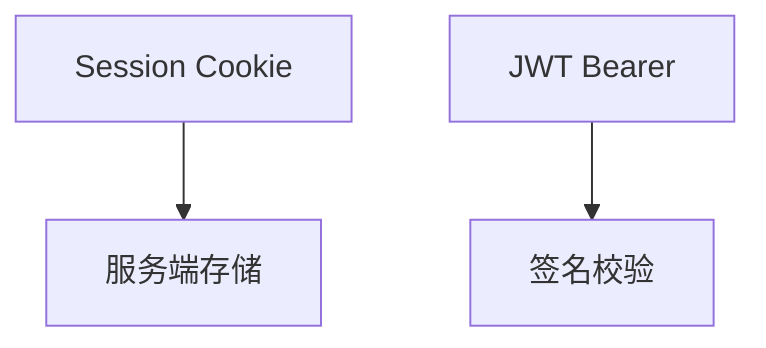

# 第 20 章：无状态 API：Session vs JWT 选型

> 本章对齐 [docs/template.md](../template.md)，建议字数 3000–5000。

---

## 1 项目背景（约 500 字）

### 业务场景

移动端与 SPA 需要 **水平扩展**；运维希望 **无 Session 黏性**。架构评审要产出：**何时用 Cookie Session、何时用 JWT、何时用 Opaque Token + Introspection**。

### 痛点放大

JWT **无法默认「服务端单点撤销」**（除非黑名单/极短 TTL）；Session **集群复制/Redis** 有运维成本但 **撤销容易**。没有边界分析会 **选错**，导致 **盗号后无法踢下线** 或 **Redis 故障全站登录挂**。

### 流程图

---

## 2 项目设计：剧本式交锋对话（约 1200 字）

**场景**：「JWT 更潮」是否成立？

**小胖**

「JWT 不是省服务器内存吗？为啥大厂还用 Session？」

**小白**

「用户被盗号，JWT 怎么立即作废？」

**大师**

「**JWT 自包含**：校验快、跨服务方便，但 **撤销难**。**Session**：服务端存储，**删 Session 即撤销**。折中：**短 access JWT + refresh + rotation**，或 **opaque token + introspection**。」

**技术映射**：OAuth2 **Token 模型**；**黑名单/jti**。

**小白**

「网关验签了，应用还要验吗？」

**大师**

「**零信任**下 **应用仍应校验 audience/scope**；网关可被绕过或配置错误。」

**技术映射**：**纵深防御**；`aud` claim。

**小胖**

「Cookie 里放 JWT 和 Session 有啥区别？」

**大师**

「Cookie 只是 **载体**；**HttpOnly/SameSite** 决定 XSS/CSRF 面；**JWT 内容**决定是否自包含用户信息。」

**技术映射**：存储 vs 载体；**XSS** 风险。

**小白**

「合规：JWT 里能放手机号吗？」

**大师**

「**最小化 claims**；PII 放 **服务端** 或 **加密 claims**（仍要密钥管理）。」

---

## 3 项目实战（约 1500–2000 字）

### 步骤 1：对比表（团队必须落文档）

| 维度 | Session | JWT access | Opaque |
|------|---------|--------------|--------|
| 撤销 | 易 | 难（需策略） | 易（中心） |
| 扩展 | 需存储 | 易 | 中 |
| 时钟 | 一般 | **skew** | 中 |

### 步骤 2：试点方案 A（Session + Redis）

压测 Session 创建与读取；模拟 Redis 故障 **降级策略**。

### 步骤 3：试点方案 B（Resource Server JWT）

配置 `issuer-uri`；测 **token 过期** 与 **刷新**。

### 步骤 4：威胁建模工作坊

STRIDE 简表：**盗 token、重放、算法降级**。

### 步骤 5：决策记录（ADR）

结论、备选方案、到期复审时间。

### 截图说明（供插图或评审时对照）

| 编号 | 建议截图内容 | 预期画面（文字描述） |
|------|----------------|----------------------|
| 图 20-1 | ADR 文档 | 记录选型理由与风险。 |
| 图 20-2 | 网关与应用双重校验序列图 | 箭头标注 **aud/scope** 校验点。 |
| 图 20-3 | jwt.io（仅脱敏 token） | claims 结构 **无 PII**（教学）。 |
| 图 20-4 | Redis 监控 | Session 连接数与延迟。 |

### 可能遇到的坑

| 坑 | 处理 |
|----|------|
| JWT 内塞过多 PII | 最小 claims |
| 时钟 skew | `leeway` NTP |
| 网关与应用校验不一致 | 契约测试 |

---

## 4 项目总结（约 500–800 字）

### 思考题

1. **Opaque token** 与 JWT 在 **中间件负载** 上的差异？
2. **BFF** 持有 Session、后端 JWT 是否常见？

### 推广计划提示

- **架构组**：每季度复审 **token 生命周期** 与 **密钥轮换**。

---

*本章完。*
