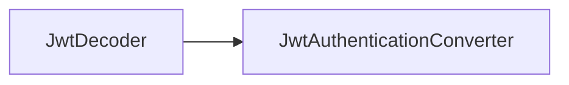

# 第 21 章：OAuth2 Resource Server + JWT：资源方最小实践

> 本章对齐 [docs/template.md](../template.md)，建议字数 3000–5000。

---

## 1 项目背景（约 500 字）

### 业务场景

微服务 B 接收网关转发的 **Bearer JWT**，需 **校验签名**、**issuer**、**audience**、**scope**，并映射为 **`GrantedAuthority`**。安全要求：**禁止 alg:none**、**校验 exp/nbf**、**绑定 azp/client_id**（按规范）。

### 痛点放大

手写 `JwtDecoder` 易 **漏验证**；使用 `spring-boot-starter-oauth2-resource-server` 可 **对齐标准**，但仍要配置 **issuer**、**clock skew**、**权限映射**。

### 流程图



源码：`oauth2/oauth2-resource-server/`。

---

## 2 项目设计：剧本式交锋对话（约 1200 字）

**场景**：`scope` 与 `ROLE_` 如何映射？

**小胖**

「`JwtDecoder` 和 JWK 啥关系？」

**小白**

「`issuer-uri` 一行配置背后拉了什么？」

**大师**

「通常拉 **OpenID Provider Metadata** 与 **JWK Set URI**，缓存 JWK；**本地验签** 无需每次调用 IdP introspection（与 opaque 区分）。」

**技术映射**：`JwtDecoder`；`NimbusJwtDecoder.withIssuerLocation`。

**小白**

「多租户 iss 怎么办？」

**大师**

「**按 iss claim 路由** 到不同 `JwtDecoder`，或 **统一 Issuer** 由网关剥离租户（架构取舍）。」

**技术映射**：`DelegatingOAuth2TokenValidator`；多 `JwtDecoder`。

**小胖**

「`scope` 要加 `ROLE_` 前缀吗？」

**大师**

「看 **前端约定**；常用 **`JwtAuthenticationConverter` 把 `SCOPE_xxx` 映射为 `GrantedAuthority`**。」

**技术映射**：`JwtGrantedAuthoritiesConverter`；**前缀常量**。

**小白**

「资源服务器还要调 UserDetailsService 吗？」

**大师**

「若 **JWT 已含授权**，可不查库；若 **需本地账户状态**（锁号），可 **组合 `JwtAuthenticationProvider` + 用户服务**。」

---

## 3 项目实战（约 1500–2000 字）

### 环境准备

- Keycloak/Auth0/自建 AS 发 JWT；或 **测试用 rsa keypair**。

### 步骤 1：依赖

```xml
<dependency>
  <groupId>org.springframework.boot</groupId>
  <artifactId>spring-boot-starter-oauth2-resource-server</artifactId>
</dependency>
```

### 步骤 2：最小配置

```yaml
spring:
  security:
    oauth2:
      resourceserver:
        jwt:
          issuer-uri: https://idp.example.com/realms/demo
```

### 步骤 3：权限映射

```java
@Bean
JwtAuthenticationConverter jwtAuthenticationConverter() {
  JwtGrantedAuthoritiesConverter g = new JwtGrantedAuthoritiesConverter();
  g.setAuthorityPrefix("SCOPE_");
  g.setAuthoritiesClaimName("scope");
  JwtAuthenticationConverter c = new JwtAuthenticationConverter();
  c.setJwtGrantedAuthoritiesConverter(g);
  return c;
}
```

### 步骤 4：`SecurityFilterChain`

```java
http.authorizeHttpRequests(a -> a.anyRequest().authenticated());
http.oauth2ResourceServer(o -> o.jwt(j -> j.jwtAuthenticationConverter(jwtAuthenticationConverter())));
```

### 步骤 5：测试

```java
import static org.springframework.security.test.web.servlet.request.SecurityMockMvcRequestPostProcessors.jwt;

mockMvc.perform(get("/api/me").with(jwt().token(token)))
    .andExpect(status().isOk());
```

### 截图说明（供插图或评审时对照）

| 编号 | 建议截图内容 | 预期画面（文字描述） |
|------|----------------|----------------------|
| 图 21-1 | Keycloak 客户端 scope 配置 | 勾选 `openid`、`profile`、自定义 API scope。 |
| 图 21-2 | 解码后 JWT claims（脱敏） | `iss`、`aud`、`exp`、`scope` 齐全。 |
| 图 21-3 | 401 响应 | `WWW-Authenticate: Bearer` 或项目自定义 JSON。 |
| 图 21-4 | 测试绿 | `MockMvc` + `jwt()` 处理器通过。 |

### 可能遇到的坑

| 坑 | 处理 |
|----|------|
| scope 与 authority 不一致 | 单测覆盖映射器 |
| 时钟漂移 | NTP / `clockSkew` |
| 多 aud | `OAuth2TokenValidator` 自定义 |

---

## 4 项目总结（约 500–800 字）

### 思考题

1. **Opaque token** 何时用 **introspection**？
2. 网关验签与应用验签 **重复** 的价值？

### 推广计划提示

- **平台**：统一 **JWKS 轮换** 与 **告警**。

---

*本章完。*
