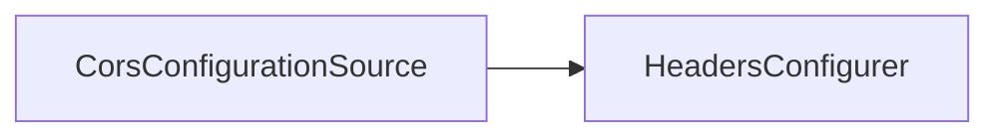

# 第 22 章：CORS 与安全头：前后端分离网关

> 本章对齐 [docs/template.md](../template.md)，建议字数 3000–5000。

---

## 1 项目背景（约 500 字）

### 业务场景

SPA 部署在 `app.example.com`，API 在 `api.example.com`，需 **CORS**；安全团队要求 **HSTS、CSP、X-Content-Type-Options、Referrer-Policy**。同时 **Cookie 会话** 与 **CSRF** 策略必须一致（第 12 章）。

### 痛点放大

**`Access-Control-Allow-Origin: *` + `credentials: include`** 在浏览器里 **无效/不安全**；**宽松 CORS** 与 **宽松 Cookie** 组合会放大风险。

### 流程图



---

## 2 项目设计：剧本式交锋对话（约 1200 字）

**场景**：「CORS 配了为啥还跨域失败？」

**小胖**

「CORS 不是前端配吗？后端也要管？」

**小白**

「浏览器到底检查谁的响应头？」

**大师**

「**浏览器**检查 **API 响应** 是否带 **正确的 CORS 头**；前端 **发起请求**，后端 **声明允许**。」

**技术映射**：`CorsFilter` / Spring MVC CORS。

**小白**

「`allowCredentials(true)` 时 origin 能用 `*` 吗？」

**大师**

「**规范不允许**；必须 **显式白名单 origin**。」

**技术映射**：`CorsConfiguration.setAllowedOrigins`。

**小胖**

「安全头 `Content-Security-Policy` 一上，内联脚本全挂？」

**大师**

「**渐进式**：先 `report-only` 收集违规，再 enforce；**nonce/hash** 管理静态资源。」

**技术映射**：`ContentSecurityPolicyHeaderWriter`；`Report-To`。

**小白**

「Nginx 已经加了 HSTS，Spring 还要加吗？」

**大师**

「**避免双配冲突**；通常 **边缘终止 TLS** 时由网关加 **HSTS**，应用层加 **CSP** 等。**一致即可**。」

---

## 3 项目实战（约 1500–2000 字）

### 环境准备

- 本地 `hosts` 模拟 `app.` 与 `api.` 子域（可选）。

### 步骤 1：Spring Security CORS

```java
@Bean
CorsConfigurationSource cors() {
  CorsConfiguration c = new CorsConfiguration();
  c.setAllowedOrigins(List.of("https://app.example.com"));
  c.setAllowCredentials(true);
  c.addAllowedHeader(CorsConfiguration.ALL);
  c.addAllowedMethod(CorsConfiguration.ALL);
  UrlBasedCorsConfigurationSource s = new UrlBasedCorsConfigurationSource();
  s.registerCorsConfiguration("/**", c);
  return s;
}

http.cors(Customizer.withDefaults());
```

### 步骤 2：预检请求验证

```bash
curl -i -X OPTIONS https://api.example.com/api/me \
  -H "Origin: https://app.example.com" \
  -H "Access-Control-Request-Method: POST"
```

期望 **204/200** 且含 `Access-Control-Allow-Origin` 为 **具体 origin**。

### 步骤 3：安全头

```java
http.headers(h -> {
  h.contentTypeOptions(Customizer.withDefaults());
  h.frameOptions(frame -> frame.sameOrigin());
  // CSP 按策略添加
});
```

### 步骤 4：DevTools 验证

浏览器 Network 查看 **OPTIONS** 与 **实际请求** 响应头。

### 截图说明（供插图或评审时对照）

| 编号 | 建议截图内容 | 预期画面（文字描述） |
|------|----------------|----------------------|
| 图 22-1 | 浏览器 Console | 无 CORS 红错；若有，显示 **blocked by CORS policy** 及缺失头。 |
| 图 22-2 | Network → Response Headers | 含 `access-control-allow-origin` 为 **精确 origin**。 |
| 图 22-3 | Security 面板（Chrome） | **CSP** 报告或违规列表（若 report-only）。 |
| 图 22-4 | Nginx 与应用响应头对比 | 避免 **重复或冲突** 的 `Strict-Transport-Security`。 |

### 可能遇到的坑

| 坑 | 处理 |
|----|------|
| 本地 http 与生产 https 混用 | Profile 分配置 |
| 反向代理剥离 Origin | 配置 `Forwarded` 信任 |
| CSP 误杀 | report-only 先行 |

---

## 4 项目总结（约 500–800 字）

### 思考题

1. CORS 与 **CSRF** 在 **Cookie 会话** 下的组合策略？
2. `Referrer-Policy` 对 **OAuth redirect** 的影响？

### 推广计划提示

- **前端**：构建时注入 **API 基址**；避免硬编码。

---

*本章完。*
