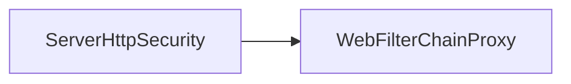

# 第 23 章：Spring Security Reactive：WebFlux 安全链

> 本章对齐 [docs/template.md](../template.md)，建议字数 3000–5000。

---

## 1 项目背景（约 500 字）

### 业务场景

网关或高并发 IO 服务使用 **Spring WebFlux**，不能使用 Servlet `FilterChain` 心智；需要 **`ServerHttpSecurity` → `SecurityWebFilterChain`**。团队从 MVC 迁移时，常误用 **`SecurityContextHolder`** 导致 **取不到用户**。

### 痛点放大

响应式线程模型下 **ThreadLocal 失效**；必须使用 **`ReactiveSecurityContextHolder`** 与 **Reactor Context** 传播身份。

### 流程图



源码：`config/.../web/server/ServerHttpSecurity.java`；`web/.../server/WebFilterChainProxy.java`。

---

## 2 项目设计：剧本式交锋对话（约 1200 字）

**场景**：`subscribe` 里 `SecurityContextHolder` 为 null。

**小胖**

「WebFlux 安全跟 MVC 配法差不多吧？复制粘贴？」

**小白**

「`WebFilter` 和 Servlet Filter 顺序一张表吗？」

**大师**

「**概念对应**：`SecurityWebFilterChain` ≈ `SecurityFilterChain`；但 **执行在 Netty/Reactor** 上，**不能**用 ThreadLocal。」

**技术映射**：`ReactiveSecurityContextHolder`；`Context`。

**小白**

「`principal` 注入 `Mono<Principal>` 啥原理？」

**大师**

「WebFlux 与 Spring Security 集成 **自动把认证放进 Reactor Context**；控制器参数 **异步解析**。」

**技术映射**：`@AuthenticationPrincipal` Reactive 变体。

**小胖**

「阻塞 JDBC 能用在 WebFlux 里吗？」

**大师**

「**禁止**在 event loop 阻塞；用 **R2DBC**、**弹性线程池** 或 **隔离调度器**。」

**技术映射**：`subscribeOn(Schedulers.boundedElastic())`；架构取舍。

**小白**

「CSRF 在 WebFlux 默认开吗？」

**大师**

「以 **当前版本文档** 为准；前后端分离常 **显式配置**。」

---

## 3 项目实战（约 1500–2000 字）

### 环境准备

`spring-boot-starter-webflux`、`spring-boot-starter-security`。

### 步骤 1：最小 `SecurityWebFilterChain`

```java
@Bean
SecurityWebFilterChain springSecurity(ServerHttpSecurity http) {
  return http.authorizeExchange(e -> e.anyExchange().authenticated())
      .httpBasic(withDefaults())
      .build();
}
```

### 步骤 2：读取当前用户

```java
@GetMapping("/me")
Mono<String> me(@AuthenticationPrincipal Mono<Principal> principal) {
  return principal.map(Principal::getName);
}
```

### 步骤 3：`ReactiveSecurityContextHolder`

```java
return ReactiveSecurityContextHolder.getContext()
    .map(ctx -> ctx.getAuthentication().getName())
    .flatMap(name -> service.findForUser(name));
```

### 步骤 4：集成测试

`WebTestClient` + `mockJwt()` 或 `httpBasic`。

### 截图说明（供插图或评审时对照）

| 编号 | 建议截图内容 | 预期画面（文字描述） |
|------|----------------|----------------------|
| 图 23-1 | IDEA Reactor 调试 | `Context` 中含 `SecurityContext`（视工具支持）。 |
| 图 23-2 | `/me` 响应 | 401 未认证 / 200 返回用户名。 |
| 图 23-3 | 阻塞点检测 | **BlockHound** 报告（若引入）显示 JDBC 阻塞。 |
| 图 23-4 | WebTestClient 测试报告 | 绿，含 JWT/Basic 用例。 |

### 可能遇到的坑

| 坑 | 处理 |
|----|------|
| 阻塞调用 | 弹性线程或换 R2DBC |
| 混用 MVC + WebFlux | 避免同应用双栈（除非刻意） |
| CSRF 配置遗漏 | 查文档 |

---

## 4 项目总结（约 500–800 字）

### 思考题

1. RSocket 安全模块与 WebFlux 关系？
2. Gateway（WebFlux）与下游 Servlet 服务 **信任边界**？

### 推广计划提示

- **团队**：建立 **Reactive 代码评审清单**（阻塞、Context）。

---

*本章完。*
