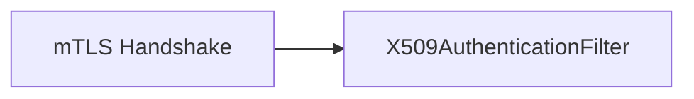

# 第 24 章：X.509/客户端证书：双向 TLS 内网调用

> 本章对齐 [docs/template.md](../template.md)，建议字数 3000–5000。

---

## 1 项目背景（约 500 字）

### 业务场景

服务间 **mTLS**：客户端证书标识调用方，**无用户名密码**。适用于 **内网零信任**、**设备接入**。运维要求：**证书轮换、吊销列表（CRL）/OCSP**、**与服务网格 SPIFFE 身份对齐**。

### 痛点放大

配置错误会导致 **全场 403** 或 **误信伪造证书**（负载均衡 **伪造 client cert 头**）。Spring Security **`x509()`** 将证书映射为 **`Authentication`**。

### 流程图



---

## 2 项目设计：剧本式交锋对话（约 1200 字）

**场景**：LB 终止 TLS，应用只看到 Header。

**小胖**

「有 HTTPS 还要 Spring Security 干啥？」

**小白**

「证书身份如何映射成 `ROLE_SERVICE_A`？」

**大师**

「TLS **验证证书链**；Security **把证书解析为 `X509AuthenticationToken`**，再用 **`UserDetailsService` / `AuthenticationUserDetailsService`** 映射角色。」

**技术映射**：`PreAuthenticatedAuthenticationProvider`；`SubjectDnX509PrincipalExtractor`。

**小白**

「LB 传 `X-SSL-CLIENT-CERT` 头可信吗？」

**大师**

「**仅当** mTLS 在 **可信侧** 终止且 **内网联路防伪造**；否则攻击者可 **伪造头**。更优：**端到端 mTLS** 或 **SPIFFE 验证**。」

**技术映射**：**信任边界**；**Ingress 配置**。

**小胖**

「证书过期监控谁做？」

**大师**

「**Prometheus** 告警 **剩余天数**；**轮换自动化**（cert-manager）。」

---

## 3 项目实战（约 1500–2000 字）

### 环境准备

- 自建 CA 或用 mkcert；**服务端 truststore** 含 **客户端 CA**。

### 步骤 1：Tomcat 客户端认证

```properties
server.ssl.client-auth=need
```

（属性名以 Boot 版本为准。）

### 步骤 2：启用 X509

```java
http.x509(withDefaults());
http.authorizeHttpRequests(a -> a.anyRequest().authenticated());
```

### 步骤 3：映射角色

```java
@Bean
public AuthenticationUserDetailsService<X509Certificate> x509UserDetails() {
  return cert -> User.withUsername(cert.getSubjectX500Principal().getName())
      .password("")
      .authorities("ROLE_SERVICE")
      .build();
}
```

### 步骤 4：curl mTLS

```bash
curl --cert client.pem --key client.key https://localhost:8443/api
```

### 截图说明（供插图或评审时对照）

| 编号 | 建议截图内容 | 预期画面（文字描述） |
|------|----------------|----------------------|
| 图 24-1 | 浏览器客户端证书选择框 | 仅双向 TLS 场景可见。 |
| 图 24-2 | curl 成功/失败对比 | 无 cert → **handshake failure** 或 **403**。 |
| 图 24-3 | 证书详情 | Subject/Issuer、有效期字段。 |
| 图 24-4 | 监控面板 | cert **expiry** 告警阈值。 |

### 可能遇到的坑

| 坑 | 处理 |
|----|------|
| 自签 CA 不信任 | 导入 truststore |
| LB 头伪造 | 禁止直接信任 Header |
| 证书链不全 | 配全链 |

---

## 4 项目总结（约 500–800 字）

### 思考题

1. **Istio mTLS** 与应用层 X509 的边界？
2. **SPIFFE ID** 如何映射到 Spring `GrantedAuthority`？

### 推广计划提示

- **运维**：证书 **轮换演练** 每年至少一次。

---

*本章完。*
