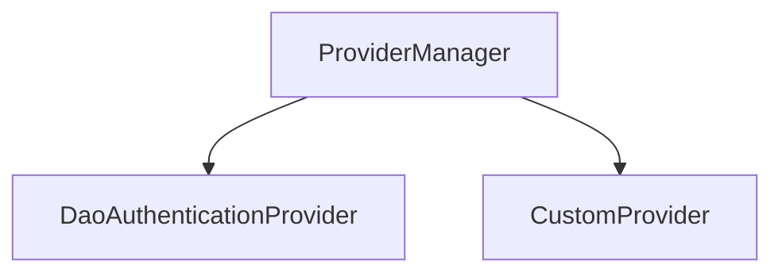

# 第 27 章：AuthenticationManager/ProviderManager 源码走读

> 本章对齐 [docs/template.md](../template.md)，建议字数 3000–5000。

---

## 1 项目背景（约 500 字）

### 业务场景

团队要接 **多因子认证**、**LDAP + 本地备库**，需读懂 **`AuthenticationManager.authenticate` 调用链** 与 **扩展点**：在哪插入 **自定义 `AuthenticationProvider`**、**何时擦除凭证**。

### 痛点放大

误以为 **`AuthenticationManager` 是魔法单例**；实际是 **`ProviderManager` 委托列表**，**supports → authenticate** 顺序执行，**成功即返回** 或 **聚合异常**。

### 流程图



源码：`core/.../authentication/ProviderManager.java`。

---

## 2 项目设计：剧本式交锋对话（约 1200 字）

**场景**：自定义 OTP Provider 放哪？

**小胖**

「为啥不一个 `if-else` 写登录？非要 Provider？」

**小白**

「`ParentAuthenticationManager` 干啥？多租户？」

**大师**

「**开闭原则**：新增认证方式 **加 Provider**，而不是改核心 `if`。`ProviderManager` 遍历 **谁 supports 这种 Token**。」

**技术映射**：`Authentication` 类型；`supports(Class)`。

**小白**

「`eraseCredentials` 何时调用？」

**大师**

「成功认证后 **清除密码** 等敏感凭据，避免 **在 SecurityContext 中长期驻留**（具体调用点以源码为准）。」

**技术映射**：`eraseCredentialsAfterAuthentication`。

**小胖**

「多个 Provider 都 support 同一 Token 会怎样？」

**大师**

「**顺序** 决定；**配置顺序** 即优先级。」

**技术映射**：`ProviderManager` 构造顺序；`HttpSecurity` 注册顺序。

**小白**

「Reactive 呢？」

**大师**

「对照 **`ReactiveAuthenticationManager`**，模式类似但 **异步**。」

---

## 3 项目实战（约 1500–2000 字）

### 步骤 1：本地打开源码

在 IDE 导航 `ProviderManager.authenticate`，**单步调试** 一次表单登录。

### 步骤 2：断点清单

| 断点位置 | 观察点 |
|----------|--------|
| `UsernamePasswordAuthenticationFilter` | Token 类型 |
| `DaoAuthenticationProvider` | `UserDetails` 与密码校验 |
| `ProviderManager` | 异常聚合 |

### 步骤 3：自定义 Provider（骨架）

```java
public class OtpAuthenticationProvider implements AuthenticationProvider {
  @Override
  public Authentication authenticate(Authentication authentication) {
    // 校验 OTP，返回已认证 Token
    return null;
  }
  @Override
  public boolean supports(Class<?> authentication) {
    return OtpAuthenticationToken.class.isAssignableFrom(authentication);
  }
}
```

### 步骤 4：注册

```java
http.authenticationProvider(new OtpAuthenticationProvider());
```

### 步骤 5：写测试

`AuthenticationManager` 单元测试：**错误密码**、**不支持类型**。

### 截图说明（供插图或评审时对照）

| 编号 | 建议截图内容 | 预期画面（文字描述） |
|------|----------------|----------------------|
| 图 27-1 | IDEA Debug 调用栈 | 从 Filter → `ProviderManager` → `DaoAuthenticationProvider`。 |
| 图 27-2 | `ProviderManager` 源码高亮 | `providers` 列表循环处。 |
| 图 27-3 | 类图（可选） | `AuthenticationManager` ← `ProviderManager`。 |
| 图 27-4 | 单测报告 | 覆盖自定义 Provider 分支。 |

### 可能遇到的坑

| 坑 | 处理 |
|----|------|
| 异常被吞 | 阅读 `ProviderManager` 聚合逻辑 |
| Token 类型不 match | 确认 `supports` |

---

## 4 项目总结（约 500–800 字）

### 思考题

1. `ProviderManager` 与 **`AuthenticationManagerResolver`**（多租户）？
2. **Reactive** 栈对应类名？

### 推广计划提示

- **团队**：新人 **Onboarding** 第一次 PR 附 **调试截图**。

---

*本章完。*
