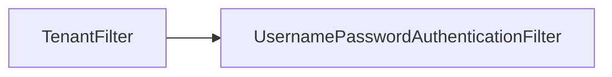

# 第 28 章：FilterChain 排序与自定义 Filter 插入点

> 本章对齐 [docs/template.md](../template.md)，建议字数 3000–5000。

---

## 1 项目背景（约 500 字）

### 业务场景

需在 **认证前** 解析 **租户 ID**（Header），写入 **TenantContext**；**必须**保证顺序：**租户解析 → 认证 → 授权**。顺序错误会导致 **审计错租户** 或 **权限缓存键错误**。

### 痛点放大

自定义 `Filter` 若 **不继承 `OncePerRequestFilter`** 可能 **重复执行**；`@Order` 与 Security **Filter 顺序** 两套体系易混淆。

### 流程图



---

## 2 项目设计：剧本式交锋对话（约 1200 字）

**场景**：租户 Filter 放在 `SecurityContextPersistenceFilter` 前还是后？

**小胖**

「Filter 越多越好吗？我能插十个吗？」

**小白**

「`addFilterBefore` 第二个参数选哪个类？」

**大师**

「**参考官方顺序常量**（随版本变化）：理解 **SecurityContext 何时可用**。**租户**若参与 **UserDetails 加载**，可能要在 **更早** 或在 **AuthenticationProvider** 内读取。」

**技术映射**：`HttpSecurity.addFilterBefore`；`Filter` 顺序图。

**小白**

「Servlet Filter 与 `HandlerInterceptor` 区别？」

**大师**

「**Filter** 在 **Servlet 容器**；**Interceptor** 在 **DispatcherServlet** 内，**更晚**。」

**技术映射**：纵深防御位置。

**小胖**

「异步请求 Filter 跑两次？」

**大师**

「`OncePerRequestFilter` **防重复**；**异步派发** 需注意 **SecurityContext 传播**。」

**技术映射**：`shouldNotFilter`；`AsyncContext`。

**小白**

「如何打印当前 Security 链顺序？」

**大师**

「**DEBUG 日志** 或断点 **`FilterChainProxy`**；部分版本有 **`FilterChain` 列表** 输出。」

---

## 3 项目实战（约 1500–2000 字）

### 步骤 1：`OncePerRequestFilter` 骨架

```java
public class TenantFilter extends OncePerRequestFilter {
  @Override
  protected void doFilterInternal(HttpServletRequest req, HttpServletResponse res, FilterChain chain)
      throws ServletException, IOException {
    String tenant = req.getHeader("X-Tenant-Id");
    TenantContext.set(tenant);
    try {
      chain.doFilter(req, res);
    } finally {
      TenantContext.clear();
    }
  }
}
```

### 步骤 2：插入到认证前

```java
http.addFilterBefore(new TenantFilter(), UsernamePasswordAuthenticationFilter.class);
```

### 步骤 3：开启 DEBUG

`logging.level.org.springframework.security.web.FilterChainProxy=DEBUG`

观察 **Filter 列表** 输出。

### 步骤 4：负例

故意 **插错顺序**，观察 **租户上下文为空** 的集成测试失败。

### 步骤 5：文档化

团队维护 **「安全 Filter 顺序表」**（Confluence）。

### 截图说明（供插图或评审时对照）

| 编号 | 建议截图内容 | 预期画面（文字描述） |
|------|----------------|----------------------|
| 图 28-1 | DEBUG 日志片段 | 列出 **Filter 名称/顺序**（格式随版本变化）。 |
| 图 28-2 | IDEA 断点在自定义 Filter | `TenantContext` 已 set。 |
| 图 28-3 | 错误顺序时的故障现象 | 401/错租户审计（教学案例）。 |
| 图 28-4 | 团队顺序表 | 表格列出 **Filter 名、职责、负责人**。 |

### 可能遇到的坑

| 坑 | 处理 |
|----|------|
| 线程池异步 | `DelegatingSecurityContextRunnable` |
| 与网关重复解析 | 明确 **信任边界** |

---

## 4 项目总结（约 500–800 字）

### 思考题

1. `FilterChainProxy.VirtualFilterChain` 工作原理？
2. WebFlux `WebFilter` **顺序**配置？

### 推广计划提示

- **评审**：新增 Filter **必须** 更新顺序文档。

---

*本章完。*
