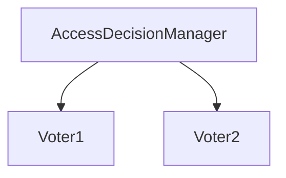

# 第 29 章：投票器与 AccessDecisionManager：复杂授权模型

> 本章对齐 [docs/template.md](../template.md)，建议字数 3000–5000。

---

## 1 项目背景（约 500 字）

### 业务场景

权限不仅来自 **角色**，还来自 **部门、数据标签、实时风控分数**。URL 授权需要 **多源投票** 决策；同时评估 **Servlet 6 / Security 6+** 中 **`AuthorizationManager` 迁移**。

### 痛点放大

`RoleVoter` 只认 `ROLE_*`；**自定义 `AccessDecisionVoter`** 可注入 **业务规则**，但 **热路径 DB** 会导致 **延迟**。

### 流程图



---

## 2 项目设计：剧本式交锋对话（约 1200 字）

**场景**：能否用「投票」实现「风控分 < 60 拒绝」？

**小胖**

「投票像综艺评委吗？会不会 2:1 通过？」

**小白**

「`AffirmativeBased` 与 `ConsensusBased` 区别？」

**大师**

「**`AffirmativeBased`**：任一 voter **赞成** 即通过（可配置）；**`ConsensusBased`**：**多数决**；还有 **一票否决** 策略。」

**技术映射**：`AccessDecisionManager` 实现类。

**小白**

「新代码还用 Voter 吗？听说 `AuthorizationManager`？」

**大师**

「**新特性** 推荐 **`AuthorizationManager`** 表达授权；**概念** 仍是 **谓词决策**。老代码/教程仍见 Voter。」

**技术映射**：`AuthorizationManager`；`AuthorizeHttpRequestsConfigurer`。

**小胖**

「全 ABSTAIN 会怎样？」

**大师**

「通常 **拒绝**（取决于 `AccessDecisionManager`）；**必须** 有 **兜底 voter**。」

**技术映射**：`AccessDecisionVoter.ACCESS_ABSTAIN`。

**小白**

「性能：每个请求跑三个 voter？」

**大师**

「**短路**、**缓存**、**把便宜 voter 放前面**。」

---

## 3 项目实战（约 1500–2000 字）

### 步骤 1：自定义 Voter 骨架

```java
public class TenantVoter implements AccessDecisionVoter<Object> {
  @Override
  public int vote(Authentication authentication, Object object, Collection<ConfigAttribute> attrs) {
    return ACCESS_ABSTAIN;
  }
  @Override
  public boolean supports(ConfigAttribute attribute) { return true; }
  @Override
  public boolean supports(Class<?> clazz) { return true; }
}
```

### 步骤 2：注册（以当前 API 为准）

查阅文档：**`AccessDecisionManager` Bean** 或 **`AuthorizationManager`** 迁移路径。

### 步骤 3：对比测试

同一请求 **仅 RoleVoter** vs **加自定义 Voter** 的耗时（Micrometer）。

### 步骤 4：负例

全 `ABSTAIN` → 期望 **403**。

### 截图说明（供插图或评审时对照）

| 编号 | 建议截图内容 | 预期画面（文字描述） |
|------|----------------|----------------------|
| 图 29-1 | DEBUG 授权决策日志 | 各 voter 返回值（若开启）。 |
| 图 29-2 | 压测对比 | P99 延迟差异。 |
| 图 29-3 | 决策表（文档） | 条件 × 结果矩阵。 |
| 图 29-4 | 源码 `AffirmativeBased` | 投票聚合逻辑高亮。 |

### 可能遇到的坑

| 坑 | 处理 |
|----|------|
| 全 ABSTAIN | 增加默认拒绝说明 |
| 与 `authorizeHttpRequests` 混用混乱 | 统一架构层 |

---

## 4 项目总结（约 500–800 字）

### 思考题

1. `AuthorizationManager` 完全替代 `AccessDecisionManager` 的路径？
2. ABAC 与 ACL（第 30 章）边界？

### 推广计划提示

- **架构**：**授权模型** 写 ADR，避免「各处 if」。

---

*本章完。*
