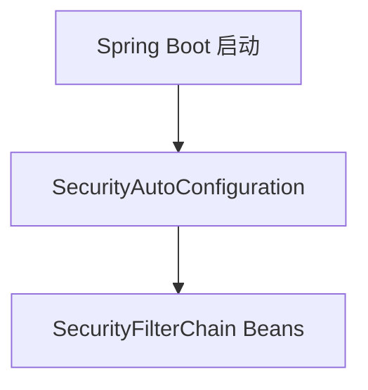

# 第 3 章：Boot 集成与安全自动配置心智模型

> 本章对齐 [docs/template.md](../template.md)，建议字数 3000–5000。

---

## 1 项目背景（约 500 字）

### 业务场景

团队从「手写 XML」迁移到 Spring Boot，希望 **引入 `spring-boot-starter-security` 后开箱即用**：默认登录页、默认用户、Session 管理、CSRF 等。架构师要求新人 **能说清哪些是 Boot 做的、哪些是 Security 核心做的**，避免排障时「猜配置」。

### 痛点放大

自动配置 **不是魔法**：一旦与自定义 `SecurityFilterChain` 混用，会出现「我以为默认关闭其实还开着」「Bean 覆盖顺序不符合预期」。没有心智模型时，问题表现为：**本地能跑、测试环境 403、生产 Cookie 域不对**。

本章目标：建立 **自动配置入口 → 条件装配 → 可覆盖点** 三层认知（具体类名随 Spring Boot 版本以源码/文档为准）。

### 流程图



---

## 2 项目设计：剧本式交锋对话（约 1200 字）

**场景**：新人问「我只加了一个 starter，为啥就有登录页了？」

**小胖**

「我就加了个依赖，像开了外挂，默认用户 `user` 密码在控制台，这谁定的？」

**小白**

「生产也能这样吗？`application.yml` 里哪些 key 真正生效？」

**大师**

「Boot 的 **自动配置** 本质是 ** classpath 上存在某类时，注册一组默认 Bean**。Security Starter 会装配 **默认的 `SecurityFilterChain`**：保护所有端点、生成临时用户（可关闭）、启用表单登录与 CSRF（Servlet 场景）。」

**技术映射**：`spring-boot-starter-security` → 自动配置类 + 默认 `SecurityFilterChain`。

**小胖**

「我自己写了 `@Bean SecurityFilterChain`，默认那条还在吗？」

**小白**

「会不会两条链打架？`Order` 怎么用？」

**大师**

「通常 **自定义 `SecurityFilterChain` 会替代默认链**（视版本与条件而定，以当前 Boot 文档为准）。原则是：**显式 Bean 优先**，但仍要注意 **`UserDetailsService`、密码编码器** 等是否仍被自动装配。」

**技术映射**：Bean 覆盖与 `@ConditionalOnMissingBean`；链优先级 `@Order`。

**小胖**

「那我把 `spring.security.user.name` 改了就行？」

**小白**

「多 Profile、K8s Secret 注入呢？」

**大师**

「可以用 **配置文件用户** 做演示；生产应接 **数据库/LDAP/OAuth2**。配置项是『快捷演示』，不是终点架构。」

**技术映射**：`spring.security.user.*` → 内存用户快捷配置。

---

## 3 项目实战（约 1500–2000 字）

### 环境准备

`spring-boot-starter-security`，`application.yml`：

```yaml
spring:
  security:
    user:
      name: demo
      password: demo
```

### 步骤 1：观察启动日志

启动时打印 **随机密码**（若未配置用户）或使用上面固定用户。

### 步骤 2：自定义 `SecurityFilterChain`

```java
@Bean
SecurityFilterChain app(HttpSecurity http) throws Exception {
  http.authorizeHttpRequests(a -> a.anyRequest().authenticated());
  http.formLogin(withDefaults());
  return http.build();
}
```

### 步骤 3：关闭默认用户（若需）

接入数据库用户后，删除 `spring.security.user`，提供 `UserDetailsService` Bean（第 5–6 章）。

### 测试

```bash
curl -u demo:demo http://localhost:8080/
```

### 可能遇到的坑

| 坑 | 处理 |
|----|------|
| Actuator 端点暴露策略与 Security 叠加 | 统一规划 `/actuator/**` |
| 多模块重复定义 Security 配置 | 用 `@Import` 或单一配置类 |

---

## 4 项目总结（约 500–800 字）

### 优点与缺点

| 维度 | Boot 自动配置 | 全手动装配 |
|------|---------------|------------|
| 上手速度 | 快 | 慢 |
| 可控性 | 需读条件注解 | 完全自控 |
| 升级成本 | 关注 release notes | 自行跟进 |

### 适用场景

- 新项目快速启动；PoC；教学。

### 不适用场景

- 需要极致精简的可执行 jar（无 Web）或自定义 Servlet 容器生命周期。

### 常见踩坑

1. 以为注释掉某段 YAML 就关闭了某 Filter（实际仍有默认链）。
2. 与 Spring Cloud Gateway 混用时混淆 **网关鉴权** 与 **应用鉴权**。

### 思考题

1. 默认生成的密码为何每次启动可能不同？如何固定？（查 Boot 文档 `UserDetailsAutoConfiguration`）
2. `WebSecurityCustomizer` 与 `SecurityFilterChain` 分工是什么？

### 推广计划提示

- **开发**：团队维护一页「Boot Security 默认行为对照表」。
- **运维**：配置中心统一下发 `spring.security` 相关项，避免环境漂移。

---

*本章完。*
