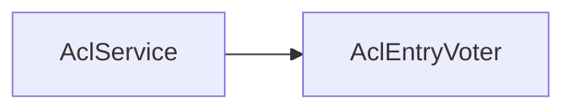

# 第 30 章：ACL：细粒度领域对象权限

> 本章对齐 [docs/template.md](../template.md)，建议字数 3000–5000。

---

## 1 项目背景（约 500 字）

### 业务场景

「合同」对象：**owner、部门经理、法务** 有不同权限；需 **行级** 控制。RBAC 粗粒度不够；评估 **Spring Security ACL** 模块 **sid、oid、mask、继承**。

### 痛点放大

ACL **表结构复杂、缓存要求高**；新项目常对比 **PostgreSQL RLS**、**外部授权服务（OPA）**。本章聚焦 **Spring ACL 能解决什么、运维成本是什么**。

### 流程图

源码：`acl/` 模块。

---

## 2 项目设计：剧本式交锋对话（约 1200 字）

**场景**：能否不用 ACL，只在 SQL 里写 `WHERE owner_id`？

**小胖**

「ACL 是不是就是把权限写数据库？」

**小白**

「继承啥意思？部门经理自动能看部门下所有合同？」

**大师**

「ACL 支持 **对象继承**（如 **文件夹 → 文件**）与 **掩码位**（读/写/删）。**简单 owner 检查** 往往 **手写 SQL + SpEL** 更轻。」

**技术映射**：`MutableAclService`；`AclPermissionEvaluator`。

**小白**

「缓存不一致怎么办？」

**大师**

「**事务同步** 更新 ACL 缓存；**高并发** 用 **EhCache/Caffeine** 并设 **合理 TTL**。」

**技术映射**：`AclPermissionCacheOptimizer`。

**小胖**

「和 `PermissionEvaluator` 啥关系？」

**大师**

「可在 **`hasPermission` SpEL** 中查 ACL；**统一入口**。」

**小白**

「多租户 SaaS 能用一套 ACL 表吗？」

**大师**

「**tenant_id** 维度必须进 **oid 或 sid**；防 **跨租户**。」

---

## 3 项目实战（约 1500–2000 字）

### 步骤 1：依赖

`spring-security-acl` + 缓存实现。

### 步骤 2：初始化 schema

执行官方 **acl 表** SQL（版本对齐）。

### 步骤 3：配置 `AclAuthorizationStrategy` 等 Bean

（按官方文档完整示例，此处不展开避免过时 API。）

### 步骤 4：写入 ACL

创建对象后 **`aclService.createAcl`** 写入 **sid + mask**。

### 步骤 5：集成测试

用户 A **可读**、用户 B **拒绝**；**继承** 场景正向/负向。

### 截图说明（供插图或评审时对照）

| 编号 | 建议截图内容 | 预期画面（文字描述） |
|------|----------------|----------------------|
| 图 30-1 | ACL 表数据 | `acl_sid`、`acl_object_identity`、`acl_entry` 有样本行。 |
| 图 30-2 | 拒绝访问日志/响应 | **403** + 统一错误码。 |
| 图 30-3 | 缓存监控 | ACL 缓存命中率。 |
| 图 30-4 | ER 图 | 对象与 ACL 关系（团队文档）。 |

### 可能遇到的坑

| 坑 | 处理 |
|----|------|
| 大规模删除对象 | 级联删 ACL |
| 缓存脏读 | 事务边界 |

---

## 4 项目总结（约 500–800 字）

### 思考题

1. ACL 与 **PostgreSQL RLS** 对比？
2. **OPA** 侧车 vs 进程内 ACL？

### 推广计划提示

- **DBA**：**acl 表** 索引与归档策略。

---

*本章完。*
