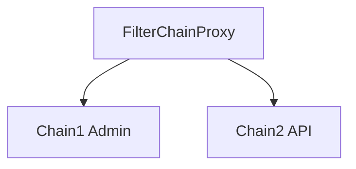

# 第 31 章：多 SecurityFilterChain/多 HttpSecurity

> 本章对齐 [docs/template.md](../template.md)，建议字数 3000–5000。

---

## 1 项目背景（约 500 字）

### 业务场景

同一进程：**`/admin/**` 表单登录 + Session**；**`/api/**` JWT 无状态**。两套 **认证机制**、**CSRF 策略**（浏览器 vs Bearer）需分离。

### 痛点放大

单链强行 `if` **requestMatchers** 会导致 **可读性差**、**CSRF 误伤 API**。**多 `SecurityFilterChain` + `@Order`** 是常见解法。

### 流程图



---

## 2 项目设计：剧本式交锋对话（约 1200 字）

**场景**：Order 写反了，全站 403。

**小胖**

「两条链谁优先？我能写十条吗？」

**小白**

「`securityMatcher` 与 `authorizeHttpRequests` 差别？」

**大师**

「**`securityMatcher`**：这条链 **是否处理该请求**；**`authorizeHttpRequests`**：链内 **授权**。**`@Order` 数值越小越先匹配**（常见约定）。」

**技术映射**：`HttpSecurity.securityMatcher`；`@Order`。

**小白**

「`/api/**` 要关 CSRF，`/admin` 要开，怎么配？」

**大师**

「**分链**：API 链 `csrf.disable()`（仅当 **无 Cookie 会话**）；Admin 链 **保留 CSRF**。」

**技术映射**：`http.csrf` 分链配置。

**小胖**

「静态资源走哪条链？」

**大师**

「常 **`WebSecurityCustomizer` 忽略** 或 **高优先级链 `permitAll`**。」

**技术映射**：`WebSecurityCustomizer#ignoring`；**安全含义** 评估。

**小白**

「兜底链怎么做？」

**大师**

「最后一条 **`anyRequest()`** 的 **denyAll** 或 **认证**。」

---

## 3 项目实战（约 1500–2000 字）

### 步骤 1：Admin 链

```java
@Bean
@Order(1)
SecurityFilterChain admin(HttpSecurity http) throws Exception {
  http.securityMatcher("/admin/**");
  http.authorizeHttpRequests(a -> a.anyRequest().hasRole("ADMIN"));
  http.formLogin(withDefaults());
  http.csrf(Customizer.withDefaults());
  return http.build();
}
```

### 步骤 2：API 链

```java
import org.springframework.security.config.Customizer;

@Bean
@Order(2)
SecurityFilterChain api(HttpSecurity http) throws Exception {
  http.securityMatcher("/api/**");
  http.authorizeHttpRequests(a -> a.anyRequest().authenticated());
  http.oauth2ResourceServer(o -> o.jwt(Customizer.withDefaults()));
  http.csrf(csrf -> csrf.disable());
  return http.build();
}
```

### 步骤 3：兜底（可选）

```java
@Bean
@Order(Ordered.LOWEST_PRECEDENCE)
SecurityFilterChain fallback(HttpSecurity http) throws Exception {
  http.authorizeHttpRequests(a -> a.anyRequest().denyAll());
  return http.build();
}
```

### 步骤 4：验证矩阵

| 请求 | 期望 |
|------|------|
| GET `/admin` | 表单登录流 |
| GET `/api/me` + Bearer | 200 |
| GET `/api/me` 无 Bearer | 401 |

### 截图说明（供插图或评审时对照）

| 编号 | 建议截图内容 | 预期画面（文字描述） |
|------|----------------|----------------------|
| 图 31-1 | DEBUG：`FilterChainProxy` | 日志显示 **匹配到哪条链**（格式随版本）。 |
| 图 31-2 | Postman 两个 Collection | Admin 用 **Session**；API 用 **Bearer**。 |
| 图 31-3 | 错误 Order 时 | 请求命中 **错误链** 导致 **意外 403/401**（教学负例）。 |
| 图 31-4 | 架构图 | 浏览器域 vs API 域 **分流**。 |

### 可能遇到的坑

| 坑 | 处理 |
|----|------|
| Order 反了 | **更具体** 的链 **更小 Order** |
| 静态资源未覆盖 | 增加 **忽略** 或 **单独链** |
| API 误开 CSRF | SPA Cookie 场景重新评估 |

---

## 4 项目总结（约 500–800 字）

### 思考题

1. `WebSecurityCustomizer` 与 **多链** 协作？
2. **多端口** Connector 与 **securityMatcher**？

### 推广计划提示

- **评审**：多链 PR **必须** 附 **请求矩阵**。

---

*本章完。*
