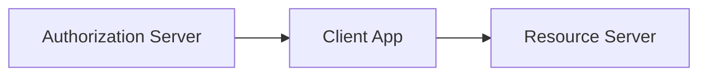

# 第 32 章：OAuth2 Authorization Server：扩展与边界

> 本章对齐 [docs/template.md](../template.md)，建议字数 3000–5000。

---

## 1 项目背景（约 500 字）

### 业务场景

企业自建 **授权服务器（AS）**：授权码、客户端凭证、刷新令牌；对接 **内部应用** 与 **第三方合作方**。需明确 **OAuth2 与「用户登录」** 的边界、**redirect_uri** 白名单、**PKCE** 与 **机密客户端** 分工。

### 痛点放大

**redirect_uri 校验不严** → **开放重定向**；**隐式流** 已废弃；**密钥** 硬编码进仓库 → **合规事故**。

### 流程图

源码：`oauth2/oauth2-authorization-server/`。

---

## 2 项目设计：剧本式交锋对话（约 1200 字）

**场景**：能否用 AS 同时当「用户中心」？

**小胖**

「AS 和 Resource Server 能放一个进程吗？」

**小白**

「PKCE 是给谁用的？移动端？」

**大师**

「**PKCE** 保护 **公开客户端**（SPA/移动）在 **授权码交换** 时防拦截；**机密服务端** 用 **client_secret + 限制 redirect**。」

**技术映射**：`RegisteredClient`；`ClientSettings`。

**小白**

「`scope` 与 `ROLE` 怎么映射？」

**大师**

「**AS 发 scope**；**RS 校验 scope** 并映射为 **`GrantedAuthority`**（第 21 章）。」

**技术映射**：**最小 scope**；**权限膨胀** 控制。

**小胖**

「第三方合作方客户端密钥怎么发？」

**大师**

「**安全通道**；**轮换**；**审计**；禁止 Slack 明文。」

**小白**

「自建 AS vs Keycloak？」

**大师**

「**Spring Authorization Server** 深度集成 Spring；**Keycloak** 功能全、运维成熟。**选型** 看团队与 SLA。」

---

## 3 项目实战（约 1500–2000 字）

### 步骤 1：依赖

引入 `spring-boot-starter-oauth2-authorization-server`（版本与 Boot 对齐）。

### 步骤 2：最小 `RegisteredClient`

按官方 sample 注册 **client_id**、**redirect_uris**、**grant_types**。

### 步骤 3：JWK / issuer

配置 **issuer URL**、**密钥轮换**（kid）。

### 步骤 4：安全测试

- **错误 redirect_uri** → 必须拒绝。
- **授权码重放** → 失败。

### 步骤 5：文档化

对外发布 **OAuth2 接入指南**（PKCE、scope、错误码）。

### 截图说明（供插图或评审时对照）

| 编号 | 建议截图内容 | 预期画面（文字描述） |
|------|----------------|----------------------|
| 图 32-1 | AS 管理端（若有） | `RegisteredClient` 列表 **脱敏**。 |
| 图 32-2 | 授权页登录 | 用户同意 scope 的界面。 |
| 图 32-3 | 错误 redirect_uri | **400** 或 **invalid_request**（依实现）。 |
| 图 32-4 | JWKS 端点 | JSON 含 `kid` 与 `n`/`e`（勿泄露私钥）。 |

### 可能遇到的坑

| 坑 | 处理 |
|----|------|
| redirect 宽松 | 白名单 |
| 密钥泄露 | 轮换与告警 |
| scope 过宽 | 最小权限 |

---

## 4 项目总结（约 500–800 字）

### 思考题

1. **PAR**、**DPoP** 何时需要？
2. **OIDC** 与纯 OAuth2 区别？

### 推广计划提示

- **安全**：渗透测试重点 **开放重定向、token 泄露**。

---

*本章完。*
