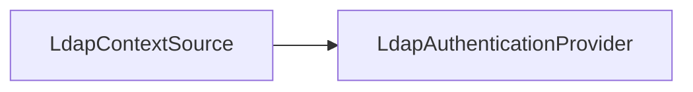

# 第 33 章：LDAP/AD 集成要点

> 本章对齐 [docs/template.md](../template.md)，建议字数 3000–5000。

---

## 1 项目背景（约 500 字）

### 业务场景

企业 **Active Directory** 统一账号；应用通过 **LDAP bind** 或 **密码比对** 认证，并把 **组映射** 为 `ROLE_*`。网络要求：**防火墙开放 389/636**、**证书**、**查询超时**。

### 痛点放大

**慢查询** 导致登录超时；**账号锁定** 与 **Spring 账户锁定** 混淆；**嵌套组** 映射复杂。

### 流程图



源码：`ldap/` 模块。

---

## 2 项目设计：剧本式交锋对话（约 1200 字）

**场景**：能否用只读账号搜索？

**小胖**

「LDAP 和 AD 一样吗？」

**小白**

「组到 `ROLE_` 映射在 `DefaultLdapAuthoritiesPopulator`？」

**大师**

「**AD 是 LDAP 的一种部署**；常见 `userSearch`、`groupSearch`。**映射** 要注意 **CN 转义** 与 **大小写**。」

**技术映射**：`LdapAuthenticationProvider`；`FilterBasedLdapUserSearch`。

**小白**

「连接池、超时怎么配？」

**大师**

「**`LdapContextSource`** 配 **超时**、**池**（或外部连接池）；**失败重试** 要限流防 **LDAP 打爆**。」

**技术映射**： resilience 与 **监控**。

**小胖**

「只读域控延迟导致新入职员工登不上？」

**大师**

「**复制延迟** 是 **基础设施问题**；应用可 **重试** 或 **提示稍后再试**。」

**小白**

「多租户不同 LDAP？」

**大师**

「**多 `AuthenticationManager`** 或 **自定义 `UserDetailsService` 路由**。」

---

## 3 项目实战（约 1500–2000 字）

### 环境准备

- 测试 AD/LDAP；或 **Docker OpenLDAP** / **Embedded LDAP**（UnboundID）用于集成测试。

### 步骤 1：依赖

`spring-boot-starter-data-ldap` + `spring-security-ldap`（按项目实际）。

### 步骤 2：配置 `LdapContextSource`

URL、base、用户名密码（**只读**）。

### 步骤 3：`BindAuthenticator` 或 `PasswordComparisonAuthenticator`

按官方文档选择 **策略**。

### 步骤 4：组映射

```java
DefaultLdapAuthoritiesPopulator populator = new DefaultLdapAuthoritiesPopulator(contextSource, "ou=groups");
populator.setGroupSearchFilter("(member={0})");
```

### 步骤 5：集成测试

嵌入式 LDAP **unboundid** 或 Testcontainers。

### 截图说明（供插图或评审时对照）

| 编号 | 建议截图内容 | 预期画面（文字描述） |
|------|----------------|----------------------|
| 图 33-1 | Apache Directory Studio / LDAP 浏览器 | 用户/组 **DN** 结构。 |
| 图 33-2 | 登录失败日志 | **超时** vs **密码错误** 分类。 |
| 图 33-3 | 测试绿 | 集成测试 **bind 成功**。 |
| 图 33-4 | 网络策略表 | 防火墙 **389/636** 放行。 |

### 可能遇到的坑

| 坑 | 处理 |
|----|------|
| StartTLS 证书 | truststore |
| 特殊字符 DN | 转义 |
| 嵌套组 | 自定义 `GrantedAuthoritiesMapper` |

---

## 4 项目总结（约 500–800 字）

### 思考题

1. LDAP 与 **OIDC** 迁移路径？
2. **只读副本** 延迟下的 UX？

### 推广计划提示

- **运维**：LDAP **SLO** 与 **告警**。

---

*本章完。*
