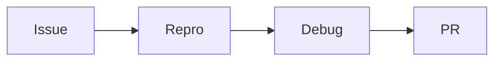

# 第 34 章：源码阅读方法论：从 issue 到 PR

> 本章对齐 [docs/template.md](../template.md)，建议字数 3000–5000。

---

## 1 项目背景（约 500 字）

### 业务场景

团队要给 Spring Security **提 bugfix** 或 **理解某行为变更**；新人面对 **多模块、多版本** 无从下手。

### 痛点放大

直接 `grep` 全仓库 **噪音大**；没有 **问题 → 复现 → 最小用例 → 定位类** 流程会 **浪费时间**。需要 **可复现的测试用例** 作为 **贡献门槛**。

### 流程图

---

## 2 项目设计：剧本式交锋对话（约 1200 字）

**场景**：「我怀疑是 Bug，但官方说 Works as Designed」。

**小胖**

「直接读 `FilterChainProxy` 一万行？」

**小白**

「从哪份测试开始？」

**大师**

「**`FilterChainProxyTests` / `SecurityFilterChain` 相关测试** 是活文档；**issue 带复现仓库** 优先。」

**技术映射**：测试即规格；**TDD** 贡献。

**小白**

「如何确认是 **版本回归**？」

**大师**

「**Git bisect** 二分；**对比** `5.x` vs `6.x` **迁移指南**。」

**技术映射**：`git bisect`；release notes。

**小胖**

「贡献要 CLA 吗？」

**大师**

「读 **`CONTRIBUTING.adoc`**；**DCO** 签名；**测试** 必须。」

**小白**

「私有客户不能上传复现？」

**大师**

「**脱敏** 最小用例；或 **内部 fork** 先验证。」

---

## 3 项目实战（约 1500–2000 字）

### 步骤 1：锁定版本

`gradle.properties` 的 `version=`。

### 步骤 2：最小复现

独立 Boot 工程 + **单一配置差异**。

### 步骤 3：本地调试

`./gradlew test --tests ...` 定位失败用例。

### 步骤 4：写 **回归测试**

失败用例应先 **红** 再 **绿**。

### 步骤 5：提 PR

描述 **问题、根因、影响版本、替代方案**。

### 截图说明（供插图或评审时对照）

| 编号 | 建议截图内容 | 预期画面（文字描述） |
|------|----------------|----------------------|
| 图 34-1 | GitHub Issue 模板 | 含 **复现步骤**、**期望/实际**。 |
| 图 34-2 | IDEA 调试断点 | 栈帧停在 **贡献者修复点**。 |
| 图 34-3 | CI 绿 | 全量或模块测试通过。 |
| 图 34-4 | PR 描述 | **Before/After** 行为对比。 |

### 可能遇到的坑

| 坑 | 处理 |
|----|------|
| 快照依赖 | 对齐 BOM |
| 行为是设计 | 查文档与 **迁移指南** |

---

## 4 项目总结（约 500–800 字）

### 思考题

1. `git bisect` 与 **Gradle 构建时间** 优化？
2. 跨仓库 issue（Spring Framework）如何关联？

### 推广计划提示

- **团队**：每月一次 **「共读 Security PR」**。

---

*本章完。*
