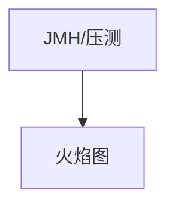

# 第 35 章：性能与常见瓶颈：Session 固定、过滤器开销

> 本章对齐 [docs/template.md](../template.md)，建议字数 3000–5000。

---

## 1 项目背景（约 500 字）

### 业务场景

大促前压测 **TPS 上不去**；火焰图显示 **Filter 链耗时**、**Session 序列化**、**同步远程调用**。

### 痛点放大

**Session 固定攻击** 防护（`changeSessionId`）与 **性能** 需平衡；**过多自定义 Filter** 每层增加 **分配与日志**。

### 流程图

---

## 2 项目设计：剧本式交锋对话（约 1200 字）

**场景**：能否关掉 `changeSessionId`「省一点」？

**小胖**

「安全还能优化？少几个 Filter 行不行？」

**小白**

「`sessionFixation` 默认策略是什么？」

**大师**

「**Session 固定** 防护会 **改变/迁移 Session**；有 **成本** 但 **安全必要**。优化重点在 **减少链上远程调用**、**缓存授权结果**。」

**技术映射**：`SessionManagementConfigurer.sessionFixation`；`migrateSession` 等。

**小白**

「火焰图里 `FilterChainProxy` 很宽？」

**大师**

「检查 **自定义 Filter** 是否 **HTTP 调用**、**大 JSON 日志**；**异步** 后是否仍 **阻塞**。」

**技术映射**：`OncePerRequestFilter`；**IO 外移**。

**小胖**

「Session 序列化 Redis 很大？」

**大师**

「**减少 `SecurityContext` 中对象**；**自定义序列化**；**压缩**（谨慎）。」

**技术映射**：Spring Session 文档。

**小白**

「WebFlux 呢？」

**大师**

「**背压** 与 **事件循环**；**BlockHound** 找阻塞点。」

---

## 3 项目实战（约 1500–2000 字）

### 步骤 1：基准

JMH 微基准或 **wrk** + **Async Profiler**。

### 步骤 2：检查清单

- 自定义 Filter 是否 **同步 HTTP**？
- `UserDetailsService` 是否 **N+1**？
- Session Redis **序列化大小**？

### 步骤 3：Session 固定

确认 **策略**（`changeSessionId` 等）与 **安全** 评审记录。

### 步骤 4：对比优化前后

**P99** 延迟、**CPU**、**Redis 内存**。

### 截图说明（供插图或评审时对照）

| 编号 | 建议截图内容 | 预期画面（文字描述） |
|------|----------------|----------------------|
| 图 35-1 | 火焰图 | `FilterChainProxy` / 自定义 Filter 占比。 |
| 图 35-2 | wrk 输出 | 优化前后 **Requests/sec** 对比。 |
| 图 35-3 | Redis 内存 | Session key 大小分布。 |
| 图 35-4 | Grafana | P99 与 **错误率** 同屏。 |

### 可能遇到的坑

| 坑 | 处理 |
|----|------|
| 过早优化 | 先证据后改 |
| 缓存安全信息 | TTL 与失效 |

---

## 4 项目总结（约 500–800 字）

### 思考题

1. `FilterChain` 与 **Servlet 异步** 交互？
2. WebFlux **背压** 与安全？

### 推广计划提示

- **SRE**：压测 **纳入发布门禁**。

---

*本章完。*
