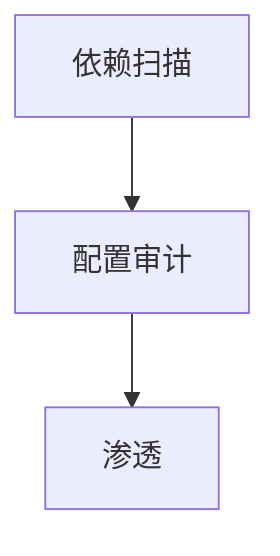

# 第 36 章：安全加固清单：依赖漏洞、配置审计、最小权限

> 本章对齐 [docs/template.md](../template.md)，建议字数 3000–5000。

---

## 1 项目背景（约 500 字）

### 业务场景

上线前 **安全评审**：依赖 CVE、**默认口令**、**Actuator 暴露**、**DEBUG 模式**、**错误堆栈**、**过宽 `permitAll`**。

### 痛点放大

**仅升级 Spring Boot 小版本** 可能已含 **安全补丁**；**演示代码 `permitAll("/**")`** 误合并 **master**。

### 流程图

---

## 2 项目设计：剧本式交锋对话（约 1200 字）

**场景**：CVE 报一堆，要不要连夜升级？

**小胖**

「Spring 自己不安全吗？」

**小白**

「OWASP Dependency-Check 报一堆怎么办？」

**大师**

「**区分可利用性**：运行时是否走到该组件路径；**读官方 advisory**；**评估** 与 **测试** 后再升级。」

**技术映射**：SBOM；`gradle dependencyUpdates`。

**小白**

「`permitAll` 能自动化扫吗？」

**大师**

「**静态规则** + **Code Review**；**集成测试** 断言 **敏感路径 401/403**。」

**技术映射**：`Semgrep` 规则（示例）；**CI**。

**小胖**

「生产 `debug=true` 谁干的？」

**大师**

「**配置中心** 禁止；**审计** 变更；**告警**。」

**小白**

「容器镜像漏洞呢？」

**大师**

「**Distroless / 最小镜像**；**定期重建**。」

---

## 3 项目实战（约 1500–2000 字）

### 步骤 1：清单（节选）

- [ ] 无 `permitAll` 过宽
- [ ] `management.*` 最小暴露
- [ ] 生产关闭 **详细错误** 给客户端
- [ ] HTTPS 强制
- [ ] `Content-Security-Policy` 策略
- [ ] 依赖 **无高危 CVE** 或 **已评估**

### 步骤 2：工具

OWASP ZAP、Burp、Gradle OWASP 依赖检查插件。

### 步骤 3：流程

将清单纳入 **发布门禁**；**红队** 定期演练。

### 步骤 4：证据留存

扫描报告、**评审签字**、**例外项** 到期日。

### 截图说明（供插图或评审时对照）

| 编号 | 建议截图内容 | 预期画面（文字描述） |
|------|----------------|----------------------|
| 图 36-1 | 依赖扫描报告 | **高危** 项列表与 **修复版本**。 |
| 图 36-2 | ZAP 报告 | **中危** 以上 **漏洞** 摘要。 |
| 图 36-3 | 配置 diff | 删除 `permitAll` 过宽 **前后**。 |
| 图 36-4 | 发布门禁 | CI **Security** 阶段 **绿**。 |

### 可能遇到的坑

| 坑 | 处理 |
|----|------|
| 假阳性 CVE | 查 NVD / 厂商 advisory |
| 紧急补丁窗口 | 蓝绿发布 |

---

## 4 项目总结（约 500–800 字）

### 思考题

1. **Supply chain**：签名验证依赖？
2. **WAF** 与应用层分工？

### 推广计划提示

- **合规**：清单 **版本化** 与 **年审**。

---

*本章完。*
