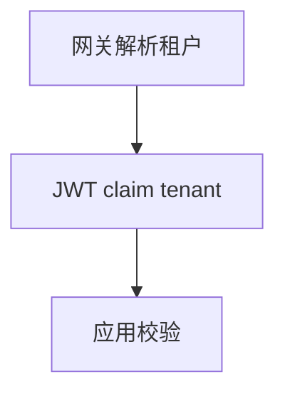

# 第 37 章：综合大实战：多租户 SaaS 安全架构

> 本章对齐 [docs/template.md](../template.md)，建议字数 3000–5000。

---

## 1 项目背景（约 500 字）

### 业务场景

多租户 SaaS：**租户数据隔离**（schema / row）、**子域名解析租户**、**OAuth2 登录**、**方法级 SpEL** 校验资源属主。

### 痛点放大

**租户 ID 仅来自客户端参数** 会 **跨租户越权**；必须在 **认证后** 绑定可信 **tenant claim** 或 **mTLS 服务身份**。

### 流程图

---

## 2 项目设计：剧本式交锋对话（约 1200 字）

**场景**：`X-Tenant-Id` 头能信吗？

**小胖**

「每个租户一套库？」

**小白**

「`WHERE tenant_id = ?` 每个查询都带？」

**大师**

「**隔离模型**：独立库 / 共享库+行级 / 中间件强制。**应用层** 用 **TenantContext + AOP**；**网关** 校验 **JWT iss/tenant**。」

**技术映射**：纵深防御；**不可信输入**。

**小白**

「管理员跨租户运维？」

**大师**

「**特权角色** + **审计** + **双人审批**；**禁止** 默认管理员 **全局 SELECT**。」

**技术映射**：`RUN_AS`；**审计日志**。

**小胖**

「缓存 key 要带 tenant 吗？」

**大师**

「**必须**；否则 **串租户**。」

**技术映射**：缓存命名空间。

**小白**

「与第 31 章多链关系？」

**大师**

「**租户路由** 可 **链级** 或 **Filter 级**；**避免** 重复解析。」

---

## 3 项目实战（约 1500–2000 字）

### 步骤 1：租户解析 Filter

见第 28 章；**不信任** 明文 Header（除非 **mTLS + 网关签名**）。

### 步骤 2：JWT

`tenant_id` claim；Resource Server **校验** 与 **用户所属租户** 一致。

### 步骤 3：数据层

共享表 **强制** `tenant_id` 谓词；**Hibernate Filter** 或 **MyBatis 插件**。

### 步骤 4：集成测试

- **租户 A** 用户 **读租户 B** → **403**。
- **缓存** 串租户负例。

### 步骤 5：演练

**红队** 尝试 `X-Tenant-Id` 篡改。

### 截图说明（供插图或评审时对照）

| 编号 | 建议截图内容 | 预期画面（文字描述） |
|------|----------------|----------------------|
| 图 37-1 | 租户矩阵表（文档） | 数据模型 × 隔离策略。 |
| 图 37-2 | JWT claims（脱敏） | `tenant` 与 `sub` 一致。 |
| 图 37-3 | 失败测试 | **403** + 审计记录。 |
| 图 37-4 | 红队报告 | **篡改 Header** 失败证据。 |

### 可能遇到的坑

| 坑 | 处理 |
|----|------|
| 管理员跨租户 | 强审计 |
| 缓存串租户 | key 带 tenant |
| 批处理忘带 tenant | 静态分析检查 |

---

## 4 项目总结（约 500–800 字）

### 思考题

1. **RLS** 与 **应用层** 双保险？
2. **租户导出** 合规？

### 推广计划提示

- **法务**：**DPA** 与 **数据驻留**。

---

*本章完。*
