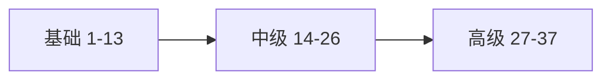

# 第 38 章：专栏回顾、面试高频与自测题解析

> 本章对齐 [docs/template.md](../template.md)，建议字数 3000–5000。

---

## 1 项目背景（约 500 字）

### 业务场景

读者完成 **基础 → 中级 → 高级** 后，需要 **自检**：能否向面试官解释 **FilterChainProxy**、**Session 与 JWT 选型**、**OAuth2 角色**？团队内训需要 **统一题库** 与 **评分标准**。

### 痛点放大

**碎片化记忆** 经不起追问；需 **结构化回顾**、**错题本**、**口述演练**（白板）。

### 流程图

---

## 2 项目设计：剧本式交锋对话（约 1200 字）

**场景**：模拟面试「你说一下 Spring Security 请求进来之后发生了什么」。

**小胖**

「面试会问源码吗？还是只考配置？」

**小白**

「`Authentication` 与 `Principal` 关系？」

**大师**

「高频题：**认证流程**（Filter → `AuthenticationManager` → `SecurityContext`）、**授权**（URL vs 方法）、**OAuth2**（client、resource server、scope）。」

**技术映射**：对照 [docs/reference/spring security常见面试题目集萃.md](../reference/spring%20security常见面试题目集萃.md)。

**小白**

「如何回答『JWT 与 Session』才不模板化？」

**大师**

「用 **业务约束**：**撤销**、**水平扩展**、**客户端类型**、**合规**。」

**技术映射**：第 20 章 ADR 思路。

**小胖**

「现场画图手抖怎么办？」

**大师**

「背 **三层**：**FilterChainProxy → SecurityFilterChain → Filters**；再补 **认证** 与 **授权** 分叉。」

**小白**

「事故题：线上全是 403？」

**大师**

「**配置变更**、**角色前缀**、**多链顺序**、**方法安全未启用**。」

---

## 3 项目实战（约 1500–2000 字）

### 自测题（节选）与解析思路

1. **403 与 401 区别？** 未认证 vs 已认证无权限。
2. **CSRF 为何主要针对 Cookie 会话？** 浏览器自动带 Cookie。
3. **`@PreAuthorize` 不生效？** 未 `@EnableMethodSecurity` 或同类自调用。
4. **多 `SecurityFilterChain` 顺序？** `@Order` 更小优先匹配。
5. **JWT 撤销？** 短 TTL、refresh、黑名单、rotation。

### 模拟面试节奏（45 min）

| 时间 | 环节 | 产出 |
|------|------|------|
| 5 min | 画 **FilterChainProxy** | 白板照 |
| 10 min | **OAuth2** 角色 | 名词解释 |
| 10 min | **事故复盘**（开放重定向） | 根因树 |
| 10 min | **手写** `SecurityFilterChain` 草图 | 代码草稿 |
| 10 min | 反问面试官 | — |

### 错题本模板

| 题目 | 错误答案 | 正确要点 | 章节 |
|------|----------|----------|------|
| … | … | … | … |

### 截图说明（供插图或评审时对照）

| 编号 | 建议截图内容 | 预期画面（文字描述） |
|------|----------------|----------------------|
| 图 38-1 | 白板 **Filter 链** | 箭头从 `DelegatingFilterProxy` 到 `Controller`。 |
| 图 38-2 | 错题本表格 | 至少 5 条 **错题**。 |
| 图 38-3 | 模拟面试评分表 | **通过/未通过** 维度。 |
| 图 38-4 | 团队内训签到 | 出勤与 **反馈**（可选）。 |

---

## 4 项目总结（约 500–800 字）

### 全书知识地图

- **基础**：链、用户、会话、匿名、Remember-Me、登出、CSRF、脚手架。
- **中级**：方法安全、会话并发、Basic/Digest、异常 i18n、缓存、JWT、CORS、WebFlux、X.509、可观测性、测试。
- **高级**：Provider、Filter 顺序、Voter、ACL、多链、AS、LDAP、方法论、性能、加固、多租户。

### 思考题（全书收尾）

1. 若你只能向团队讲 **三个** Spring Security 核心类，选哪三个？为什么？
2. 下一版本 Spring Security **Release Notes** 里，你最关心哪一节？

### 推广计划提示

- **团队内训**：每周一章 + 实验作业；**老带新** 结对走读 `FilterChainProxy`。
- **持续学习**：**CVE**、**Release Notes**、**OWASP ASVS**。

---

*本章完。*
