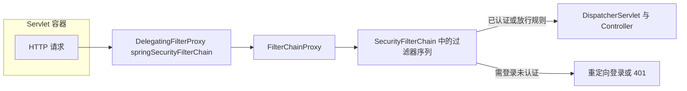

# 第 4 章：SecurityFilterChain 与 HttpSecurity：第一条链

> 本章对齐 [docs/template.md](../template.md)，建议字数 3000–5000。

---

## 1 项目背景（约 500 字）

### 业务场景

某连锁零售企业正在开发「门店运营后台」：店长可以在浏览器里查看本店库存、排班和日结报表；总部运营可以跨店查看汇总数据。系统采用典型的 **B/S + 单体 Spring Boot** 架构，第一批需求里已经实现了 `/login` 登录页和若干只读页面。产品要求：**未登录用户只能访问登录页与静态资源；其余任何 URL 都必须先完成身份认证**，否则统一拦截，不得「漏进」业务 Controller。

### 痛点放大

若团队没有统一的安全入口，常见做法是：在每个 Controller 方法里手写 `if (user == null) return 401`，或依赖拦截器但规则分散。这样会迅速出现三类问题：

1. **可维护性**：新增一个接口就忘加判断，测试环境不易发现，上线后形成「越权访问」类漏洞。
2. **一致性**：有人返回 401，有人重定向到登录页，前端与网关对「未登录」行为无法约定。
3. **演进成本**：后续要接 SSO、多角色、审计日志时，没有「一条清晰的主线」可扩展。

Spring Security 的答案是把 **「先认证、后业务」** 固化成 **Servlet 过滤器链** 上的一段可配置策略。本章只聚焦最小子集：**用 `HttpSecurity` 装配出第一条 `SecurityFilterChain` Bean**，让「仅放行 `/login` 与静态资源，其余需登录」成为可版本化、可 Code Review 的代码。

### 流程图（请求如何被「第一条链」处理）



**读者只需记住**：你在 `HttpSecurity` 上写的 `authorizeHttpRequests(...)`，最终会变成 **Filter 链里「授权决策」相关步骤** 的配置；而 `SecurityFilterChain` 则是 **这一条链的抽象**（本仓库中见 `web/src/main/java/org/springframework/security/web/SecurityFilterChain.java`）。

---

## 2 项目设计：剧本式交锋对话（约 1200 字）

**场景**：团队评审会上，后端要定「第一条安全链」的写法。

**小胖**

「这不就跟食堂门口闸机一样吗？只放行拿饭卡的人，没卡的别进。那为啥 Spring Security 要搞 `HttpSecurity` 又搞 `SecurityFilterChain`，名字这么长？一个注解搞定不行吗？」

**小白**

「闸机是比喻，但 HTTP 还有静态资源、登录页、错误页、健康检查。若只用一个注解，**放行规则**和**登录方式**绑死了，后面要拆管理端和开放 API 时会不会很麻烦？另外，`HttpSecurity` 和 `SecurityFilterChain` 谁是『配置草稿』，谁是『成品』？」

**大师**

「可以把它想成：**`HttpSecurity` 是装配车间里的流水线控制面板**，你按按钮选择「哪些 URL 放行」「表单登录还是 HTTP Basic」。点「生成」后，产出的 **成品** 就是 **`SecurityFilterChain`** 接口的一个实现——里面包含 **匹配哪些请求**（`RequestMatcher`）以及 **一组排好序的 Filter**。」

**技术映射**：`HttpSecurity` → `SecurityFilterChain` 的构建与 DSL；`SecurityFilterChain` → 对「某一类请求」生效的过滤器链定义。

**小胖**

「懂了，那 `FilterChainProxy` 又是啥？听名字像大总管。」

**小白**

「对，如果以后我们配 **多条** `SecurityFilterChain`（比如 `/api/**` 与 `/admin/**` 两套规则），谁来决定当前请求走哪条链？会不会匹配两次？」

**大师**

「`FilterChainProxy`（见 `web/.../FilterChainProxy.java`）是 **真正注册进 Servlet 容器的那条 Filter**。它内部维护 **多个** `SecurityFilterChain`，按顺序找 **第一条** 能匹配当前请求的链，然后只执行那一条链上的过滤器。这样 **不会** 对同一请求重复跑两套完全无关的规则。」

**技术映射**：`FilterChainProxy` → 多链路由与委托；`SecurityFilterChain` 的「匹配」→ `RequestMatcher`。

**小胖**

「所以我们第一章就写 `authorizeHttpRequests`，把 `/login` 放行，其余 `authenticated`，就等于在流水线上装了闸机？」

**小白**

「等等，**只放行 `/login`** 的话，`/error` 被 Spring Boot 用来展示错误页，会不会被拦？还有 CSRF 对表单登录的影响，要不要一开始就开？」

**大师**

「好问题。最小实践里通常会 **放行 `/error` 与静态资源**，否则登录失败或 500 时用户会看到异常页面被拦截。CSRF 在 **表单登录** 场景下默认开启，要配合 Thymeleaf 的 `_csrf` 或前后端分离的 Token 策略；本章 **刻意只讲授权与链**，CSRF 放到第 12 章专门讲，避免第一节课就堆满开关。」

**技术映射**：`HttpSecurity.authorizeHttpRequests` → `AuthorizationFilter` 等链上组件；`permitAll` / `authenticated` → 访问决策与 `SecurityContext` 中是否已建立认证。

**小白**

「最后确认一下：`SecurityFilterChain` Bean 和旧版 `WebSecurityConfigurerAdapter` 什么关系？」

**大师**

「在 **当前推荐写法** 里，**不要再继承** `WebSecurityConfigurerAdapter`（已废弃）。用 **`@Bean SecurityFilterChain filterChain(HttpSecurity http)`** 返回链即可。`HttpSecurity` 仍由 Spring 注入，语义与以前一致，只是 **组合优于继承**。」

**技术映射**：`@Bean SecurityFilterChain` → **基于 DSL 的函数式配置**，替代基于类的 `configure(HttpSecurity)`。

---

## 3 项目实战（约 1500–2000 字）

### 环境准备

- **JDK**：与本项目 `gradle.properties` 中 Spring Boot 版本一致（示例思路适用于 Spring Boot 3.x / 4.x 与 Spring Security 6.x / 7.x）。
- **构建**：Maven 或 Gradle 均可；下列依赖以 **Spring Boot 父 BOM** 管理版本为准（勿手写 Security 版本号，避免与 Boot 不一致）。

**Maven 依赖示例（最小化）**

```xml
<parent>
  <groupId>org.springframework.boot</groupId>
  <artifactId>spring-boot-starter-parent</artifactId>
  <version>3.4.5</version>
  <relativePath/>
</parent>
<dependencies>
  <dependency>
    <groupId>org.springframework.boot</groupId>
    <artifactId>spring-boot-starter-web</artifactId>
  </dependency>
  <dependency>
    <groupId>org.springframework.boot</groupId>
    <artifactId>spring-boot-starter-security</artifactId>
  </dependency>
  <dependency>
    <groupId>org.springframework.boot</groupId>
    <artifactId>spring-boot-starter-thymeleaf</artifactId>
  </dependency>
</dependencies>
```

> 说明：文中 **3.4.5** 仅为示例；你本地项目应使用团队统一的 Boot 版本。

### 步骤 1：定义第一条 `SecurityFilterChain`

**目标**：放行 `/login`、`/error`、静态资源；其余请求需登录；启用表单登录。

```java
package com.example.store;

import org.springframework.context.annotation.Bean;
import org.springframework.context.annotation.Configuration;
import org.springframework.security.config.annotation.web.builders.HttpSecurity;
import org.springframework.security.config.annotation.web.configuration.EnableWebSecurity;
import org.springframework.security.web.SecurityFilterChain;

import static org.springframework.security.config.Customizer.withDefaults;

@Configuration
@EnableWebSecurity
public class SecurityConfig {

	@Bean
	public SecurityFilterChain filterChain(HttpSecurity http) throws Exception {
		http
			.authorizeHttpRequests(auth -> auth
				.requestMatchers("/login", "/error", "/css/**", "/js/**").permitAll()
				.anyRequest().authenticated()
			)
			.formLogin(withDefaults());
		return http.build();
	}
}
```

**预期行为（文字描述）**

- 访问 `/` 或任意业务路径：未登录 → 重定向到默认 `/login`。
- 访问 `/login`：可打开登录页。
- 登录成功：按默认配置跳转到 `/` 或 `defaultSuccessUrl`（后续章节可改）。

**可能遇到的坑**

| 现象 | 常见根因 | 处理 |
|------|----------|------|
| 登录后仍 403 | 用户无角色且误用了 `hasRole` 等 | 本章仅用 `authenticated()`，先排除角色问题 |
| `/error` 白屏 | 未 `permitAll("/error")` | 按上面清单放行 |
| 静态 404 仍被拦 | 路径不匹配 | 核对 `resources/static` 下的实际 URL 前缀 |

### 步骤 2：提供一个最小 Controller 与首页

**目标**：验证「未登录不可访问 `/dashboard`」。

```java
package com.example.store;

import org.springframework.stereotype.Controller;
import org.springframework.web.bind.annotation.GetMapping;

@Controller
public class HomeController {

	@GetMapping("/dashboard")
	public String dashboard() {
		return "dashboard";
	}
}
```

**测试验证（curl）**

```text
# 未带会话访问受保护页，应 302 到 /login（或 401，取决于配置）
curl -i http://localhost:8080/dashboard
```

期望：响应头含 `302` 且 `Location` 指向登录页；登录后重复请求应 `200`。

**单元测试（节选）**

```java
import org.junit.jupiter.api.Test;
import org.springframework.beans.factory.annotation.Autowired;
import org.springframework.boot.test.autoconfigure.web.servlet.AutoConfigureMockMvc;
import org.springframework.boot.test.context.SpringBootTest;
import org.springframework.test.web.servlet.MockMvc;

import static org.springframework.security.test.web.servlet.request.SecurityMockMvcRequestPostProcessors.user;
import static org.springframework.test.web.servlet.request.MockMvcRequestBuilders.get;
import static org.springframework.test.web.servlet.result.MockMvcResultMatchers.status;

@SpringBootTest
@AutoConfigureMockMvc
class DashboardSecurityTest {

	@Autowired
	MockMvc mockMvc;

	@Test
	void dashboardWhenAnonymousThenUnauthorized() throws Exception {
		mockMvc.perform(get("/dashboard"))
			.andExpect(status().is3xxRedirection());
	}

	@Test
	void dashboardWhenUserThenOk() throws Exception {
		mockMvc.perform(get("/dashboard").with(user("pat").password("pw").roles("USER")))
			.andExpect(status().isOk());
	}
}
```

> 测试模块依赖：`spring-security-test`（通常由 `spring-boot-starter-test` 管理）。

### 完整代码清单与仓库

- 本仓库为 **Spring Security 框架源码**，不是业务样例工程；专栏实战示例建议放在 **独立 demo 仓库**（如 `spring-security-column-samples`），或引用 Spring 官方 **samples**。
- 若你正在阅读 **本仓库** 源码，请对照：`config/.../HttpSecurity.java`（DSL 入口）、`web/.../SecurityFilterChain.java`（链抽象）、`web/.../FilterChainProxy.java`（总过滤器）。

---

## 4 项目总结（约 500–800 字）

### 优点与缺点（对比「在 Controller 里手写判断」）

| 维度 | Spring Security 链式配置（`SecurityFilterChain`） | 手写判断 |
|------|--------------------------------------------------|----------|
| 集中治理 | 规则集中在一处 Bean，易审计 | 分散，易遗漏 |
| 与协议栈集成 | 与 Session、匿名、CSRF、异常翻译统一 | 需自行补全 |
| 学习曲线 | 概念多，需理解过滤器顺序 | 入门快，长期难维护 |
| 灵活性 | 可扩展 Filter、多链、方法级安全 | 业务代码侵入大 |
| 与生态兼容 | 与 Boot、OAuth2、测试支持好 | 与标准组件脱节 |

### 适用场景（3–5 个）与不适用场景（1–2 个）

- **适用**：传统 B/S 管理后台；需要统一登录页与 Session 的 Web 应用；要从零建立「最小权限」基线的项目。
- **适用**：后续会拆 **多 `SecurityFilterChain`** 的中大型系统（本章先打好单链基础）。
- **不适用**：纯无状态 API 且完全由网关鉴权、应用层 **零信任** 的极简场景（可能更偏向 Resource Server 模式，见第 20–21 章）。
- **不适用**：非 Servlet 栈（如纯 Netty 自定义协议）——需换安全集成方式。

### 注意事项

- **版本对齐**：`spring-boot-starter-security` 版本由 **Spring Boot BOM** 锁定，勿与 Spring Framework 混用旧版 XML 配置示例。
- **放行列表**：`/error`、静态资源、健康检查（若启用）需显式放行，否则排障困难。
- **安全边界**：`permitAll` 的路径越少越好；仅开放真正「公开」的端点。

### 常见踩坑（生产向）

1. **双链冲突**：多 `SecurityFilterChain` Bean 时未配 `@Order`，导致匹配顺序异常（见第 31 章）。
2. **错误页被拦截**：未放行 `/error`，故障时用户看到登录页而非 500 详情。
3. **误以为「链」会重复执行**：同一请求只进入 **匹配到的第一条** `SecurityFilterChain`（由 `FilterChainProxy` 决定）。

### 思考题（答案见第 5 章或附录）

1. 若产品要求「`/api/public/**` 完全匿名，`/api/**` 其余需 JWT」，在只有 **一条** `SecurityFilterChain` 的前提下，如何写 `requestMatchers` 最清晰？若拆成两条链，路由顺序应如何设计？
2. `HttpSecurity` 的 `build()` 与 `SecurityFilterChain` 接口之间，**哪些对象**在源码中负责把 DSL 编译成 Filter 列表？（提示：在 `HttpSecurity` 与 `DefaultSecurityFilterChain` 中搜索 `getFilters()` 或类似方法。）

### 推广计划提示

- **开发**：先统一本仓库术语（`FilterChainProxy`、`SecurityFilterChain`、`HttpSecurity`），再进入第 5 章「用户对象与表单登录」。
- **测试**：把「未登录 302/401」与「登录后 200」纳入 **CI 的最小 MockMvc 用例**。
- **运维**：关注应用日志中 **Spring Security 相关 Filter 顺序** 与 **Session 超时**（与网关超时协同），避免「用户以为登录了却频繁被踢」。

---

## 篇幅自检（供编辑用）

| 段落 | 目标字数 | 说明 |
|------|----------|------|
| 1 背景 | ~500 | 含场景、痛点、图 |
| 2 对话 | ~1200 | 三角色 + 技术映射 |
| 3 实战 | ~1500–2000 | 依赖、步骤、坑、curl/测试 |
| 4 总结 | ~500–800 | 表、场景、踩坑、思考题 |
| **合计** | **约 3700–4500** | 落在 `template` 的 3000–5000 字区间 |

---

*本章完。*
