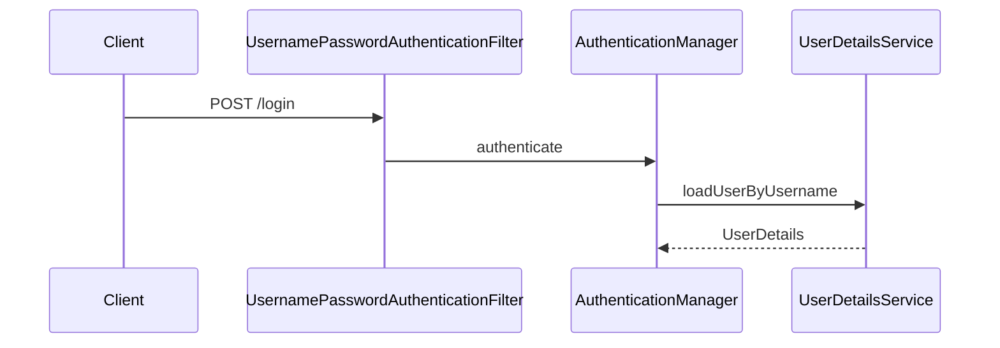

# 第 5 章：表单登录与 UserDetails：从内存用户到业务用户

> 本章对齐 [docs/template.md](../template.md)，建议字数 3000–5000。

---

## 1 项目背景（约 500 字）

### 业务场景

「门店运营后台」需要 **演示账号** 与 **正式员工账号** 并存：演示环境用内存用户快速验收；生产环境从 HR 系统同步账号。产品要求：**登录成功后，业务层能拿到统一的用户对象**，而不是在 Session 里手写 Map。

### 痛点放大

若登录逻辑散落在 Servlet 里，会出现 **密码校验与授权规则不一致**、`User` 对象类型各模块各写一套。Spring Security 用 **`UserDetails`** 抽象「安全视角的用户」，用 **`UserDetailsService`** 抽象「按用户名加载用户」，表单登录过滤器负责 **把提交的用户名密码交给 `AuthenticationManager`**。

### 流程图



---

## 2 项目设计：剧本式交锋对话（约 1200 字）

**场景**：讨论演示账号方案。

**小胖**

「内存用户不就是写死在代码里？和配置文件有啥区别？」

**小白**

「`UserDetails` 和领域层的 `User` 实体要不要合并成一个类？」

**大师**

「**安全视角** 的 `UserDetails` 关注 **凭证、是否过期、权限集合**；领域 `User` 可能关心 **积分、等级**。可以 **同一类实现两接口**，也可以 **适配器模式** 把领域实体转成 `UserDetails`。」

**技术映射**：`UserDetails` → 认证主体快照；`UserDetailsService` → 按用户名加载。

**小胖**

「`PasswordEncoder` 在哪一步参与？」

**小白**

「若自定义登录页字段名不是 `username`/`password` 怎么办？」

**大师**

「`DaoAuthenticationProvider` 会用 **`PasswordEncoder` 校验密码**；字段名可通过 `UsernamePasswordAuthenticationFilter` 的 `setUsernameParameter` 等调整。」

**技术映射**：`DaoAuthenticationProvider` + `PasswordEncoder`；`formLogin().loginPage(...)`。

**小胖**

「登录成功后的默认跳转页能改吗？」

**大师**

「可以 `defaultSuccessUrl`、`successHandler`；**记住业务跳转要防开放重定向漏洞**。」

**技术映射**：`SavedRequest` / `successHandler`；开放重定向 → 校验 URL。

---

## 3 项目实战（约 1500–2000 字）

### 环境准备

`spring-boot-starter-security`、`thymeleaf`（可选）。

### 步骤 1：内存用户（演示）

```java
@Bean
UserDetailsService users() {
  UserDetails user = User.withUsername("demo")
      .password(passwordEncoder().encode("demo"))
      .roles("USER")
      .build();
  return new InMemoryUserDetailsManager(user);
}

@Bean
PasswordEncoder passwordEncoder() {
  return new BCryptPasswordEncoder();
}
```

### 步骤 2：启用表单登录

```java
http.formLogin(withDefaults());
```

### 步骤 3：自定义 `UserDetails`（业务）

```java
public class ShopUserDetails implements UserDetails {
  private final Long storeId;
  // ... getAuthorities, getPassword, isEnabled 等
}
```

### 测试

```java
mockMvc.perform(formLogin().user("demo").password("demo"))
    .andExpect(authenticated());
```

### 可能遇到的坑

| 坑 | 处理 |
|----|------|
| 明文密码未编码 | 必须 `PasswordEncoder` |
| 角色名 `ROLE_` 前缀 | `hasRole("ADMIN")` 与 `ROLE_ADMIN` 关系（见文档） |

---

## 4 项目总结（约 500–800 字）

### 优点与缺点

| 维度 | UserDetails 模型 | Session 手写 Map |
|------|------------------|------------------|
| 一致性 | 与 Provider 链统一 | 差 |
| 灵活性 | 可扩展字段 | 随意 |

### 适用场景

- 表单登录 B/S；需要 RBAC 扩展。

### 不适用场景

- 纯无状态 JWT、无表单（见第 21 章）。

### 常见踩坑

1. 忘记密码编码导致「永远登录失败」。
2. 混淆 `User`（Spring）与自建实体类名。

### 思考题

1. `UserDetails` 的 `getAuthorities()` 与数据库角色表如何映射？（第 15 章 SpEL）
2. 登录成功后如何拿到 `ShopUserDetails`？（`SecurityContextHolder.getContext().getAuthentication().getPrincipal()`）

### 推广计划提示

- **测试**：`@WithUserDetails` 与自定义 `UserDetailsService` 联调。
- **开发**：领域层与安全层边界写进编码规范。

---

*本章完。*
