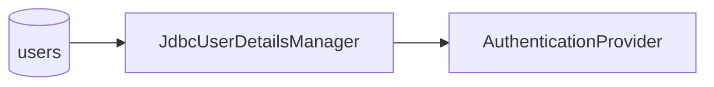

# 第 6 章：JDBC UserDetailsService 与密码存储

> 本章对齐 [docs/template.md](../template.md)，建议字数 3000–5000。

---

## 1 项目背景（约 500 字）

### 业务场景

HR 系统已将员工账号落在 **关系型数据库**（如 `users`、`authorities` 表）。应用需 **按用户名加载账号**、校验密码哈希、加载角色。不允许在生产使用内存用户。

### 痛点放大

手写 SQL 容易 **SQL 注入**、与 Security 的 **默认表结构** 不一致；密码若明文存储则 **合规一票否决**。需要使用 **`JdbcUserDetailsManager`** 或自定义 `JdbcUserDetailsManager` 子类 / 自定义 `UserDetailsService` + Repository。

### 流程图



源码锚点：`core/.../provisioning/JdbcUserDetailsManager.java`。

---

## 2 项目设计：剧本式交锋对话（约 1200 字）

**场景**：数据库表设计评审。

**小胖**

「官方文档老提 `users` 表，我们表名不一样咋办？」

**小白**

「密码哈希存在哪一列？升级算法时如何批量迁移？」

**大师**

「可以 **自定义 SQL** 或 **继承/组合 `JdbcUserDetailsManager`**，把列名映射到查询语句。密码列 **只存哈希**，算法用 `PasswordEncoder` 标识（如 `{bcrypt}` 前缀，BCrypt 自带）。」

**技术映射**：`JdbcUserDetailsManager` + SQL 定制；`PasswordEncoder` → 存储格式。

**小胖**

「权限存在一张表还是 JSON 里？」

**大师**

「常见 **多对多** `user_authorities`；**方法级权限**可走 SpEL 或 DB 侧拉平（见第 15 章）。」

**技术映射**：`GrantedAuthority` 列表 ← `authorities` 查询结果。

**小白**

「连接池、事务边界呢？`loadUserByUsername` 每次登录都打 DB？」

**大师**

「可加 **缓存**（第 19 章）并注意 **缓存失效**（改密、锁号）。」

---

## 3 项目实战（约 1500–2000 字）

### 环境准备

`spring-boot-starter-jdbc`、`spring-security-core`、数据库（H2 演示）。

### 步骤 1：初始化 schema（示例）

```sql
CREATE TABLE users (
  username VARCHAR(50) NOT NULL PRIMARY KEY,
  password VARCHAR(500) NOT NULL,
  enabled BOOLEAN NOT NULL
);
CREATE TABLE authorities (
  username VARCHAR(50) NOT NULL,
  authority VARCHAR(50) NOT NULL
);
```

### 步骤 2：配置 `DataSource` 与 `JdbcUserDetailsManager`

```java
@Bean
UserDetailsManager users(DataSource dataSource) {
  JdbcUserDetailsManager jdbc = new JdbcUserDetailsManager(dataSource);
  jdbc.setCreateUserSql("..."); // 若需自定义
  return jdbc;
}
```

### 步骤 3：插入测试数据（密码 BCrypt）

```java
jdbc.update("INSERT INTO users VALUES (?,?,?)", "alice", encoder.encode("secret"), true);
```

### 测试

```bash
curl -u alice:secret http://localhost:8080/api/me
```

### 可能遇到的坑

| 坑 | 处理 |
|----|------|
| 密码无 `{bcrypt}` 前缀导致 DelegatingPasswordEncoder 解析失败 | 统一编码策略或迁移 |
| 大小写敏感 | 用户名规范 |

---

## 4 项目总结（约 500–800 字）

### 优点与缺点

| 维度 | JDBC | LDAP / OAuth |
|------|------|----------------|
| 运维复杂度 | 低（单库） | 依赖外部 |
| 账号生命周期 | 应用内可控 | 与 IdP 同步 |

### 适用场景

- 中小团队内网系统；账号在自有库。

### 不适用场景

- 集团统一 AD/SSO（第 33 章）。

### 常见踩坑

1. 忘记给 `enabled` 字段导致账户永久禁用。
2. 角色字符串与 `hasRole` 前缀不一致。

### 思考题

1. 如何用 `UserDetailsManager` 的 API 创建用户并避免密码明文落库？（`createUser`）
2. 与 Spring Data JPA 的 `UserDetailsService` 实现相比，JDBC 何时更优？

### 推广计划提示

- **DBA**：评审索引（`username`）、审计字段。
- **测试**：准备脱敏数据集。

---

*本章完。*
