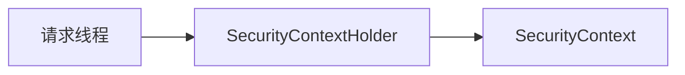

# 第 8 章：会话、SecurityContext 与线程绑定

> 本章对齐 [docs/template.md](../template.md)，建议字数 3000–5000。

---

## 1 项目背景（约 500 字）

### 业务场景

浏览器会话（Session）维持登录态；同一用户连续点击多个接口，**每个请求线程**都要能取到当前 `Authentication`。微服务内部还有 **异步任务** 需要「谁在执行」的上下文。

### 痛点放大

若业务代码用 **静态 ThreadLocal 存用户**，异步一切就丢；若 **把用户 ID 放请求参数**，则易被伪造。Spring Security 用 **`SecurityContextHolder`** 绑定 **`SecurityContext`**（内含 `Authentication`），并在请求结束时清理。

### 流程图



源码：`core/.../SecurityContextHolder.java`。

---

## 2 项目设计：剧本式交锋对话（约 1200 字）

**小胖**

「Session 和 SecurityContext 啥关系？不都是存用户吗？」

**小白**

「`HttpSession` 里存的是 `SecurityContext` 还是整个 `Authentication`？」

**大师**

「典型 Servlet 场景：**Session 持久化安全上下文**（由 `SecurityContextRepository` 负责存取）；**`SecurityContextHolder` 是当前请求的『工作副本』**。」

**技术映射**：`HttpSessionSecurityContextRepository`；`SecurityContextHolder` → ThreadLocal 策略。

**小白**

「`MODE_INHERITABLETHREADLOCAL` 干啥用？」

**大师**

「子线程 **继承** 父线程上下文；**响应式** 则不用 ThreadLocal，改用 Reactor Context。」

**技术映射**：`SecurityContextHolderStrategy`；WebFlux → `ReactiveSecurityContextHolder`。

**小胖**

「定时任务谁的用户？」

**大师**

「**系统任务** 通常用 **RUN_AS** 或 **显式切换** `SecurityContext`，不能默认继承用户。」

---

## 3 项目实战（约 1500–2000 字）

### 步骤 1：读取当前用户

```java
Authentication auth = SecurityContextHolder.getContext().getAuthentication();
String name = auth.getName();
```

### 步骤 2：异步传递（Servlet）

```java
SecurityContext context = SecurityContextHolder.getContext();
executor.execute(() -> {
  try {
    SecurityContextHolder.setContext(context);
    // ...
  } finally {
    SecurityContextHolder.clearContext();
  }
});
```

### 步骤 3：Session 超时

`server.servlet.session.timeout` 与业务「闲置登出」协同。

### 测试

`@WithSecurityContext` 或手动 `SecurityContextHolder` 设置。

### 可能遇到的坑

| 坑 | 处理 |
|----|------|
| 线程池复用导致上下文泄漏 | `finally` 中 `clearContext` |
| WebFlux 混用 Servlet 代码 | 用响应式 API |

---

## 4 项目总结（约 500–800 字）

### 优点与缺点

| 维度 | SecurityContextHolder | 手写 ThreadLocal |
|------|----------------------|------------------|
| 一致性 | 与 Filter 链一致 | 易错 |
| 跨栈 | 需区分 Servlet/Reactive | 灵活 |

### 思考题

1. `SecurityContextPersistenceFilter` 在链上的位置为何重要？
2. 集群 Session 下要注意什么？（Redis、序列化）

### 推广计划提示

- **运维**：Session 黏性与负载均衡；Redis 会话序列化版本升级。

---

*本章完。*
