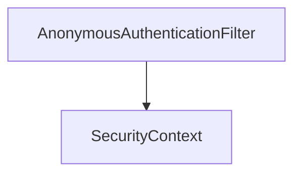

# 第 9 章：匿名用户：公开接口与「未登录」语义

> 本章对齐 [docs/template.md](../template.md)，建议字数 3000–5000。

---

## 1 项目背景（约 500 字）

### 业务场景

电商商品页 **允许匿名浏览**；加入购物车需登录。技术层需要区分：**「未登录」与「匿名用户」在 Security 里是否同一对象**？审计日志要写「guest」还是 `anonymousUser`？运营还要求：**公开接口的访问日志里必须能统计 UV**，但又不能把匿名请求误记成「已登录用户行为」。

### 痛点放大

若 `permitAll` 后 `SecurityContext` 为 `null`，业务代码 **空指针**；若把匿名当已登录，**权限错误**。Spring Security 提供 **`AnonymousAuthenticationFilter`**，为匿名请求注入 **`AnonymousAuthenticationToken`**，让「没有凭证」在模型上仍是 **合法的 Authentication**，只是 **类型为匿名**。

### 流程图



源码：`web/.../authentication/AnonymousAuthenticationToken.java`、`AnonymousAuthenticationFilter.java`。

---

## 2 项目设计：剧本式交锋对话（约 1200 字）

**场景**：商品详情页要展示「登录后可见的会员价」，匿名用户只能看原价。

**小胖**

「匿名为啥还算一种 Authentication？不矛盾吗？没登录不就是 null 吗？」

**小白**

「如果业务里统一写 `getAuthentication().getName()`，匿名会不会 NPE？和 `permitAll` 谁先谁后？」

**大师**

「Spring Security 刻意避免 **『无认证对象』** 这种三态，否则每个业务点都要判空。匿名请求在通过 `AnonymousAuthenticationFilter` 后，`SecurityContext` 里会放入 **`AnonymousAuthenticationToken`**，名字通常是 **`anonymousUser`**。这样 **审计、SpEL、日志** 都能走同一套 API。」

**技术映射**：`AnonymousAuthenticationFilter` → 为「无凭证请求」补齐 `Authentication`；避免 `null`。

**小胖**

「那跟食堂『临时访客证』一样？有证但不是正式员工？」

**小白**

「等等，`isAuthenticated()` 到底返回啥？我如果写 `authenticated()` 规则，匿名会被挡吗？」

**大师**

「这是高频混淆点：**`AnonymousAuthenticationToken` 历史上常被当作 `isAuthenticated()==true`（表示『身份已建立』为匿名）**；但在 **授权规则里**，`authenticated()` 一般指 **非匿名**。务必以你使用的 **Spring Security 版本文档** 为准，并在集成测试里 **断言行为**。」

**技术映射**：`authorizeHttpRequests` 的 `authenticated()` → **非匿名主体**；与 `permitAll()` 组合使用。

**小胖**

「公开 API 要打审计日志，用户写谁？」

**小白**

「方法级 `@PreAuthorize("isAnonymous()")` 和 URL 层 `permitAll` 会冲突吗？」

**大师**

「审计里可以写 `auth.getName()` → `anonymousUser`，或自定义 **`AnonymousAuthenticationProvider` 的 key**；若需要 **区分爬虫与真人**，仍要靠 WAF/风控，Security 只解决 **『主体标识一致』**。」

**技术映射**：`AnonymousAuthenticationProvider`；`GrantedAuthority` 如 `ROLE_ANONYMOUS`（若启用）。

**小白**

「什么时候要 `http.anonymous(disable)`？」

**大师**

「极少数 **纯机器 API** 想强制「要么 JWT 要么 401、不要匿名主体」时才关掉；多数 Web 场景 **保留匿名** 更简单。」

**技术映射**：`http.anonymous(AbstractHttpConfigurer::disable)` → 无匿名 `Authentication`，需评估 NPE 与 `ExceptionTranslationFilter` 行为。

---

## 3 项目实战（约 1500–2000 字）

### 环境准备

- Spring Boot 3.x + `spring-boot-starter-security`、`spring-boot-starter-web`。
- 打开调试日志：`logging.level.org.springframework.security=DEBUG`（仅本地）。

### 步骤 1：配置公开路由与受保护路由

**目标**：商品浏览匿名可访问，购物车必须登录。

```java
http.authorizeHttpRequests(a -> a
    .requestMatchers("/products/**", "/css/**", "/error").permitAll()
    .requestMatchers("/cart/**").authenticated());
```

**预期**：未登录访问 `/products/1` → 200；访问 `/cart` → 302/401（视配置）。

### 步骤 2：在控制器中安全地读取身份

```java
@GetMapping("/products/{id}")
public String detail(@PathVariable Long id, Model model) {
  Authentication a = SecurityContextHolder.getContext().getAuthentication();
  model.addAttribute("viewer", a.getName());
  model.addAttribute("isAnon", a instanceof AnonymousAuthenticationToken);
  return "product";
}
```

### 步骤 3：方法安全（可选）

```java
@PreAuthorize("isAuthenticated() and !isAnonymous()")
public void addToCart(Long skuId) { ... }
```

需 `@EnableMethodSecurity`。

### 步骤 4：关闭匿名（慎用）

```java
http.anonymous(AbstractHttpConfigurer::disable);
```

**验证**：观察未登录访问 `permitAll` 路径时 `SecurityContext` 是否仍有所需信息。

### 测试验证

```java
@Test
void productAnonymousOk() throws Exception {
  mockMvc.perform(get("/products/1")).andExpect(status().isOk());
}

@Test
void cartRedirects() throws Exception {
  mockMvc.perform(get("/cart")).andExpect(status().is3xxRedirection());
}
```

**控制台（文字预期）**：DEBUG 日志中出现 `AnonymousAuthenticationFilter` 相关条目（视版本格式略有差异）。

### 截图说明（供插图或评审时对照）

| 编号 | 建议截图内容 | 预期画面（文字描述） |
|------|----------------|----------------------|
| 图 9-1 | 浏览器访问 `/products/1` | 页面正常渲染；若页面上展示「当前访客：anonymousUser」，应与控制器写入一致。 |
| 图 9-2 | 未登录访问 `/cart` | 浏览器地址栏跳转到 `/login` 或返回 401（JSON API 场景）；Network 面板可见重定向链。 |
| 图 9-3 | IDEA 断点停在 `AnonymousAuthenticationFilter` | Variables 中可见 `AnonymousAuthenticationToken` 或 Filter 向 `SecurityContext` 写入的过程。 |
| 图 9-4 | 日志 DEBUG | 控制台出现 Security 过滤链处理匿名请求的相关行（可复制关键 3～5 行作为附录）。 |

### 可能遇到的坑

| 坑 | 处理 |
|----|------|
| 误以为 permitAll 无 Authentication | 实际常有匿名 Token；不要对 `getAuthentication()` 无条件判 null |
| SpEL `isAnonymous()` 与方法安全未启用 | 加 `@EnableMethodSecurity` |
| 前后端分离时 401 与 302 不一致 | 自定义 `AuthenticationEntryPoint`（第 18 章） |

---

## 4 项目总结（约 500–800 字）

### 优点与缺点

| 维度 | 匿名对象模型 | null 表示未登录 |
|------|--------------|-----------------|
| NPE | 少 | 多 |
| 语义 | 需学习 | 直观 |
| 审计 | 统一 `getName()` | 需分支 |

### 适用场景

- 公开读多、写少的站点；需要 **一致的主体 API**。

### 不适用场景

- 强制 **无匿名主体** 的纯 API（可关 `anonymous`，但要全链路评估）。

### 注意事项

- **版本差异**：以官方文档与 **集成测试** 为准，不要死记 `isAuthenticated()` 的布尔组合。

### 常见踩坑经验

1. **报表把匿名当登录用户**：统计口径应用 `instanceof AnonymousAuthenticationToken` 或 `isAnonymous()`。
2. **方法安全与 URL 规则打架**：同一接口既有 `permitAll` 又有 `@PreAuthorize`，需理清执行顺序与代理边界。

### 思考题

1. `permitAll` 与 `AnonymousAuthenticationFilter` 在链上的大致顺序？（对照 `FilterChainProxy` 调试）
2. 匿名用户能否带 `GrantedAuthority`？`ROLE_ANONYMOUS` 在授权里如何用？

### 推广计划提示

- **开发**：封装 `CurrentUser`：返回 `Optional<AuthenticatedUser>`，明确排除匿名。
- **测试**：用例覆盖「匿名 200」「未登录访问受保护 302/401」。

---

*本章完。*
