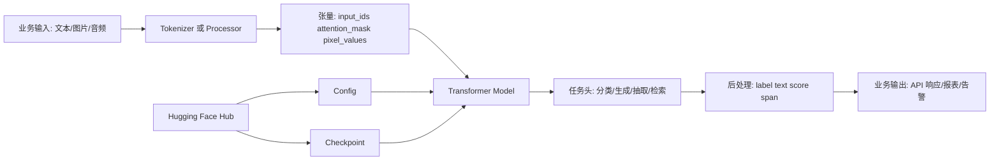

# Transformers 源码剖析与实战修炼专栏大纲

> 版本：Transformers 4.x 主线版本
> 面向人群：新人开发、测试、算法工程师、后端开发、运维、架构师
> 总章节：40 章（基础篇 16 章 / 中级篇 15 章 / 高级篇 9 章）
> 每章独立成文件，字数 3000-5000 字

---

## 专栏定位

本专栏以 Hugging Face Transformers 为主线，围绕“能用、会调、敢上线、懂源码”四个目标展开。内容不把理论堆成公式墙，而是用真实或拟真的业务场景驱动：客服分类、合同抽取、知识库问答、模型微调、推理服务、监控告警、源码扩展等。每章采用“业务痛点 → 三人剧本对话 → 代码实战 → 总结思考”的四段式结构，让读者在动手完成一个个小项目的过程中，逐步理解 Tokenizer、Model、Pipeline、Trainer、Generation、PEFT、Accelerate、Serving、源码架构等核心能力。

---

## 阅读路线建议

| 角色 | 建议阅读顺序 | 重点章节 |
|------|-------------|---------|
| 新人开发/测试 | 基础篇全读 → 中级篇选读 | 第 1-16 章 |
| 算法/核心开发 | 基础篇速读 → 中级篇精读 → 高级篇选读 | 第 17-31、32-40 章 |
| 运维/SRE | 基础篇选读 → 中级篇部署与可观测性 → 高级篇性能优化 | 第 14-16、22-31、39-40 章 |
| 架构师/资深开发 | 高级篇为主线，按需回溯中级篇 | 第 32-40 章，辅以第 17-31 章 |

---

# 基础篇（第 1-16 章）

> **核心目标**：建立 Transformers 核心概念，掌握本地环境、常用 API、基础 NLP 任务与小规模实战。
> **源码关联**：src/transformers/pipelines/、src/transformers/models/auto/、src/transformers/tokenization_utils_base.py、src/transformers/modeling_utils.py。

---

## 第1章：Transformers 术语全景与工作原理
**定位**：专栏开篇，建立统一语系，理解 Transformers 从文本到预测结果的完整链路。
**核心内容**：
- 术语词典：Tokenizer、Token、Embedding、Attention、Encoder、Decoder、Model、Config、Checkpoint、Pipeline、Trainer、Dataset、Hub
- Transformer 架构基本流程：输入文本、分词、向量化、注意力计算、任务头输出
- Transformers 库的抽象层：AutoTokenizer、AutoModel、AutoConfig、Pipeline、Trainer
- 模型生态：BERT、GPT、T5、BART、LLaMA、Qwen、Vision Transformer、CLIP
- 工程链路：下载模型、缓存权重、加载配置、前向推理、后处理
- 源码关联：src/transformers/pipelines/base.py、src/transformers/models/auto/、src/transformers/modeling_utils.py

**实战目标**：用 Pipeline 分别完成情感分析、文本生成、问答三个最小 Demo，并画出团队内部可复用的 Transformers 工作流图。

---

## 第2章：环境搭建与第一个 Pipeline 应用
**定位**：从零跑通 Transformers，解决安装、模型下载和本地缓存问题。
**核心内容**：
- Python、PyTorch、Transformers、Datasets、Accelerate 的版本选择
- CPU、CUDA、MPS 环境差异与验证方式
- pipeline 的任务类型：text-classification、text-generation、question-answering、summarization
- 模型缓存目录、离线加载、镜像源与网络失败处理
- 常见报错：依赖冲突、CUDA 不匹配、模型下载中断、内存不足
- 源码关联：src/transformers/pipelines/__init__.py、src/transformers/utils/hub.py
**实战目标**：搭建一个“AI 文案小助手”命令行工具，输入一句中文商品描述，输出情感倾向和改写建议。

---

## 第3章：Tokenizer 入门与文本预处理实战
**定位**：理解模型为什么不能直接读自然语言文本。
**核心内容**：
- Tokenizer 的职责：规范化、预分词、词表映射、特殊符号、padding、truncation
- BPE、WordPiece、SentencePiece 的直观差异
- input_ids、attention_mask、token_type_ids 的含义
- 中文文本处理：空格、全角半角、表情、繁简转换、长文本截断
- batch_encode_plus 与 __call__ 的常用参数
- 源码关联：src/transformers/tokenization_utils_base.py、src/transformers/tokenization_utils_fast.py
**实战目标**：构建一个客服工单预处理脚本，把原始投诉文本批量转换为模型可用的张量输入，并输出长度分布报告。

---

## 第4章：模型加载、配置文件与权重管理
**定位**：理解 from_pretrained 背后发生了什么。
**核心内容**：
- AutoConfig、AutoTokenizer、AutoModel 的加载顺序
- config.json、tokenizer.json、model.safetensors、generation_config.json 的作用
- PyTorch 权重、Safetensors 权重与安全加载
- 本地路径加载、私有模型加载、revision 固定版本
- device_map、torch_dtype、low_cpu_mem_usage 的基础用法
- 源码关联：src/transformers/configuration_utils.py、src/transformers/modeling_utils.py
**实战目标**：下载并本地化一个中文 BERT 模型，封装成可复用的模型加载器，支持在线与离线两种模式。

---

## 第5章：文本分类实战：客服工单自动分派
**定位**：用最常见的监督学习任务建立业务闭环。
**核心内容**：
- 文本分类任务定义：单标签、多标签、层级标签
- AutoModelForSequenceClassification 的输入与输出
- label2id、id2label 与业务标签映射
- 小样本数据集划分：train、validation、test
- 混淆矩阵、准确率、召回率、F1 的业务解释
- 源码关联：src/transformers/models/auto/modeling_auto.py、src/transformers/modeling_outputs.py
**实战目标**：训练一个客服工单分类器，把投诉、咨询、退款、物流问题自动分派给不同处理队列。

---

## 第6章：命名实体识别实战：合同关键信息抽取
**定位**：掌握 token 级别预测任务，解决结构化抽取问题。
**核心内容**：
- NER 与 BIO/BIOES 标注体系
- Token 与 Label 对齐：中文字符、子词切分、ignore_index
- AutoModelForTokenClassification 的训练与推理
- 实体后处理：合并 span、去重、置信度过滤
- 合同、发票、病历等抽取场景的边界条件
- 源码关联：src/transformers/models/auto/modeling_auto.py、examples/pytorch/token-classification/
**实战目标**：从合同文本中抽取甲方、乙方、金额、日期、合同编号，并输出 JSON 结构化结果。

---

## 第7章：问答任务实战：搭建 FAQ 智能助手
**定位**：理解抽取式问答的输入拼接和答案定位机制。
**核心内容**：
- Question Answering 的 start_logits 与 end_logits
- question/context 拼接、max_seq_length、doc_stride
- 长文档滑窗切分与答案回填
- SQuAD 风格数据格式
- 无答案问题与置信度阈值
- 源码关联：examples/pytorch/question-answering/、src/transformers/pipelines/question_answering.py
**实战目标**：基于公司产品 FAQ 构建一个抽取式问答机器人，支持从长文档中定位答案片段。

---

## 第8章：文本生成入门：从提示词到可控输出
**定位**：掌握生成式模型最常用的推理参数。
**核心内容**：
- Causal LM 与 Seq2Seq LM 的区别
- max_new_tokens、temperature、top_k、top_p、repetition_penalty
- 贪心搜索、采样、Beam Search 的适用场景
- prompt 模板与停止词处理
- 中文生成常见问题：重复、跑题、幻觉、格式不稳定
- 源码关联：src/transformers/generation/utils.py、src/transformers/generation/configuration_utils.py
**实战目标**：实现一个“营销标题生成器”，对比不同生成参数下的多样性、稳定性和可用率。

---

## 第9章：Embedding 实战：语义搜索与相似问匹配
**定位**：从生成和分类之外，掌握向量检索这一高频工程能力。
**核心内容**：
- Embedding、Sentence Embedding、Pooling 的概念
- CLS pooling、mean pooling、max pooling 的差异
- 向量相似度：cosine、dot product、L2 distance
- 批量编码、归一化、向量缓存
- FAISS 或本地向量索引的基础使用
- 源码关联：src/transformers/modeling_outputs.py、src/transformers/models/auto/modeling_auto.py
**实战目标**：构建一个相似问题检索系统，输入用户问题后返回 Top 5 历史问答。

---

## 第10章：Datasets 入门：数据加载、清洗与切分
**定位**：把零散 CSV、JSON、Excel 数据变成可训练数据集。
**核心内容**：
- load_dataset、Dataset、DatasetDict 的基本用法
- map、filter、shuffle、select、train_test_split
- 数据清洗：去重、空值、异常标签、超长文本
- 数据缓存、Arrow 格式与内存映射
- 数据版本管理与可复现实验
- 源码关联：examples/pytorch/text-classification/、examples/pytorch/language-modeling/
**实战目标**：整理一份客服工单 CSV，完成清洗、标签映射、训练验证切分，并保存为可复用数据集。

---

## 第11章：Trainer 入门：标准训练流程跑通
**定位**：使用官方训练框架完成从数据到模型的闭环。
**核心内容**：
- TrainingArguments 的核心参数：batch size、learning rate、epochs、logging、save_strategy
- Trainer 的组成：model、args、train_dataset、eval_dataset、tokenizer、compute_metrics
- DataCollator 与动态 padding
- Checkpoint 保存、断点续训、最佳模型加载
- 训练日志阅读：loss、eval_loss、metric、learning_rate
- 源码关联：src/transformers/trainer.py、src/transformers/training_args.py、src/transformers/data/data_collator.py
**实战目标**：用 Trainer 训练一个文本分类模型，保存最佳 checkpoint，并编写推理脚本验证效果。

---

## 第12章：模型评估与错误分析
**定位**：学会判断模型是否真的解决了业务问题。
**核心内容**：
- 训练集、验证集、测试集的职责边界
- 分类指标：Accuracy、Precision、Recall、F1、AUC
- 生成指标：BLEU、ROUGE、Exact Match、人工评审
- 错误样本分析：标签错、边界错、数据偏、模型弱
- 业务验收指标：误分成本、人工节省率、覆盖率
- 源码关联：examples/pytorch/text-classification/run_glue.py、examples/pytorch/summarization/run_summarization.py
**实战目标**：为客服分类器生成一份错误分析报告，找出 Top 3 误分原因并提出数据改进方案。

---

## 第13章：模型保存、导出与本地推理封装
**定位**：让训练好的模型能被业务系统稳定调用。
**核心内容**：
- save_pretrained 与 from_pretrained 的配套使用
- 模型目录结构规范与元数据说明
- 推理类封装：加载、预处理、预测、后处理
- 批量推理与单条推理的性能差异
- 输出格式标准化：label、score、latency、trace_id
- 源码关联：src/transformers/modeling_utils.py、src/transformers/tokenization_utils_base.py
**实战目标**：把训练好的分类模型封装为一个 Python SDK，供后端服务直接调用。

---

## 第14章：FastAPI 部署入门：把模型变成 HTTP 服务
**定位**：完成从 notebook 到 API 服务的第一步。
**核心内容**：
- FastAPI 服务结构：路由、请求模型、响应模型
- 模型单例加载与启动耗时优化
- 同步推理、批量接口、健康检查接口
- Dockerfile 基础构建与依赖瘦身
- API 级错误处理：超长文本、空输入、模型未加载
- 源码关联：src/transformers/pipelines/base.py、src/transformers/utils/import_utils.py
**实战目标**：部署一个文本分类 HTTP 服务，提供 /predict、/batch_predict、/health 三个接口，并用 curl 验证。

---

## 第15章：新手常见故障排查与调试技巧
**定位**：从能跑到能定位问题。
**核心内容**：
- 模型下载失败、缓存损坏、版本不兼容排查
- CUDA OOM、CPU 内存爆掉、推理速度慢
- Tokenizer 输出异常、label 对齐错误、输出全是同一类
- 训练 loss 不下降、验证指标虚高、数据泄漏
- logging、断点、最小复现脚本的使用习惯
- 源码关联：src/transformers/utils/logging.py、src/transformers/utils/hub.py
**实战目标**：构造 5 个常见故障案例，写出排查 SOP 和最小复现脚本。

---

## 第16章：【基础篇综合实战】企业客服文本智能分派系统
**定位**：融会贯通基础篇知识，完成一个可演示的小型业务系统。
**核心内容**：
- 场景：客服中心每天接收大量投诉、咨询、退款、物流问题，需要自动分派
- 需求拆解：数据清洗、文本分类训练、错误分析、模型保存、API 部署
- 分步实现：Datasets 处理数据、Trainer 训练模型、FastAPI 提供预测接口、Docker 打包
- 验收标准：宏平均 F1 大于 0.85，单条推理 P95 小于 100ms，支持批量预测
- 推广计划：测试团队负责构造边界样本，开发团队负责接口集成，运维团队负责部署与监控
**实战目标**：交付一个可运行的客服分派 Demo，包括训练脚本、推理服务、测试数据和验收报告。

---

# 中级篇（第 17-31 章）

> **核心目标**：掌握微调策略、分布式训练、推理优化、RAG、可观测性与生产化部署。
> **源码关联**：src/transformers/trainer.py、src/transformers/generation/、src/transformers/integrations/、src/transformers/models/auto/。

---

## 第17章：微调策略进阶：全量微调、冻结与差分学习率
**定位**：从“能训练”走向“训练得稳、训练得省”。
**核心内容**：
- 全量微调、冻结底层、只训练任务头的适用场景
- 学习率、warmup、weight decay、gradient clipping
- 分层学习率与参数组设置
- 小数据集过拟合的识别与处理
- 训练成本、效果、上线风险的取舍
- 源码关联：src/transformers/trainer.py、src/transformers/optimization.py
**实战目标**：在同一数据集上对比三种微调策略，输出效果、耗时、显存占用对比表。

---

## 第18章：PEFT 与 LoRA 实战：低成本微调大模型
**定位**：掌握企业最常用的大模型低成本适配方法。
**核心内容**：
- LoRA 的核心思想：冻结原权重，注入低秩矩阵
- target_modules、rank、alpha、dropout 的调参思路
- Adapter 权重保存、加载、合并与回滚
- QLoRA 与量化训练的基础概念
- 多业务 Adapter 管理与版本隔离
- 源码关联：src/transformers/integrations/peft.py、src/transformers/modeling_utils.py
**实战目标**：用 LoRA 微调一个中文指令模型，让它学会输出固定格式的客服回复模板。

---

## 第19章：长文本处理：滑窗、摘要与层级建模
**定位**：解决合同、报告、日志等超长输入无法一次喂给模型的问题。
**核心内容**：
- max_position_embeddings 与上下文窗口限制
- 滑窗切分、overlap、结果聚合
- 先摘要后分类、先检索后阅读的工程策略
- Longformer、BigBird、RoPE 扩展的基本思路
- 长文本评估：覆盖率、遗漏率、段落级召回
- 源码关联：src/transformers/models/longformer/、src/transformers/models/big_bird/
**实战目标**：构建一个合同风险识别流程，对 50 页合同进行切分、检索、摘要和风险标签输出。

---

## 第20章：生成控制进阶：Beam Search、约束解码与结构化输出
**定位**：让生成结果更可控、更适合业务系统消费。
**核心内容**：
- Beam Search、Beam Sampling、Diverse Beam Search
- repetition_penalty、no_repeat_ngram_size、bad_words_ids
- constrained decoding 与 prefix_allowed_tokens_fn
- JSON、Markdown、SQL 等结构化输出约束
- 生成结果自动校验与重试策略
- 源码关联：src/transformers/generation/beam_search.py、src/transformers/generation/logits_process.py
**实战目标**：实现一个“工单处理建议生成器”，要求输出严格 JSON，并在格式错误时自动修复。

---

## 第21章：RAG 入门：知识库问答系统
**定位**：把模型生成能力与企业私有知识结合起来。
**核心内容**：
- RAG 基本流程：文档切分、向量化、召回、重排、生成
- chunk size、overlap、metadata 的设计
- 向量数据库与本地 FAISS 的选择
- Prompt 组装：引用来源、拒答策略、防幻觉提示
- 召回质量与答案质量的分层评估
- 源码关联：src/transformers/generation/utils.py、src/transformers/models/auto/
**实战目标**：基于产品手册搭建一个知识库问答 Demo，回答时附带引用段落和置信度。

---

## 第22章：推理性能优化：批处理、量化与设备映射
**定位**：在有限机器资源下提升吞吐并降低成本。
**核心内容**：
- batch size、sequence length、padding 对吞吐的影响
- fp32、fp16、bf16、int8、int4 的效果与风险
- device_map、max_memory、offload 的基础配置
- torch.compile、BetterTransformer、Flash Attention 的适用条件
- 性能指标：QPS、TPOT、TTFT、P50/P95/P99
- 源码关联：src/transformers/modeling_utils.py、src/transformers/utils/quantization_config.py
**实战目标**：对一个生成模型进行 fp16、int8、int4 推理对比，输出延迟、显存、质量变化报告。

---

## 第23章：分布式训练入门：Accelerate 与多卡训练
**定位**：从单卡训练扩展到多卡训练。
**核心内容**：
- 数据并行、模型并行、张量并行的基本概念
- Accelerate 配置文件与启动方式
- gradient accumulation、mixed precision、checkpointing
- 多卡日志、随机种子、指标聚合
- 常见问题：卡住、通信超时、显存不均、NCCL 报错
- 源码关联：src/transformers/trainer.py、src/transformers/integrations/deepspeed.py
**实战目标**：用 Accelerate 将文本分类训练从单卡迁移到双卡，并验证速度提升和指标一致性。

---

## 第24章：DeepSpeed 与 ZeRO：训练大模型的内存魔法
**定位**：理解大模型训练中参数、梯度和优化器状态如何被拆分。
**核心内容**：
- ZeRO Stage 1/2/3 的拆分对象
- CPU offload、NVMe offload 的适用场景
- DeepSpeed config 与 TrainingArguments 集成
- 梯度检查点与激活值重计算
- 成本、速度、稳定性的工程取舍
- 源码关联：src/transformers/integrations/deepspeed.py、src/transformers/trainer.py
**实战目标**：用 DeepSpeed ZeRO-2 训练一个中等规模模型，对比普通 DDP 的显存占用。

---

## 第25章：模型服务化进阶：异步队列、批量合并与限流
**定位**：让推理服务能扛真实流量。
**核心内容**：
- 在线推理架构：API 层、队列层、模型执行层
- 动态 batching、请求超时、优先级队列
- 限流、熔断、降级与缓存
- GPU 利用率、队列长度、请求积压监控
- 多模型路由与热加载边界
- 源码关联：src/transformers/pipelines/base.py、src/transformers/generation/streamers.py
**实战目标**：改造基础篇 FastAPI 服务，加入异步队列、批量推理、超时控制和限流策略。

---

## 第26章：可观测性实战：训练与推理全链路监控
**定位**：让模型训练和线上推理可追踪、可报警、可复盘。
**核心内容**：
- 训练监控：loss、metric、learning rate、显存、吞吐
- 推理监控：QPS、延迟、错误率、显存、输出长度
- TensorBoard、Weights & Biases、MLflow 的使用边界
- Prometheus + Grafana 指标设计
- 日志字段：trace_id、model_version、input_length、latency、error_type
- 源码关联：src/transformers/integrations/integration_utils.py、src/transformers/trainer_callback.py
**实战目标**：为训练任务和推理服务接入指标监控，配置 5 条核心告警规则。

---

## 第27章：模型版本管理与灰度发布
**定位**：降低模型上线带来的业务风险。
**核心内容**：
- 模型版本命名：base、dataset、metric、commit、date
- 模型注册表、制品存储、元数据管理
- A/B 测试、灰度发布、影子流量
- 回滚策略：权重回滚、配置回滚、路由回滚
- 线上评估：人工抽检、用户反馈、业务指标
- 源码关联：src/transformers/utils/hub.py、src/transformers/modeling_utils.py
**实战目标**：设计一个模型发布流程，让 v1 与 v2 分类模型按 10%/90% 流量灰度运行并支持一键回滚。

---

## 第28章：多模态 Transformers 入门：图文检索与图片分类
**定位**：从纯文本扩展到图片、文本联合建模。
**核心内容**：
- Processor、FeatureExtractor、ImageProcessor 的关系
- Vision Transformer、CLIP、BLIP 的任务边界
- pixel_values、input_ids 与多模态 batch
- 图文相似度、零样本分类、图片描述生成
- 多模态数据预处理与部署注意事项
- 源码关联：src/transformers/image_processing_utils.py、src/transformers/models/clip/、src/transformers/models/vit/
**实战目标**：构建一个商品图文检索系统，输入商品图片返回最相似的商品标题。

---

## 第29章：Agent 与工具调用入门
**定位**：理解大模型如何从“会说话”走向“会办事”。
**核心内容**：
- Agent 基础流程：计划、调用工具、观察结果、继续推理
- 工具描述、参数 schema、返回结果标准化
- ReAct 思路与函数调用风格
- 安全边界：权限、沙箱、审计、敏感信息过滤
- 与传统后端 API 编排的区别
- 源码关联：src/transformers/agents/、src/transformers/tools/
**实战目标**：实现一个能查询天气、计算价格、检索知识库的简易客服 Agent。

---

## 第30章：安全、合规与内容风控
**定位**：让模型系统具备基本的生产安全意识。
**核心内容**：
- Prompt Injection、越权工具调用、敏感信息泄露
- 输入过滤、输出审核、敏感词与分类模型组合
- 模型许可证、数据版权、隐私合规
- 红队测试与安全用例库
- 审计日志与责任追踪
- 源码关联：src/transformers/pipelines/text_classification.py、src/transformers/generation/logits_process.py
**实战目标**：为 RAG 问答系统加入输入检测、输出审核和审计日志，拦截高风险请求。

---

## 第31章：【中级篇综合实战】企业知识库问答与模型服务平台
**定位**：融会贯通中级篇知识，交付一个具备生产雏形的 AI 应用平台。
**核心内容**：
- 场景：企业内部文档分散，员工需要统一问答入口和可追溯答案
- 功能需求：文档入库、向量检索、RAG 生成、模型服务、监控告警、灰度发布
- 架构设计：Transformers + Embedding Model + Vector Store + FastAPI + Prometheus + Grafana
- 分步实现：文档切分、索引构建、问答接口、异步批处理、模型版本路由
- 验收标准：答案引用准确率大于 90%，P95 延迟小于 2s，支持版本回滚
**实战目标**：完成一个可部署的企业知识库问答系统，并输出上线检查清单。

---

# 高级篇（第 32-40 章）

> **核心目标**：源码级理解 Transformers 的抽象设计，掌握自定义扩展、生成机制、训练框架与极端场景优化。
> **源码关联**：src/transformers/models/auto/、src/transformers/modeling_utils.py、src/transformers/generation/、src/transformers/trainer.py。

---

## 第32章：源码目录与 AutoClass 机制剖析
**定位**：从 API 使用者进入源码阅读者视角。
**核心内容**：
- Transformers 源码目录：models、pipelines、generation、trainer、utils、integrations
- AutoConfig、AutoTokenizer、AutoModel 的映射表
- Lazy module 与延迟导入机制
- trust_remote_code 的能力与风险
- 新模型接入 Transformers 的整体流程
- 源码关联：src/transformers/models/auto/、src/transformers/utils/import_utils.py
**实战目标**：跟踪 AutoModel.from_pretrained 的完整调用链，画出模型类解析和实例化流程图。

---

## 第33章：PreTrainedModel 与权重加载源码
**定位**：理解模型对象如何保存、加载、迁移和分片。
**核心内容**：
- PreTrainedModel 的职责边界
- from_pretrained 核心流程：解析配置、定位权重、初始化模型、加载 state_dict
- 权重分片、sharded checkpoint、safetensors metadata
- missing_keys、unexpected_keys、mismatched_keys 的处理
- tie_weights、resize_token_embeddings、post_init
- 源码关联：src/transformers/modeling_utils.py、src/transformers/modeling_outputs.py
**实战目标**：手动构造一个缺失权重的 checkpoint，观察加载日志并修复权重映射问题。

---

## 第34章：Tokenizer Fast 内核与特殊符号处理
**定位**：深入分词器性能和边界行为。
**核心内容**：
- Python Tokenizer 与 Fast Tokenizer 的差异
- Rust tokenizers 后端与 offset_mapping
- AddedToken、special_tokens_map、chat_template
- encode、decode、batch_decode 的细节
- 中文、emoji、代码文本、混合语言的特殊处理
- 源码关联：src/transformers/tokenization_utils.py、src/transformers/tokenization_utils_fast.py、src/transformers/tokenization_utils_base.py
**实战目标**：为一个行业词表扩展 Tokenizer，新增特殊业务符号，并验证训练与推理一致性。

---

## 第35章：Attention 与模型前向传播源码链路
**定位**：把 Transformer 原理落到具体代码路径。
**核心内容**：
- Embedding、Position Encoding、Self-Attention、MLP、LayerNorm
- attention_mask、causal_mask、padding_mask 的生成与广播
- past_key_values 与 KV Cache 的数据结构
- ModelOutput、BaseModelOutput、CausalLMOutput 的返回约定
- 以 BERT 或 GPT 类模型追踪一次 forward
- 源码关联：src/transformers/models/bert/modeling_bert.py、src/transformers/models/gpt2/modeling_gpt2.py、src/transformers/modeling_attn_mask_utils.py
**实战目标**：在模型 forward 中插入 hook，导出 attention 权重并可视化一个句子的注意力分布。

---

## 第36章：Generation 源码：从 generate 到下一个 Token
**定位**：理解文本生成背后的调度器、缓存和解码策略。
**核心内容**：
- generate 的入口参数与 GenerationConfig 合并
- prepare_inputs_for_generation 与 KV Cache 更新
- LogitsProcessor、LogitsWarper、StoppingCriteria
- greedy_search、sample、beam_search 的核心循环
- Streaming 输出与中断控制
- 源码关联：src/transformers/generation/utils.py、src/transformers/generation/logits_process.py、src/transformers/generation/stopping_criteria.py
**实战目标**：实现一个自定义 LogitsProcessor，禁止生成指定业务黑名单词，并验证流式输出效果。

---

## 第37章：Trainer、Callback 与训练循环源码
**定位**：理解官方训练框架如何组织训练、评估、保存和回调。
**核心内容**：
- Trainer.train 的主流程：数据加载、前向、loss、反向、优化器、调度器
- TrainingArguments 到运行时行为的映射
- Callback 机制：on_log、on_evaluate、on_save、on_train_end
- 自定义 compute_loss 与自定义评估逻辑
- 分布式训练下的日志和 checkpoint 处理
- 源码关联：src/transformers/trainer.py、src/transformers/trainer_callback.py、src/transformers/training_args.py
**实战目标**：编写一个自定义 Callback，在指标连续下降时提前停止并发送告警。

---

## 第38章：自定义模型与任务头开发
**定位**：从使用现成模型走向扩展 Transformers 能力。
**核心内容**：
- PretrainedConfig 与 PreTrainedModel 的最小实现
- 自定义任务头：分类、匹配、排序、多任务学习
- register_for_auto_class 与 AutoClass 集成
- 自定义 Processor、Tokenizer、Config 的打包方式
- 单元测试、文档与模型卡片编写
- 源码关联：src/transformers/configuration_utils.py、src/transformers/modeling_utils.py、src/transformers/models/auto/
**实战目标**：开发一个“文本匹配 + 分类”双任务模型，并让 AutoModel 能自动加载。

---

## 第39章：极端推理优化：KV Cache、量化、并发与压测
**定位**：面向高并发和低成本场景做系统级优化。
**核心内容**：
- KV Cache 内存占用估算与长上下文瓶颈
- continuous batching 与静态 batching 的差异
- int8、int4、GPTQ、AWQ、bitsandbytes 的取舍
- vLLM、TGI、TensorRT-LLM 与原生 Transformers 的边界
- 压测方法：并发数、输入长度、输出长度、TTFT、TPOT、P99
- 源码关联：src/transformers/cache_utils.py、src/transformers/generation/utils.py、src/transformers/utils/quantization_config.py
**实战目标**：对同一模型分别用原生 Transformers、量化方案和高性能推理框架压测，形成选型报告。

---

## 第40章：【高级篇综合实战】从零构建生产级 Transformers AI 平台
**定位**：融会贯通高级篇知识，产出可落地的企业级平台方案。
**核心内容**：
- 场景：为企业搭建统一 AI 平台，支持模型训练、评估、发布、推理和监控
- 架构设计：Model Registry + Training Pipeline + Evaluation Pipeline + Serving Gateway + Observability
- 功能实现：
  - 模型接入：支持 AutoClass、本地模型、Hub 模型和自定义模型
  - 训练平台：支持 Trainer、PEFT、DeepSpeed、实验追踪
  - 推理平台：支持批量推理、流式生成、限流熔断、灰度发布
  - 质量平台：支持离线评测、在线反馈、红队测试、安全审核
  - 运维平台：支持指标监控、日志追踪、版本回滚、成本看板
- 性能指标：分类接口 P95 小于 100ms，RAG 问答 P95 小于 2s，生成接口可观测 TTFT 和 TPOT
- 推广计划：开发负责 SDK 与业务接入，算法负责模型质量，测试负责评测集，运维负责部署与告警
**实战目标**：输出一个生产级 AI 平台原型，包括系统架构图、核心 API、部署方案、压测报告和上线检查清单。

---

# 附录与资源

## 附录 A：源码阅读路线图
1. 入口：src/transformers/__init__.py 与 Lazy Module 导入机制
2. 加载：AutoConfig -> AutoTokenizer -> AutoModel -> from_pretrained
3. 推理：Tokenizer -> Model.forward -> ModelOutput -> Pipeline 后处理
4. 生成：generate -> LogitsProcessor -> 解码循环 -> StoppingCriteria
5. 训练：Trainer.train -> training_step -> optimizer.step -> evaluate -> save_model

## 附录 B：推荐工具链
- 训练与推理：PyTorch、Transformers、Datasets、Evaluate、Accelerate、PEFT、DeepSpeed
- 服务化：FastAPI、Uvicorn、Docker、Kubernetes、Helm
- 向量检索：FAISS、Milvus、Qdrant、Elasticsearch
- 监控追踪：Prometheus、Grafana、OpenTelemetry、MLflow、Weights & Biases
- 压测分析：Locust、wrk、hey、Nsight Systems、PyTorch Profiler

## 附录 C：章节写作统一模板
1. 项目背景：用真实业务需求引出本章主题，放大没有该技术时的痛点。
2. 项目设计：使用小胖、小白、大师三人剧本式对话，由浅入深讨论技术决策。
3. 项目实战：给出环境准备、分步实现、可运行代码、测试命令和常见坑。
4. 项目总结：总结优缺点、适用场景、注意事项、故障案例和思考题。

## 附录 D：生产上线检查清单
- 数据：来源合法、标签可靠、训练验证测试集隔离、隐私字段脱敏。
- 模型：版本可追踪、指标达标、错误样本复盘、回滚方案明确。
- 服务：健康检查、限流熔断、超时控制、日志字段完整。
- 监控：QPS、延迟、错误率、显存、输出长度、业务指标均有告警。
- 安全：Prompt Injection、敏感信息、越权工具调用、许可证风险均已评估。

---

> **版权声明**：本专栏围绕 Hugging Face Transformers 开源项目与公开生态工具编写，源码引用需遵循对应项目许可证；企业内部数据、模型权重和业务案例应按所在组织的安全与合规要求处理。
