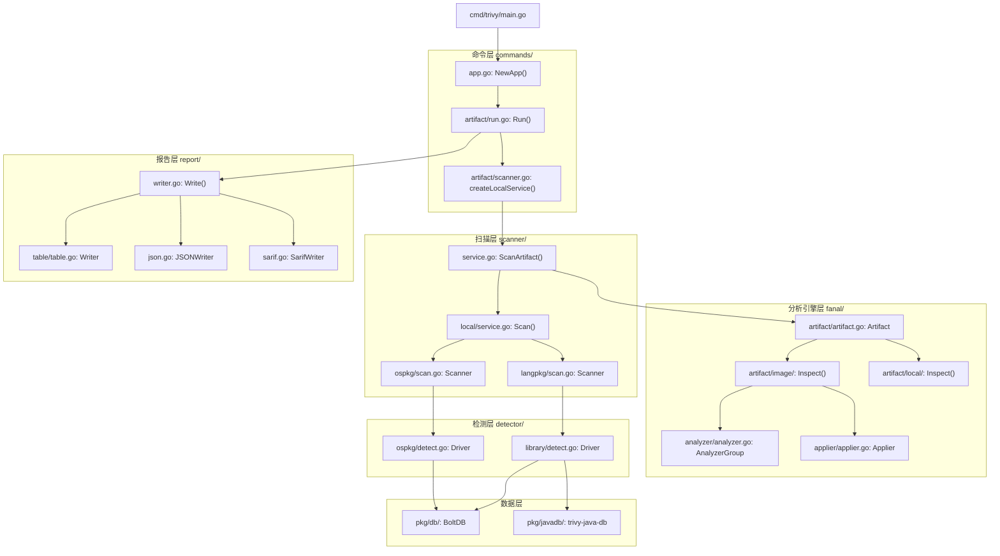

# 第32章：Trivy 源码架构全景与核心模块剖析

> 版本：Trivy v0.50+
> 面向人群：Go 开发者、架构师、资深安全工程师
> 源码参考：cmd/trivy/main.go、pkg/commands/app.go、pkg/scanner/scan.go

---

## 1. 项目背景

### 业务场景

从本章开始，我们进入高级篇——不再「用」Trivy，而是「理解」Trivy 如何工作、「扩展」Trivy 的能力、「内嵌」Trivy 到自研平台中。

云帆科技的架构师小白面临一个新的挑战：公司的自研容器管理平台需要集成安全扫描能力。市面上有两条路——一条是调用 Trivy CLI（fork 进程，解析 stdout），另一条是将 Trivy 作为 Go Library 直接调用（进程内，零开销）。CTO 倾向后者：「我们已经是一个 Go 技术栈的公司，为什么要把一个 Go 项目当黑盒用？理解它、扩展它、贡献它。」

但小白打开 `github.com/aquasecurity/trivy` 的那一刻，面对 300+ 个 Go 包、错综复杂的接口嵌套、层层封装的依赖注入，有点迷失了方向。`cmd/trivy/main.go` 只有 50 行代码，但它的调用链路深达 10 层——从 CLI 到 Scanner 到 Detector 到 Fanal 到最终的 BoltDB 查询。

「如果不画一张架构全景图，我永远看不懂这个项目。」小白一边说，一边开始在白板上画图。

### 痛点放大

**第一，庞大的代码量。** Trivy 的 `pkg/` 目录包含 80+ 个子包，每个子包有 3-20 个文件。不看架构图直接读代码，如同盲人摸象——每次只能看到一小部分。

**第二，接口层次深。** Trivy 大量使用接口抽象和依赖注入——Scanner 依赖 Detector，Detector 依赖 DB，DB 依赖 OCI Registry……追踪一个函数调用往往要横跨 5-6 个包。

**第三，注册机制隐式。** Trivy 大量使用 Go 的 `init()` 函数进行「自注册」——Analyzer、Detector、Marshaler 等组件通过 `import _` 的方式自动注册到全局表中。如果不理解这个机制，你甚至不知道一段代码是如何被「调用」的。

**第四，配置来源碎片化。** Trivy 的配置来自 CLI Flag、环境变量、trivy.yaml 配置文件、甚至 OCI annotations。Viper 的合并逻辑如果不理解，你无法確切知道某个参数在运行时到底是什么值。

**本章的核心目标是：绘制 Trivy 源码的全景架构图，理解核心模块（Command、Scanner、Fanal、Detector、Report）的职责划分和接口关系，掌握自注册机制和配置合并逻辑，为后续章节的源码分析和自定义扩展打下基础。**

---

## 2. 项目设计

**场景**：云帆科技源码研讨室，小白（架构师）、小胖（Go 开发者）、大师在分析 Trivy 源码。

---

**小胖**：「Go 项目不都差不多吗？一个 main 函数，一堆 packages，有什么好讲的？」

**小白**：「Trivy 的特殊之处在于它的『六层洋葱架构』。不是你想象的一个简单 CLI 工具——它是一个按照 Clean Architecture 精心设计的扫描框架。」

**大师**：「技术映射：Trivy 的架构就像一座现代化的工厂。`cmd/trivy/main.go` 是工厂的『前台接待台』——接收客户订单（CLI 命令）。`pkg/commands/` 是『调度中心』——把订单分配给生产线。`pkg/scanner/` 是『生产线』——协调各工位完成扫描。`pkg/fanal/` 是『原料处理车间』——把原始的镜像/文件系统拆解成结构化数据。`pkg/detector/` 是『质检中心』——把结构化数据和漏洞数据库比对。`pkg/report/` 是『包装车间』——把结果格式化成客户要的报告。」

**六层架构概览**：

```
┌─────────────────────────────────────────────┐
│  1. cmd/trivy/main.go          (入口层)       │
│     run() → commands.Run()                   │
├─────────────────────────────────────────────┤
│  2. pkg/commands/               (命令层)      │
│     cobra 命令树 · Viper 配置 · 命令行解析     │
├─────────────────────────────────────────────┤
│  3. pkg/commands/artifact/      (编排层)      │
│     Runner 接口 · 扫描编排 · 过滤 · 报告调度   │
├─────────────────────────────────────────────┤
│  4. pkg/scanner/                (扫描核心层)   │
│     ScanArtifact() · Backend.Scan()          │
│     ospkg.Scanner · langpkg.Scanner          │
├─────────────────────────────────────────────┤
│  5. pkg/fanal/                  (分析引擎层)   │
│     Artifact.Inspect() · Analyzer 注册        │
│     Applier.ApplyLayers() · mapfs 虚拟文件系统│
├─────────────────────────────────────────────┤
│  6. pkg/detector/ + pkg/report/ (检测报告层)  │
│     OSPkg Driver · Library Driver            │
│     BoltDB 查询 · Writer 序列化               │
└─────────────────────────────────────────────┘
```

**小白**：「我们先看入口。`cmd/trivy/main.go` 的核心逻辑就两步：

```go
// cmd/trivy/main.go (简化)
func main() {
    if err := run(); err != nil {
        // 处理不同类型的错误
    }
}

func run() error {
    // 插件模式：如果设置了 TRIVY_RUN_AS_PLUGIN
    if os.Getenv("TRIVY_RUN_AS_PLUGIN") != "" {
        return plugin.Run()
    }

    // 正常 CLI 模式
    ctx := commands.NotifyContext(context.Background())
    defer commands.Cleanup()
    return commands.Run(ctx)
}
```

注意 `commands.NotifyContext()`——它创建了一个带 signal handling 的 context。当收到 SIGINT（Ctrl+C）时，取消 context，触发所有下游 goroutine 优雅退出。收到第二个信号时，直接 force exit。」

**小胖**：「那 `commands.Run(ctx)` 干了什么？」

**大师**：「它创建 cobra 命令树，解析命令行参数，然后执行对应的子命令。`pkg/commands/app.go` 中的 `NewApp()` 函数创建了所有子命令：

```go
func NewApp() *cobra.Command {
    // 创建根命令
    rootCmd := &cobra.Command{
        Use: "trivy",
    }

    // 扫描类命令组
    rootCmd.AddCommand(
        NewImageCommand(),       // trivy image
        NewFilesystemCommand(),  // trivy fs
        NewRootfsCommand(),      // trivy rootfs
        NewRepositoryCommand(),  // trivy repo
        NewSBOMCommand(),        // trivy sbom
        NewVMCommand(),          // trivy vm
        NewKubernetesCommand(),  // trivy k8s
        NewConfigCommand(),      // trivy config
    )

    // 管理类命令组
    rootCmd.AddCommand(
        NewServerCommand(),      // trivy server
        NewPluginCommand(),      // trivy plugin
        NewVersionCommand(),     // trivy version
    )

    return rootCmd
}
```

每个子命令最终都会调用 `artifact.Run(ctx, options, targetKind)`。`targetKind` 决定了扫描的入口行为（镜像、文件系统、仓库等）。」

**小胖**：「那 `artifact.Run()` 的流程呢？」

**小白**：「这是最核心的编排逻辑。在 `pkg/commands/artifact/run.go` 中，`Run()` 函数做了三件事：

```go
func run(ctx context.Context, opts flag.Options, initializeScanner scannerInitializer) error {
    // 第一步：初始化扫描器
    s, cleanup, err := initializeScanner(ctx, opts)
    defer cleanup()

    // 第二步：执行扫描
    report, err := s.ScanArtifact(ctx, scanOptions)

    // 第三步：过滤结果
    report, err = result.Filter(ctx, report, filterOpts)

    // 第四步：输出报告
    return pkgReport.Write(ctx, report, opts)
}
```

这四步就是 Trivy 的完整执行流水线：**初始化 → 扫描 → 过滤 → 输出**。任何一个扫描命令（image、fs、k8s）走的是同一条流水线，只是初始化和 Artifact 类型不同。」

**大师**：「另外，Trivy 还有一个关键的『自注册』设计。当你 `import _ "github.com/aquasecurity/trivy/pkg/fanal/analyzer/all"` 时，Go 编译器会自动执行该包中所有 `.go` 文件的 `init()` 函数。这些 `init()` 函数调用 `analyzer.RegisterAnalyzer()` 将具体的 Analyzer 实现注册到全局 map 中。这意味着——你不需要在代码中显式地写 `analyzerA.Scan()`、`analyzerB.Scan()`——Fanal 引擎会自动遍历所有已注册的 Analyzer，找到能处理当前文件的那些。」

---

## 3. 项目实战

### 环境准备

- **Go**：1.21+
- **Trivy 源码**：clone 到本地
- **IDE**：GoLand 或 VS Code + Go 插件

```bash
git clone https://github.com/aquasecurity/trivy.git
cd trivy
go mod download
```

### 步骤一：从 main 函数追踪完整调用链

**目标**：在关键函数中插入日志，追踪一次 `trivy image alpine:latest` 的完整调用路径。

创建 `debug-trace/main.go`：

```go
// debug-trace/main.go
// 编译：go build -o trivy-trace ./cmd/trivy/
// 使用：./trivy-trace image alpine:latest --debug

package main

// 不需要修改源码——直接使用 Trivy 的 Debug 日志级别
// 但为了更好地理解调用链，我们在阅读源码时应该关注这些函数：
//
// 入口：cmd/trivy/main.go:main()
//   → pkg/commands/app.go:NewApp().ExecuteContext()
//     → pkg/commands/artifact/run.go:Run()
//       → pkg/commands/artifact/scanner.go:createLocalService()
//         → pkg/scan/service.go:ScanArtifact()
//           → pkg/fanal/artifact/image/artifact.go:Inspect()
//           → pkg/scan/local/service.go:Scan()
//             → pkg/scan/ospkg/scan.go:Scan()
//             → pkg/scan/langpkg/scan.go:Scan()
//         → pkg/result/filter.go:Filter()
//         → pkg/report/writer.go:Write()
```

```bash
# 用 DEBUG 级别运行，观察日志中的模块名称
TRIVY_DEBUG=true trivy image alpine:latest 2>&1 | head -50
```

**输出示例及调用链解读**：

```
# Fanal 引擎开始分析镜像
DEBUG  [fanal] New image artifact created
DEBUG  [fanal] Image inspecting...
DEBUG  [fanal] Analyzing layer: sha256:abc123...
DEBUG  [analyzer] os/alpine: detected Alpine 3.19.0
DEBUG  [analyzer] apk: found 42 packages

# 扫描器开始检测漏洞
DEBUG  [ospkg] Scanning OS packages...
DEBUG  [ospkg/alpine] Consulting trivy-db for Alpine 3.19...
DEBUG  [library] No language packages found

# 报告输出
DEBUG  [report] Writing results in table format
```

### 步骤二：理解核心接口设计

**目标**：掌握 Trivy 中最重要的几个接口，理解它们如何解耦模块。

```go
// 这些接口定义在不同包中，但构成了 Trivy 的核心骨架

// === pkg/commands/artifact/run.go ===
// Runner 是命令行层的抽象——每种扫描类型对应一个方法
type Runner interface {
    ScanImage(ctx context.Context, opts flag.Options) (types.Report, error)
    ScanFilesystem(ctx context.Context, opts flag.Options) (types.Report, error)
    ScanRootfs(ctx context.Context, opts flag.Options) (types.Report, error)
    ScanRepository(ctx context.Context, opts flag.Options) (types.Report, error)
    ScanSBOM(ctx context.Context, opts flag.Options) (types.Report, error)
    ScanVM(ctx context.Context, opts flag.Options) (types.Report, error)
    Filter(ctx context.Context, opts flag.Options, report types.Report) (types.Report, error)
    Report(ctx context.Context, opts flag.Options, report types.Report) error
    Close(ctx context.Context) error
}

// === pkg/fanal/artifact/artifact.go ===
// Artifact 是被扫描对象的抽象——镜像、文件系统、仓库等
type Artifact interface {
    Inspect(ctx context.Context) (reference Reference, err error)
    Clean(reference Reference) error
}

// === pkg/scan/service.go ===
// Backend 是扫描后端的抽象——本地扫描 vs 远程扫描（Client/Server 模式）
type Backend interface {
    Scan(ctx context.Context, target, artifactKey string, blobKeys []string,
         options types.ScanOptions) (types.ScanResponse, error)
}

// === pkg/detector/ospkg/driver/driver.go ===
// Driver 是 OS 包漏洞检测的抽象——Alpine、Debian、RHEL 各有一套实现
type Driver interface {
    Detect(context.Context, string, *ftypes.Repository, []ftypes.Package) ([]types.DetectedVulnerability, error)
    IsSupportedVersion(context.Context, ftypes.OSType, string) bool
}
```

> **设计洞察**：每个接口只有 2-4 个方法，遵循「接口隔离原则」（Interface Segregation Principle）。这使得每个实现都非常聚焦，且易于 mock 测试。

### 步骤三：理解自注册机制

**目标**：追踪一个 Analyzer 从注册到被调用的完整过程。

以 Alpine OS Analyzer 为例（`pkg/fanal/analyzer/os/alpine/alpine.go`）：

```go
// 第一步：定义结构体并实现 analyzer 接口
type alpineOSAnalyzer struct{}

func (a alpineOSAnalyzer) Type() analyzer.Type { return analyzer.TypeAlpine }
func (a alpineOSAnalyzer) Version() int { return 1 }

// Required 方法告诉 Fanal 引擎：「只有 /etc/alpine-release 文件需要我来处理」
func (a alpineOSAnalyzer) Required(filePath string, _ os.FileInfo) bool {
    return filePath == "etc/alpine-release"
}

// Analyze 方法是核心——从文件中提取 OS 信息
func (a alpineOSAnalyzer) Analyze(_ context.Context, input analyzer.AnalysisInput) (*analyzer.AnalysisResult, error) {
    scanner := bufio.NewScanner(input.Content)
    scanner.Scan()
    line := scanner.Text()
    return &analyzer.AnalysisResult{
        OS: &types.OS{
            Family: types.Alpine,
            Name:   line,  // 例如 "3.19.0"
        },
    }, nil
}

// 第二步：在 init() 中自注册（Go 保证在 import 时执行）
func init() {
    analyzer.RegisterAnalyzer(&alpineOSAnalyzer{})
}
```

**注册机制的核心实现**（`pkg/fanal/analyzer/analyzer.go`）：

```go
// 全局 map，存储所有已注册的 Analyzer
var analyzers = map[Type]analyzer{}

// RegisterAnalyzer 用于注册一个新的 Analyzer
func RegisterAnalyzer(a analyzer) {
    analyzers[a.Type()] = a
}

// AnalyzerGroup 在初始化时收集所有匹配的 Analyzer
func NewAnalyzerGroup(name string, disabled []Type, opt AnalyzerOptions) (AnalyzerGroup, error) {
    group := AnalyzerGroup{}
    for t, a := range analyzers {
        if !slices.Contains(disabled, t) {
            // 检查 Analyzer 是否需要初始化参数
            if as, ok := a.(Initializer); ok {
                if err := as.Init(opt); err != nil {
                    return nil, err
                }
            }
            group.add(a)
        }
    }
    return group, nil
}
```

**触发注册的 import 链**（`pkg/fanal/analyzer/all/import.go`）：

```go
package all

import (
    // 40+ 个 blank import，触发所有 Analyzer 的 init() 注册
    _ "github.com/aquasecurity/trivy/pkg/fanal/analyzer/os/alpine"
    _ "github.com/aquasecurity/trivy/pkg/fanal/analyzer/os/debian"
    _ "github.com/aquasecurity/trivy/pkg/fanal/analyzer/language/pip"
    _ "github.com/aquasecurity/trivy/pkg/fanal/analyzer/language/gomod"
    // ... 还有 30+ 个
)
```

> **设计洞察**：这种「自注册 + blank import」模式在 Go 生态中很常见（如 database/sql 驱动）。优点是高度解耦——添加新 Analyzer 不需要改动核心代码，只需要在新包中注册并加一行 import。缺点是隐式——IDE 难以追踪调用链。

### 步骤四：绘制源码模块依赖图

**目标**：输出一张 Mermaid 格式的模块依赖图，可嵌入到团队 Wiki。



### 步骤五：理解配置合并机制（Viper）

**目标**：搞清楚 `trivy.yaml`、环境变量、CLI Flag 的优先级。

Trivy 使用 Viper 进行配置管理。在 `pkg/commands/app.go` 中：

```go
func NewApp() *cobra.Command {
    // 配置优先级（从低到高）：
    // 1. trivy.yaml（配置文件）
    // 2. 环境变量（如 TRIVY_SEVERITY）
    // 3. CLI Flag（如 --severity）
    
    // Viper 的 BindPFlag 将 cobra flag 绑定到 Viper
    viper.BindPFlag("severity", cmd.Flags().Lookup("severity"))
    
    // 环境变量自动映射：TRIVY_SEVERITY → severity
    viper.SetEnvPrefix("trivy")
    viper.AutomaticEnv()
}

// 读取配置的顺序
func readConfig() {
    // 1. 读取 trivy.yaml
    viper.SetConfigName("trivy")
    viper.SetConfigType("yaml")
    viper.AddConfigPath(".")
    viper.ReadInConfig()
    
    // 2. 环境变量自动覆盖（Viper 的 AutomaticEnv）
    // 3. CLI Flag 由 cobra 直接处理，优先级最高
}
```

> **坑点**：如果你同时设置了 `trivy.yaml` 中的 `severity: HIGH` 和环境变量 `TRIVY_SEVERITY=CRITICAL`，实际生效的是环境变量。如果你还加了 `--severity LOW`，CLI Flag 最终胜出。

### 测试验证

1. Clone Trivy 源码，找到 `cmd/trivy/main.go` 中的 `run()` 函数，手动在代码中插入 `fmt.Println("DEBUG: Entering run()")` 编译并运行，验证能追踪到入口。
2. 在 `pkg/fanal/analyzer/os/alpine/alpine.go` 的 `Analyze()` 函数中插入日志，扫描 `alpine:latest` 镜像，验证 Alpine Analyzer 被调用。
3. 运行 `opa test` 验证 Rego 策略文件的测试框架。
4. 用 `go doc` 查看关键接口的文档：`go doc github.com/aquasecurity/trivy/pkg/fanal/artifact.Artifact`。

---

## 4. 项目总结

### 优点 & 缺点

| 维度 | 优点 | 缺点 |
|------|------|------|
| Clean Architecture | 接口抽象清晰；模块低耦合；易测试 | 接口层次深，新人理解曲线陡 |
| 自注册机制 | 极简的扩展方式；不改核心代码 | 隐式行为；IDE 追踪困难 |
| cobra + Viper | 标准化的 CLI 框架；配置灵活 | Viper 的嵌套 key 映射偶尔不直观 |
| 插件系统 | 支持第三方扩展扫描能力 | 插件开发文档不够完善 |
| 依赖注入 | 手动构造函数注入，无框架依赖 | 构造函数参数多时需要很多工厂函数 |

### 适用场景

1. **计划为 Trivy 贡献代码的开发者**：必须先理解本章的架构全景。
2. **需要扩展 Trivy 能力的企业**：理解接口和注册机制后，可以添加自定义 Analyzer/Detector/Writer。
3. **将 Trivy 内嵌到自研平台**：了解 Runner 接口和依赖注入方式。
4. **Go 语言进阶学习**：Trivy 是 Clean Architecture 在 Go 中的优秀实践案例。
5. **技术面试准备**：Trivy 的架构设计可以作为系统设计面试的讨论素材。

**不适用场景**：
1. 仅使用 Trivy CLI 做日常扫描的开发/运维——不需要阅读源码。

### 注意事项

- **版本差异**。Trivy 的接口在不同版本间可能有 breaking change。阅读源码时务必 checkout 对应版本的 tag。
- **Blank import 的副作用**。`import _` 不仅仅是「触发 init()」，它还会引入该包的所有传递依赖——可能导致依赖树膨胀。
- **全局状态**。自注册模式意味着 Analyzer/Detector 是全局单例。在 Library 模式下，需要注意并发安全和状态隔离。

### 常见踩坑经验

**踩坑案例 1：自己编译的 Trivy 扫描结果与官方版本不一致**
- **现象**：自己编译的 trivy 二进制缺少某些语言包扫描能力。
- **根因**：编译时使用了 `-tags` 参数限制了 import 范围，或者 Go 版本不匹配导致某些包未正确编译。
- **解法**：不要自定义 `-tags`，使用 `go build ./cmd/trivy/` 的标准编译命令。

**踩坑案例 2：在 Library 模式下 Analyzer 不生效**
- **现象**：将 Trivy 作为 Library 调用时，某些 Analyzer 没有被触发。
- **根因**：未 import `pkg/fanal/analyzer/all` 包，缺少 blank import 触发的自注册。
- **解法**：在 main 包中加入 `import _ "github.com/aquasecurity/trivy/pkg/fanal/analyzer/all"`。

**踩坑案例 3：Viper 配置不生效**
- **现象**：在 `trivy.yaml` 中设置了 `severity: HIGH`，但运行时仍然是默认的 `UNKNOWN,LOW,MEDIUM,HIGH,CRITICAL`。
- **根因**：没有正确指定配置文件路径，或 YAML 格式缩进错误导致解析失败（Viper 静默忽略）。
- **解法**：用 `--debug` 模式运行，检查日志中是否有 `config file not found` 的提示。

### 思考题

1. Trivy 的自注册模式使用全局 map 存储所有 Analyzer。如果要在同一个进程中同时运行两个不同配置的 Trivy 实例（Library 模式），这种全局状态会导致什么冲突？如何设计一个更好的注册机制避免这个问题？
2. Trivy 的 Runner 接口有 7 个方法。如果未来要新增第 8 种扫描类型（如 `ScanOCIArtifact`），需要在哪些地方修改代码？Go 语言有没有更好的设计模式来减少这类修改的波及面？

> **答案提示**：第 33 章「Artifact 分析与 Fanal 引擎源码」将深入 fanal/ 包的实现细节。

---

> **推广计划**：本章建议团队中计划为 Trivy 贡献代码或二次开发的 Go 工程师作为必读。配合「附录 A：Trivy 源码阅读路线图」，可以在 1 周内建立起对核心架构的理解。如果需要团队内部培训，可以让通读过源码的工程师用本章的 Mermaid 架构图做分享，引导其他同事按模块深入。

---

> **版权声明**：本章基于 Trivy 官方开源项目（Apache-2.0 License）源码分析编写，所有源码引用均遵循原许可证条款。
