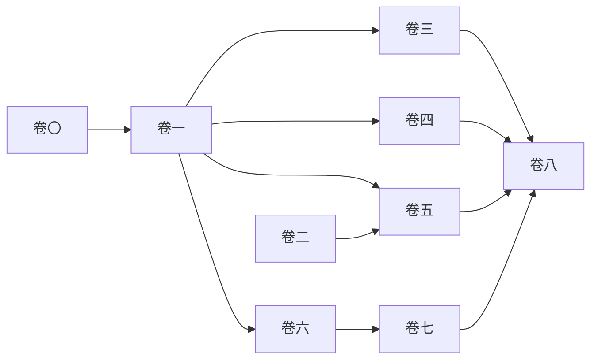

# 《实战 Redis 8.6》以战代练 · 专栏总目

> 本目录为 **Redis 8.6.x** 主线大纲全篇，叙事风格延续「大师 / 小白」武侠旁白；技术点以官方文档与本地源码仓库为准。  
> 与 Redis 6 时代旧文（同上级目录下 `00`–`14`）并存，**不替代旧文文件名**，便于对照改版。

**阅读纪律**：每篇文首有 **版本 / 模块** 提示；涉及带 `*` 的概率模块请先读 [卷〇-附录-模块与BUILD_WITH_MODULES对照表.md](卷〇-附录-模块与BUILD_WITH_MODULES对照表.md)。

---

## 卷〇 · 登堂

| 序号 | 篇目 | 文件 |
|------|------|------|
| 1 | 前传：Win11 / WSL2 尝鲜 | [卷〇-01-前传-Win11与WSL2.md](卷〇-01-前传-Win11与WSL2.md) |
| 2 | 潮式：Docker 与 Compose | [卷〇-02-潮式-Docker与Compose.md](卷〇-02-潮式-Docker与Compose.md) |
| 3 | 新总诀式：8.6 能力地图 | [卷〇-03-新总诀式-Redis86能力地图.md](卷〇-03-新总诀式-Redis86能力地图.md) |
| 4 | 编译秘笈 | [卷〇-04-编译秘笈-BUILD_WITH_MODULES.md](卷〇-04-编译秘笈-BUILD_WITH_MODULES.md) |
| 附 | 模块对照表 | [卷〇-附录-模块与BUILD_WITH_MODULES对照表.md](卷〇-附录-模块与BUILD_WITH_MODULES对照表.md) |

## 卷一 · 兵器谱

| 序号 | 篇目 | 文件 |
|------|------|------|
| 5 | 字符串 | [卷一-05-字符串-破剑式新编.md](卷一-05-字符串-破剑式新编.md) |
| 6 | 哈希与字段级过期 | [卷一-06-哈希-字段级过期.md](卷一-06-哈希-字段级过期.md) |
| 7 | 列表 | [卷一-07-列表-队列与栈.md](卷一-07-列表-队列与栈.md) |
| 8 | 集合 | [卷一-08-集合-标签与关系.md](卷一-08-集合-标签与关系.md) |
| 9 | 有序集合 | [卷一-09-有序集合-排行榜与延时.md](卷一-09-有序集合-排行榜与延时.md) |
| 10 | 位图与位域 | [卷一-10-位图与位域.md](卷一-10-位图与位域.md) |

## 卷二 · 概率与计数

| 序号 | 篇目 | 文件 |
|------|------|------|
| 11 | HyperLogLog | [卷二-11-HyperLogLog.md](卷二-11-HyperLogLog.md) |
| 12 | Bloom 等（模块） | [卷二-12-概率数据结构-模块篇.md](卷二-12-概率数据结构-模块篇.md) |

## 卷三 · 流与消息

| 序号 | 篇目 | 文件 |
|------|------|------|
| 13 | Stream 与 IDMP | [卷三-13-Stream消费组与XADD幂等.md](卷三-13-Stream消费组与XADD幂等.md) |
| 14 | Pub/Sub 家族 | [卷三-14-PubSub家族.md](卷三-14-PubSub家族.md) |
| 15 | List 与 Stream 混合战 | [卷三-15-List与Stream混合战.md](卷三-15-List与Stream混合战.md) |

## 卷四 · 时空数据

| 序号 | 篇目 | 文件 |
|------|------|------|
| 16 | Geo | [卷四-16-Geo附近的人.md](卷四-16-Geo附近的人.md) |
| 17 | Time series | [卷四-17-TimeSeries模块篇.md](卷四-17-TimeSeries模块篇.md) |

## 卷五 · 文档、查询与向量

| 序号 | 篇目 | 文件 |
|------|------|------|
| 18 | JSON 类型 | [卷五-18-JSON类型.md](卷五-18-JSON类型.md) |
| 19 | Query Engine 导论 | [卷五-19-RedisQueryEngine导论.md](卷五-19-RedisQueryEngine导论.md) |
| 20 | Vector set 与 RAG | [卷五-20-VectorSet与RAG迷你管道.md](卷五-20-VectorSet与RAG迷你管道.md) |
| 21 | 语义缓存与路由 | [卷五-21-语义缓存与路由.md](卷五-21-语义缓存与路由.md) |

## 卷六 · 内功

| 序号 | 篇目 | 文件 |
|------|------|------|
| 22 | 编码与内存 | [卷六-22-编码与内存-内外结构8x.md](卷六-22-编码与内存-内外结构8x.md) |
| 23 | 持久化与副本 | [卷六-23-持久化与副本.md](卷六-23-持久化与副本.md) |
| 24 | 淘汰策略 2.0 | [卷六-24-淘汰策略-LRU到LRM.md](卷六-24-淘汰策略-LRU到LRM.md) |

## 卷七 · 运维与安全

| 序号 | 篇目 | 文件 |
|------|------|------|
| 25 | 可观测与 HOTKEYS | [卷七-25-可观测与HOTKEYS.md](卷七-25-可观测与HOTKEYS.md) |
| 26 | 安全 ACL 与 TLS | [卷七-26-安全-ACL与TLS.md](卷七-26-安全-ACL与TLS.md) |
| 27 | 集群与高可用 | [卷七-27-集群与高可用.md](卷七-27-集群与高可用.md) |

## 卷八 · 试剑

| 序号 | 篇目 | 文件 |
|------|------|------|
| 28 | 综合项目 | [卷八-28-综合试剑-推荐缓存向量流.md](卷八-28-综合试剑-推荐缓存向量流.md) |
| 29 | 面试铜人阵 2.0 | [卷八-29-面试篇-铜人阵2.md](卷八-29-面试篇-铜人阵2.md) |

---

## 学习顺序（简图）

**源码导读模板**（旁白写法）见姊妹目录 [`redis8-redis86-专栏/源码导读模板与锚点索引.md`](../redis8-redis86-专栏/源码导读模板与锚点索引.md)。
