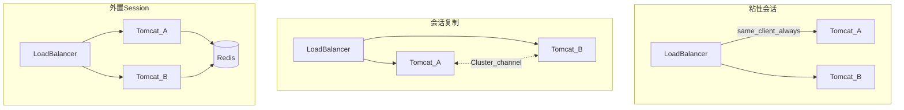

# 第11章 会话与集群调优（正文初稿）

> 对应总纲：**驯兽师修炼 · Session 与水平扩展**。读完本章，你应能说清 **粘性会话 vs Session 复制** 的取舍，了解 Tomcat **内置集群复制** 的基本组件与 **`DeltaManager`** 角色，并持有一份可执行的 **「单机 → 集群」迁移检查单**。  
> **重要**：生产里 **Redis / Memcached 等外置 Session** 很常见；本章 **以 Tomcat 原生集群与负载均衡协同** 为主，外置方案作对照。

---

## 本章导读

- **你要带走的三件事**
  1. **默认 Session**：靠 **`JSESSIONID` Cookie**（或 URL 重写）绑定到 **某一 JVM 内的 `HttpSession`**；扩成多机后必须 **显式选策略**。
  2. **粘性（Sticky）**：同用户总是到 **同一节点**；**最简单** 但节点宕机要 **配合会话复制或外置**，否则 **登出/丢购物车**。
  3. **DeltaManager**：在集群成员间 **传播 Session 变更**；有 **网络、序列化、GC** 成本，**不适合无限放大 Session**。

- **阅读建议**：先画 **「LB → Tomcat1/2 → DB」** 三条线，标上 **Cookie、JVMRoute、复制通道**；再对照 **11.7 检查单** 勾一遍。

---

## 11.1 与第6章的衔接：四段式

| 段落 | Session / 集群 |
|------|----------------|
| **指标** | Session 数、单 Session 大小、复制流量、失败登录率、节点不均衡、Full GC |
| **观察** | LB 日志、Tomcat `Cluster` 日志、JMX Session、线程与堆、网络抓包（组播/单播） |
| **参数** | `session-timeout`、Cookie `secure/httpOnly`、`<Cluster>`、`Manager`、`jvmRoute`、外置 TTL |
| **风险** | 大对象进 Session → **复制风暴**；序列化漏洞；**脑裂**；组播被交换机丢弃 |

---

## 11.2 Servlet Session 基础（快速对齐）

| 概念 | 说明 |
|------|------|
| **`HttpSession`** | 服务端键值容器；默认超时见 `web.xml` `session-timeout` |
| **`JSESSIONID`** | Cookie 名可配；**路径** 与 **域名** 影响多应用隔离 |
| **创建时机** | `request.getSession(true)` 或 JSP 默认行为等 |
| **序列化** | 集群复制或持久化要求 **属性可序列化**（`Serializable`） |

**安全基线**（`web.xml` 片段示意）：

```xml
<session-config>
  <session-timeout>30</session-timeout>
  <cookie-config>
    <http-only>true</http-only>
    <secure>true</secure>
  </cookie-config>
</session-config>
```

> 生产 HTTPS 下 **`secure`** 必开；内网 HTTP 调试时可临时关闭并限制环境。

---

## 11.3 水平扩展的三种常见策略



| 策略 | 优点 | 缺点 |
|------|------|------|
| **仅粘性，不复制** | 实现简单、无复制开销 | **单点故障丢会话** |
| **粘性 + Tomcat 复制** | 故障时可 **漂移到已有副本**（视配置） | **网络与序列化开销**、调试复杂 |
| **外置 Session** | 节点无状态、易扩缩 | **依赖 Redis**、一致性、延迟 |

---

## 11.4 负载均衡与 `jvmRoute`

- **Apache `mod_proxy_balancer` / `mod_jk`** 等常支持 **`stickysession=JSESSIONID`**：从 Cookie 中解析 **`...route`** 后缀路由到固定 worker。
- Tomcat **`Engine`** 上配置 **`jvmRoute`** 后，Session ID 形如 **`...node1`**，便于 **LB 解析**。

```xml
<Engine name="Catalina" defaultHost="localhost" jvmRoute="node1">
```

> **多实例** 每台 **`jvmRoute` 必须唯一**。

---

## 11.5 Tomcat 内置集群（概念与配置骨架）

### 11.5.1 组件直觉

| 组件 | 作用 |
|------|------|
| **`<Cluster>`** | 在 **`Engine` 或 `Host`** 上启用集群能力 |
| **`Channel`** | 组播 **Membership** + **Receiver** + **Sender** + **Interceptor** |
| **`Valve`**（如 `ReplicationValve`） | 控制 **哪些请求** 触发复制 |
| **`Manager`** | **`DeltaManager` / `BackupManager`** 等，决定 **如何存与如何同步** |

### 11.5.2 `DeltaManager` vs `BackupManager`（教学级）

| Manager | 直觉 |
|---------|------|
| **`DeltaManager`** | 将 **变更增量** 广播到 **除自己外所有成员**；**写多** 时流量放大 |
| **`BackupManager`** | 主会话在 **本机**，**备份到指定备份节点**；成员多时 **拓扑不同** |

总纲锚点 **`org.apache.catalina.ha.session.DeltaManager`**：**读「何时序列化 delta、发给谁」**。

### 11.5.3 `server.xml` 骨架（仅示意，生产需按网络改地址/端口）

```xml
<Engine name="Catalina" defaultHost="localhost" jvmRoute="node1">
  <Cluster className="org.apache.catalina.ha.tcp.SimpleTcpCluster"
           channelSendOptions="8">
    <Channel className="org.apache.catalina.tribes.group.GroupChannel">
      <Membership className="org.apache.catalina.tribes.membership.McastService"
                  address="228.0.0.4"
                  port="45564"
                  frequency="500"
                  dropTime="3000"/>
      <Receiver className="org.apache.catalina.tribes.transport.nio.NioReceiver"
                address="auto"
                port="4000"
                autoBind="100"
                selectorTimeout="5000"
                maxThreads="6"/>
      <Sender className="org.apache.catalina.tribes.transport.ReplicationTransmitter"/>
    </Channel>
    <Valve className="org.apache.catalina.ha.tcp.ReplicationValve"
           filter=".*\.gif;.*\.js;.*\.css;.*\.png;.*\.ico;.*\.woff.*"/>
    <Deployer className="org.apache.catalina.ha.deploy.FarmWarDeployer"/>
    <ClusterListener className="org.apache.catalina.ha.session.ClusterSessionListener"/>
  </Cluster>

  <Host name="localhost" appBase="webapps" unpackWARs="true" autoDeploy="true">
    <Context path="" docBase="ROOT">
      <Manager className="org.apache.catalina.ha.session.DeltaManager"
               expireSessionsOnShutdown="false"
               notifyListenersOnReplication="true"/>
    </Context>
  </Host>
</Engine>
```

**注意**：

- **组播** 在部分云网络 **默认不通**，需改 **静态成员（StaticMembershipInterceptor）** 或 **TCP Ping** 等方案（查官方 **Cluster How-To**）。
- **`ReplicationValve` 的 filter**：避免 **静态资源** 无意义复制。

---

## 11.6 故障转移与观测

### 11.6.1 故障转移（直觉）

- **粘性 + DeltaManager**：节点 A 宕机，若 B **已有副本** 且 LB 将流量切到 B，用户 **可能** 不断线；若 **副本滞后或未复制**，仍会 **掉线**。
- **外置 Session**：Tomcat 宕机 **不丢会话**（Redis 仍存活）；要处理 **Redis 故障**。

### 11.6.2 观测

- **LB**：每台后端 **活跃连接、2xx/5xx、session stick 失败率**。
- **Tomcat**：`Cluster` **成员视图是否稳定**（频繁 join/leave → 网络或 GC STW）。
- **应用**：登录态异常 **是否与发布/扩容时间点相关**。

### 11.6.3 WebSocket 与 Session

- WebSocket **握手** 依赖 HTTP Session（常见）；**连接本身** 不随 Session 复制自动「迁移」。
- 多节点时：**粘性** 或 **独立消息层** 重建订阅（第5章联动）。

---

## 11.7 源码锚点：`org.apache.catalina.ha.session.DeltaManager`

**读什么**：

1. **变更检测**：哪些操作触发 **`sendDelta`**（或等价）。
2. **序列化**：`Session` 属性如何 **写出**；**不可序列化对象** 的后果。
3. **与 `Cluster`** 的回调：节点 **崩溃** 时 **其它节点** 如何 **接管或过期**。

**读法提示**：配合 **`ClusterSession`**、**`DeltaRequest`**（类名以源码为准）看 **一次 `setAttribute` 的复制路径**。

---

## 11.8 关键产出：单机到集群迁移检查单

```markdown
## 单机 → Tomcat 集群迁移检查单

### A. 架构与路由
- [ ] LB 算法与 **粘性** 策略已定义（Cookie / 源 IP）
- [ ] 每台 Tomcat **`jvmRoute` 唯一** 且与 LB 规则匹配
- [ ] **健康检查** URL 不依赖 Session（或文档化例外）
- [ ] **HTTP/HTTPS 终止点** 与 **Cookie Secure** 一致

### B. Session 策略
- [ ] 选定：**仅粘性 / 复制 / 外置** 之一为主方案，并有 **降级说明**
- [ ] `session-timeout`、**单 Session 大小上限**（规范/监控）
- [ ] 所有进 Session 对象 **可序列化**（若复制）
- [ ] 已排除 **大缓存、大列表** 进 Session

### C. 集群通道
- [ ] **组播/单播** 与 **安全组、ACL、MTU** 已打通
- [ ] **端口列表**（Receiver、复制、管理）已备案
- [ ] **脑裂/分区** 时的行为已评审（会话双写？只读？）

### D. 应用与框架
- [ ] Spring Session / Shiro 等若使用，**与 Tomcat 集群不重复打架**
- [ ] **登出、并发登录、踢人** 在集群下行为已测
- [ ] **定时任务** 仅在一节点执行（Quartz 等）

### E. 发布与运维
- [ ] **滚动发布** 顺序与 **会话漂移** 已演练
- [ ] **监控**：Session 数、复制字节率、GC、网络重传
- [ ] **回滚**：LB 切回单机或关闭 `Cluster` 的步骤

### F. 安全
- [ ] **Cookie HttpOnly / Secure / SameSite** 评审
- [ ] **Session 固定** 防护（登录后 `changeSessionId` 等）
```

---

## 11.9 与第7、8、10章的联动

- **Session 过大** → **堆** 与 **复制流量** 同时炸（第7章）。
- **每请求写 Session** → **复制放大** + **线程占用**（第8章）。
- **Session 里塞连接 / 大对象** → **泄漏与 Full GC**（第10章）。

---

## 本章小结

- 多机 first question：**Session 放哪**：**粘性、复制、外置** 三选一或组合。
- **`DeltaManager`** 是 **Tomcat 内置复制** 的核心之一；**网络与序列化** 是主要成本。
- **迁移** 不是只改 `server.xml`，而是 **LB + 应用 + 运维** 的联合清单。

---

## 自测练习题

1. **仅开启 LB 粘性、不做 Session 复制**，节点宕机时用户最可能经历什么？
2. **`ReplicationValve` 过滤静态资源** 是为了解决什么问题？
3. 为什么 **不可序列化对象** 放进 Session 在集群下会出事？

---

## 课后作业

### 必做

1. 为你负责的系统 **勾选 11.8 检查单**，标出 **3 项不适用** 并说明原因。
2. 阅读 **`DeltaManager` 类 JavaDoc 或类头注释**，写 **10 行摘要**。
3. 画 **一张** 时序图：**`setAttribute` → 复制 → 对端接收**（类名可简化）。

### 选做

1. 对比 **外置 Redis Session** 与 **DeltaManager** 的 **运维成本** 列表（各 5 条）。
2. 在测试环境模拟 **单节点下线**，记录 **用户是否需要重新登录**。
3. 预习第12章：思考 **手写极简 Tomcat** 若要多节点，**最先缺哪块能力**。

---

## 延伸阅读

- Tomcat 官方：**Clustering/Session Replication How-To**（对应你的主版本）。
- 第5章：[`第5章-WebSocket贪吃蛇.md`](第5章-WebSocket贪吃蛇.md)

---

*本稿为专栏第11章初稿，可与总纲 [`专栏.md`](专栏.md) 对照使用。*
