# 第13章 撸猫心得：从会用到会造（正文初稿）

> 对应总纲：**第六阶段总结回顾**。这一章不再新增大块知识点，而是把前 12 章压缩成一套可迁移的能力模型：**你如何理解 Tomcat、如何在现场排障、如何把经验沉淀成团队资产**。

---

## 本章导读

- **你要带走的三件事**
  1. Tomcat 学习的核心不是背参数，而是建立 **请求主链路 + 调优闭环** 的双坐标系。
  2. 绝大多数性能问题都能落回三个问题：**谁在排队、谁在占用、谁在扩散**。
  3. 进阶路线从「会用」到「会造」的关键节点是：**读源码、做实验、写手册**。

- **阅读建议**：先看 `13.1` 知识地图，再拿 `13.2` 源码定位清单做一次 30 分钟快查演练，最后用 `13.5` 复盘模板沉淀你自己的版本。

---

## 13.1 知识地图回顾（全链路复盘）

### 13.1.1 一张图串起前 12 章

```mermaid
flowchart LR
  intro[第1章_初识]
  arch[第2章_架构]
  caseServlet[第3章_同步_vs_异步Servlet]
  caseJsp[第4章_JSP_EL]
  caseWs[第5章_WebSocket]
  method[第6章_调优方法论]
  jvm[第7章_JVM]
  connector[第8章_Connector]
  cache[第9章_缓存与sendfile]
  logdb[第10章_日志与连接池]
  cluster[第11章_Session与集群]
  mini[第12章_mini_tomcat]
  intro --> arch --> caseServlet --> caseJsp --> caseWs --> method
  method --> jvm --> connector --> cache --> logdb --> cluster --> mini
```



### 13.1.2 两条主线

| 主线 | 你最终要会什么 |
|------|----------------|
| **功能主线** | 从请求进入到响应返回：Connector -> Coyote -> Catalina -> Servlet/JSP/WebSocket |
| **调优主线** | 指标定义 -> 基线 -> 定位 -> 小步调参 -> 回归 -> 手册化 |

**一句话总结**：功能主线回答「**怎么跑**」，调优主线回答「**怎么跑得稳又快**」。

---

## 13.2 面试题与源码定位清单（可直接拿来用）

### 13.2.1 高价值问题与短答模板

1. **请求处理链路如何走？**
   - 短答：`NioEndpoint` 接连接，`Http11Processor` 解析协议，经 `CoyoteAdapter` 进入 `Engine/Host/Context/Wrapper`，最终执行 `FilterChain + Servlet`。
2. **Valve 与 Filter 本质区别？**
   - 短答：Valve 是 **Tomcat 容器级扩展点**（非 Servlet 规范），Filter 是 **应用级规范能力**；配置位置、类加载边界、作用域不同。
3. **异步 Servlet 什么时候更优？**
   - 短答：大量 **等待型**（IO/RPC）请求且容器线程成为瓶颈时更优；CPU 密集场景收益有限，甚至更差。
4. **OOM 如何快速定界？**
   - 短答：先看 OOM 关键词（heap/metaspace/direct/native thread），再用 `jcmd/jmap/jstat` + dump 工具定位，避免先入为主只加 `-Xmx`。
5. **集群 Session 策略怎么选？**
   - 短答：优先按业务与运维能力选 **粘性 / Tomcat 复制 / 外置 Session**，明确故障转移与成本边界。

### 13.2.2 源码快查路径（15 分钟版）

| 问题 | 优先类 |
|------|--------|
| 启动顺序 | `org.apache.catalina.startup.Bootstrap`、`org.apache.catalina.startup.Catalina` |
| 生命周期 | `org.apache.catalina.util.LifecycleBase` |
| HTTP 解析 | `org.apache.coyote.http11.Http11Processor` |
| 进容器桥接 | `org.apache.catalina.connector.CoyoteAdapter` |
| 容器路由 | `StandardEngineValve`、`StandardHostValve`、`StandardContextValve`、`StandardWrapperValve` |
| JSP 机制 | `org.apache.jasper.servlet.JspServlet`、`org.apache.jasper.compiler.Compiler` |
| WebSocket 升级 | `org.apache.tomcat.websocket.server.WsHttpUpgradeHandler` |
| 连接器线程模型 | `org.apache.tomcat.util.net.NioEndpoint` |
| 资源缓存 | `org.apache.catalina.webresources.Cache` |
| 连接池 | `org.apache.tomcat.jdbc.pool.ConnectionPool` |
| Session 复制 | `org.apache.catalina.ha.session.DeltaManager` |

---

## 13.3 常见误区复盘（踩坑清单）

| 误区 | 为什么错 | 正确姿势 |
|------|----------|----------|
| 只调 `maxThreads` 就能提吞吐 | 很多瓶颈在 DB/RPC/锁/GC | 先做基线与瓶颈归类，再小步调 |
| `-Xmx` 越大越稳 | 大堆可能拉长停顿与回收成本 | 根据 GC 日志与目标停顿做平衡 |
| 异步 Servlet 就一定更快 | 只是释放容器线程，不会消除业务耗时 | 配套有界线程池、超时与监控 |
| Session 能放啥都行 | 大对象复制/序列化成本高，易触发 GC | Session 轻量化，重数据外置 |
| 日志越详细越安全 | 高 QPS 下刷盘会反噬性能 | 分级、采样、滚动、短时提级 |
| sendfile 一开就赢 | 受 TLS/压缩/文件大小路径影响 | 必须按场景实测前后差异 |

---

## 13.4 你的 Tomcat 能力模型（从会用到会造）

### 13.4.1 五级能力刻度（自评）

| 等级 | 特征 |
|------|------|
| **L1 会部署** | 会配端口、部署 WAR、看基础日志 |
| **L2 会排错** | 能从 404/500、线程打满、OOM 快速定界 |
| **L3 会调优** | 能基于指标做实验，给出可回滚参数方案 |
| **L4 会读源码** | 能从入口跟到关键类，解释机制而非背结论 |
| **L5 会抽象迁移** | 能做 mini 实现、写团队手册、指导他人 |

### 13.4.2 升级路线建议

- **L1 -> L2**：固定「10 个断点 + 5 类故障」演练。
- **L2 -> L3**：按第6章模板，完成 3 次真实变更单。
- **L3 -> L4**：每周读 2 个核心类，写 300 字源码笔记。
- **L4 -> L5**：完成第12章 mini-cat + 一份团队 runbook。

---

## 13.5 总结模板：把经验沉淀成团队资产

### 13.5.1 复盘模板（复制即用）

```markdown
# Tomcat 实战复盘（日期）

## 1. 背景与目标
- 业务目标：
- 触发原因（事故/容量/优化）：

## 2. 证据与结论
- 关键指标（前后）：
- 关键日志/线程/GC 证据：
- 根因归类（CPU/GC/队列/IO/配置）：

## 3. 变更与回滚
- 本次变更：
- 回滚条件：
- 实际结果：

## 4. 经验沉淀
- 可复用参数模板：
- 新增监控与告警：
- 仍存风险：
```

### 13.5.2 最小团队交付物

- 一份 **运行手册**（启动、监控、回滚）。
- 一份 **故障速查表**（现象 -> 工具 -> 责任边界）。
- 一份 **容量规划表**（机器规格、线程、堆、连接池上限）。

---

## 13.6 下一步深挖方向（进阶路线图）

1. **Tomcat Native / APR**
   - 关注 TLS 与静态交付路径、操作系统层优化边界。
2. **容器化与云原生**
   - cgroup 内存限制、探针、滚动发布、弹性扩缩与粘性策略。
3. **AOT 与启动优化**
   - 关注类加载、启动热点、镜像层与预热策略。
4. **可观测性体系**
   - Metrics + Tracing + Logging 三件套统一关联（traceId 串全链路）。
5. **安全专项**
   - 会话固定、反序列化风险、TLS 配置基线、敏感日志合规。

---

## 本章小结

- 到这里你已经具备一条完整能力链：**理解机制 -> 设计实验 -> 参数调优 -> 风险回滚 -> 经验沉淀**。
- 真正拉开差距的不是「知道多少参数」，而是能否在复杂现场把问题 **快速定界并稳定收敛**。
- 这就是“撸猫心得”：从会用，到会造，再到会教别人一起造。

---

## 自测练习题（收官）

1. 用 3 分钟向团队新人讲清：Tomcat 请求从端口到 Servlet 的最短路径。
2. 给出一个你遇到过的性能问题，按第6章模板写出「指标、观察、参数、风险」四段。
3. 解释为什么“参数最优值”通常不具有跨系统可移植性。

---

## 课后作业（收官作业）

### 必做

1. 完成一次 **全专栏复盘文档**（建议用 `13.5.1` 模板）。
2. 提交一份 **源码定位速查卡**（不少于 12 个类，含用途）。
3. 选你当前系统的一个问题，提交 **30 天优化计划**（每周目标 + 验收指标）。

### 选做

1. 录一段 5 分钟分享视频：主题「Tomcat 性能问题如何从 0 到 1 定位」。
2. 把第12章 `mini-cat` 做到可跑 M3（WebSocket echo）并附 README。
3. 设计一页「Tomcat 面试官题库」：10 题 + 标准答案要点。

---

## 致谢与结束语

如果你已经把第1～12章至少跑过一遍，再回看这章，你会发现一个变化：以前你在记“结论”，现在你在构建“方法”。这就是技术成长最可贵的拐点。

---

*本稿为专栏第13章初稿，可与总纲 [`专栏.md`](专栏.md) 及第1～12章正文配套使用。*
