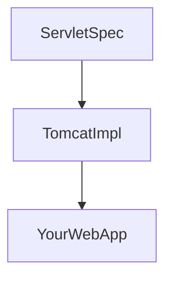
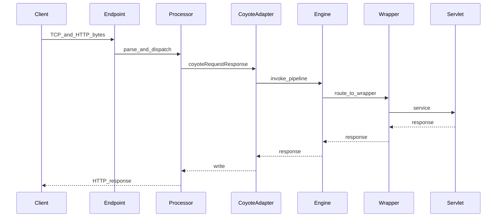
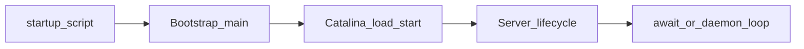

# 第1章 邻家有猫初长成

> 对应总纲：初识 Tomcat —— 建立全局认知。读完本章，你应能说明 Tomcat 在体系中的位置、三大子系统分工，并能在本机完成「源码可调试」环境搭建。

---

## 本章导读

- **你要带走的三件事**
  1. Tomcat 不是「又一个框架」，而是 **Servlet 容器 + HTTP 连接器 + JSP 引擎** 的组合体。
  2. 一次请求从网卡到业务代码，大致经过 **Coyote（协议/IO）→ Catalina（容器）→ 你的 Servlet**，JSP 则走 **Jasper** 编译链路。
  3. 读源码的第一步不是「逐行啃」，而是 **从启动入口跟到 Server 启动完成**，再选一条 HTTP 请求跟到底（第2章会展开）。

- **阅读建议**：每节先扫「图示建议」，再读「源码锚点」，最后做「练习题」自检。

## 本章节奏（60分钟）

| 小节 | 时长（分钟） | 详细说明 |
| --- | ---: | --- |
| tom走了，留下cat——tomcat概述 | 10 | tomcat历史演变及特色 |
| 和tomcat初次见面——tomcat构成 | 30 | tomcat术语，组件的构成及作用 |
| 搭建tomcat的小屋——tomcat源码编译并导入到IDE | 20 | tomcat源码下载，编译，导入到sts，在sts下单步调试 |

> 使用建议：如果是直播/线下分享，可按 `10 + 30 + 20` 的节奏推进；若是自学，建议把第 1.3 小节扩展到 40 分钟，完整走一遍断点。

---

## 1.1 tom 走了，留下 cat：Tomcat 概述

> 本节时长建议：**10 分钟**（讲清历史演变、定位与特色）

### 背景问题

很多开发者第一次接触 Tomcat 时，脑子里只有「把 war 丢进去、点启动」。要进阶到读源码、调性能，需要先回答：**Tomcat 在 Java Web 里到底占哪一块？和 Spring Boot 内嵌 Tomcat 是什么关系？**

### 核心原理

**1）Tomcat 的定位**

- **Servlet 规范实现**：提供 `ServletContext`、`HttpServletRequest/Response`、Filter、Session 等运行时。
- **HTTP 服务能力**：通过 **Coyote** 解析 HTTP/1.1（及升级协议如 WebSocket），把字节流变成「可被容器消费的请求对象」。
- **JSP 编译与执行**：通过 **Jasper** 把 JSP 编译成 Servlet 类再执行（现代项目里 JSP 用得少，但读 Tomcat 源码时 Jasper 仍是重要一块）。

**补充：Tomcat 历史演变与特色（10 分钟版要点）**

- 早期定位：Apache 基金会下的开源 Servlet/JSP 容器实现，长期作为 Java Web 默认部署选择。
- 版本演进：从早期 Java EE（`javax.*`）到 Jakarta EE（`jakarta.*`）生态迁移，Tomcat 10+ 包名变化最明显。
- 核心特色：
  1. 轻量、可嵌入（Spring Boot 内嵌场景广泛）；
  2. 组件边界清晰（Catalina/Coyote/Jasper）；
  3. 生产可运维性成熟（日志、连接器、线程、JMX、集群）。

**2）与框架、内嵌容器的关系**

- **Spring MVC / Spring Boot**：主要解决依赖注入、Web MVC、生态集成；**真正监听端口、管理线程与请求生命周期** 的仍是嵌入式 Servlet 容器（常见为 Tomcat）。
- **「不用 Tomcat 用框架」** 在工程上通常变成：**框架 + 另一个容器实现**（Jetty、Undertow 等），而不是「没有容器」。

**3）源码锚点：`org.apache.catalina.startup.Bootstrap`**

`Bootstrap` 是 Tomcat 的 **进程入口**（由 `catalina.sh` / `startup.bat` 最终调到 `Bootstrap.main`）。典型职责包括：

- 初始化 **Tomcat 专用类加载器**（`common`、`server`、`shared` 等路径逻辑，具体随版本略有差异），保证容器类与应用类隔离。
- 通过反射创建并启动 **`Catalina`**（真正的「启动编排器」），把命令行参数（如 `start`、`stop`）传下去。

**读法提示**：在 IDE 里打开 `Bootstrap.main`，顺着调用链找到「加载 Catalina → 调用其 load/start」的几行即可，不必第一遍就深入每个 ClassLoader 细节。

### 图示建议

**图 1-1：Tomcat 与 Web 应用在部署视图中的关系**

建议手绘或用工具画：**浏览器 →（HTTP）→ Connector → Catalina（Host/Context）→ 你的 `*.war` / 类路径资源**。在图旁标注：`server.xml` 管连接器与引擎，`web.xml` / 注解管应用内 Servlet 映射。

**图 1-2：规范、实现、应用三层（概念图）**

### 实战产出（本节）

- 输出一张 **「Tomcat 与 Web 应用关系图」**（纸上或 Markdown 均可），至少包含：Connector、Engine/Host/Context、WAR、Servlet。

### 自测练习题（1.1）

1. 用一句话说明：**Coyote** 与 **Catalina** 各自解决什么问题？
2. 内嵌 Tomcat 与独立安装的 Tomcat，**进程与类加载** 视角有什么相似点？
3. 为什么入口类叫 `Bootstrap` 而不是 `TomcatMain`？（从「类加载与隔离」角度思考）

---

## 1.2 和 Tomcat 初次见面：Tomcat 构成

> 本节时长建议：**30 分钟**（术语扫盲 + 组件构成及作用）

### 背景问题

文档里常出现 Catalina、Coyote、Jasper 三个名字。若不能对应到「请求路径」和「源码包」，后面读 `server.xml`、跟断点都会晕。

### 核心原理

**1）三大块分工（面试高频）**

| 名称 | 大致职责 | 典型包前缀 |
|------|----------|------------|
| **Catalina** | Servlet 容器：Host/Context/Wrapper、Pipeline/Valve、Session、Realm 等 | `org.apache.catalina.*` |
| **Coyote** | 协议与 IO：HTTP 解析、连接、Processor、Adapter 与容器对接 | `org.apache.coyote.*`、`org.apache.tomcat.util.net.*` |
| **Jasper** | JSP 编译与运行时：JspServlet、编译器、标签处理 | `org.apache.jasper.*` |

**补充：本节术语速记（课堂可边讲边画）**

- **Server / Service / Connector / Engine / Host / Context / Wrapper**：Tomcat 树形容器与连接入口的核心术语。
- **Pipeline / Valve**：容器级责任链扩展点。
- **ProtocolHandler / Endpoint / Processor**：协议处理与网络 IO 的关键术语。
- **Adapter**：Coyote 与 Catalina 的桥接层（从协议对象进入容器对象）。

**2）协作直觉（一次 HTTP 请求的粗粒度路径）**

1. **Socket 接受连接**（`NioEndpoint` 等）→ 交给 **ProtocolHandler** 选定的实现。
2. **Processor** 解析请求行/头，构造 **Coyote Request/Response**。
3. **CoyoteAdapter**（桥）把 Coyote 对象转成 **Connector 层的 `Request`/`Response` facade**，再进入 **Engine 的 Pipeline**。
4. 容器链一路路由到 **Wrapper**，调用 **Servlet.service**。
5. 响应沿相反方向写出。

**3）源码锚点一：`org.apache.catalina.core.StandardServer`**

- `Server` 在 `server.xml` 里对应根元素，是 **多个 Service 的持有者**。
- 启动时你会看到 **Listener、GlobalResources、Service（含 Engine 与 Connector）** 被统一生命周期管理（`Lifecycle`）。第一遍跟代码时，记住：**Server.start() 会带动整条树启动**。

**4）源码锚点二：`org.apache.coyote.AbstractProtocol`**

- 各类 `Http11NioProtocol` 等协议实现常继承自抽象协议类。
- 这里连接 **端点（Endpoint）** 与 **连接处理器（ConnectionHandler）**，决定 **线程模型与连接如何映射到 Processor**。读源码时抓住：**「一个连接/一次读事件如何变成一个 Processor」** 这条线即可。

### 图示建议

**图 1-3：组件协作时序图（请求 → 响应）**

> 说明：上图是教学用简化模型，具体类名随 Tomcat 小版本可能略有差异，但**层次关系**稳定。

### 实战产出（本节）

- 在纸上或文档中画出 **「组件协作时序图」**，并在 5 个关键步骤旁各写 **一个真实类名**（允许对照源码修正）。

### 自测练习题（1.2）

1. **Pipeline / Valve** 更接近设计模式里的哪一种？（提示：责任链）
2. 若只改 `server.xml` 里的 **Connector 端口**，会动到 Catalina 容器树吗？
3. JSP 首次访问变慢，从 **Jasper** 角度可能原因是什么？

---

## 1.3 搭建 Tomcat 的小屋：源码编译并导入 IDE

> 本节时长建议：**20 分钟**（源码下载、编译、导入 STS、单步调试）

### 背景问题

「下载发行版 zip」只能运维；**读源码、下断点、改一行试效果** 需要可构建工程。目标不是背命令，而是：**任何版本我都能自己编出来并在 IDE 里 Main/Debug 跑起来**。

### 核心原理

**1）Tomcat 源码构建（通用思路）**

- 官方源码通常用 **Ant** 构建（具体以你所选版本的 `BUILDING.txt` 为准）。
- 典型产物：`output/build` 下出现完整可运行目录结构（`bin`、`lib`、`conf` 等），或等价布局。
- **IDE 导入**：将 `java` 源码目录作为模块依赖，并把 **构建产物中的 `lib`、配置目录** 配到运行 classpath / working directory。

**2）启动参数如何落到主流程**

- 脚本最终执行：`java ... org.apache.catalina.startup.Bootstrap start`
- `Bootstrap` 委托 **`Catalina`**：`load()` 解析配置并组装组件树，`start()` 启动生命周期。

**3）源码锚点：`org.apache.catalina.startup.Catalina`**

建议第一遍调试路径：

1. `Catalina.load()`：关注 **解析 `server.xml`、实例化 Server/Service/Connector**。
2. `Catalina.start()`：关注 **Server.start → 子组件递归 start**。
3. `Server.await()`（或等价阻塞点）：进程为何 **不会立刻退出**。

**读法提示**：`load` 与 `start` 里若遇到大量 XML 解析与反射，**先跳过细节**，只标出「创建了谁、谁被 addChild 了」。

### 图示建议

**图 1-4：从脚本到「进程常驻」的调用链（简化）**

### 实战步骤清单（Windows + STS）

1. 从官网或镜像获取 **与你 JDK 版本匹配** 的 Tomcat 源码分支。
2. 阅读该版本根目录 **`BUILDING.txt`**，安装文档要求的 **Ant / JDK**。
3. 按文档执行构建目标，确认 **`output/build`**（或文档指定目录）生成完整布局。
4. 在 STS（Spring Tool Suite）中：
   - `File -> Import -> Existing Projects into Workspace` 导入源码工程；
   - 运行配置 **Main class**：`org.apache.catalina.startup.Bootstrap`；
   - **Program arguments**：`start`；
   - **Working directory**：指向构建产物的 **Tomcat 根目录**（含 `conf`、`webapps`）；
   - **VM options**（示例，按机器调整）：`-Dcatalina.home=... -Dcatalina.base=...`
5. STS 下断点单步：
   - 断点 1：`Bootstrap.main`
   - 断点 2：`Catalina.load`
   - 断点 3：`Catalina.start`
   - 断点 4：`StandardServer.startInternal`
   - 启动 Debug，观察调用栈与线程窗口，完成一遍单步链路。

### 排错与自检清单

- [ ] 构建报错：先核对 **JDK 主版本** 与文档是否一致。
- [ ] 启动找不到 `server.xml`：检查 **catalina.home / base** 是否指向含 `conf` 的目录。
- [ ] 端口占用：改 `server.xml` 中 **Connector port** 或关闭占用进程。
- [ ] 断点不进：确认运行的是 **源码对应版本** 的类，而非误引了发行版 jar。

### 实战产出（本节）

- 一份 **「调试记录」**（半页即可），包含：
  - 从 `Bootstrap.main` 到 `Server.start` 的 **调用栈截图或文字摘要**；
  - 一句话说明 **`await` 在干什么**；
  - 你本机 **Tomcat 版本号 + JDK 版本号**。

### 自测练习题（1.3）

1. `catalina.home` 与 `catalina.base` 分离部署时，各目录通常放什么？（用自己的话描述即可）
2. 为什么改源码后有时要 **全量 rebuild**，而不能只依赖 IDE 增量编译？
3. `stop` 与 `start` 在 `Bootstrap` 层通常如何区分处理？（可查 `Catalina` 中与 stop 相关方法）

---

## 本章小结

- Tomcat = **Catalina（容器） + Coyote（协议/IO） + Jasper（JSP）**；请求从 **Endpoint/Processor** 进入，经 **Adapter** 进容器 **Pipeline**，最终到 **Servlet**。
- 读源码的「最小闭环」：**Bootstrap → Catalina → Server 生命周期**；下一章在此基础上展开 **Engine/Host/Context/Wrapper 与 Connector 细节**。

---

## 综合自测练习题（本章）

1. 画出 **逻辑分层图**：从 TCP 到 `HttpServlet.service` 至少 6 个层次/组件。
2. 对比说明：**Filter** 与 **Valve** 在「规范归属」和「配置位置」上的差异（第2章会讲透，此处可先查资料作答）。
3. 若你向新人用 2 分钟介绍 Tomcat，你的 **三句话版本** 是什么？

---

## 课后作业（必做 + 选做）

### 必做作业

1. **关系图**：提交「Tomcat 与 Web 应用关系图」1 张（手绘拍照或电子稿均可）。
2. **调试记录**：按 1.3 完成一次本地调试，提交 **调试记录**（含版本信息与 await 说明）。
3. **术语表**：自建表格，列出本章出现的 **10 个术语**（如 Coyote、Catalina、Jasper、Connector、Context 等），每词 **一句话定义**。

### 选做作业

1. 在源码中搜索 **`CoyoteAdapter.service`**（或你版本中对接容器的 adapter 入口），阅读方法注释与前后 30 行，写 **200 字读后感**：「Coyote 与 Catalina 的边界在哪里」。
2. 对比阅读 **`server.xml`** 与 **`web.xml`**：各列举 **3 个** 只能在该文件中配置的典型项，并说明原因。
3. 预习第2章：打开 `StandardEngineValve`，不查资料先回答：**Engine 为什么需要 Valve？** 下章对照源码修正自己的答案。

---

## 延伸阅读（不考核）

- 官方文档：对应版本的 **Architecture** 与 **Class Loader** 章节。
- Servlet 规范中 **Servlet Container** 概念章节（帮助建立「规范 vs 实现」对照）。

---

*本稿为专栏第1章正文，可与总纲 [`专栏.md`](专栏.md) 对照使用；图示可直接复制 Mermaid 到支持渲染的编辑器中查看。*
