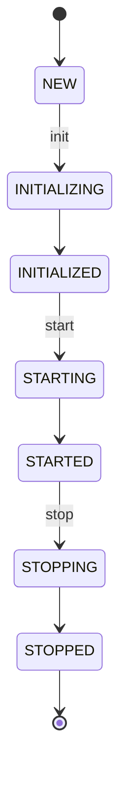
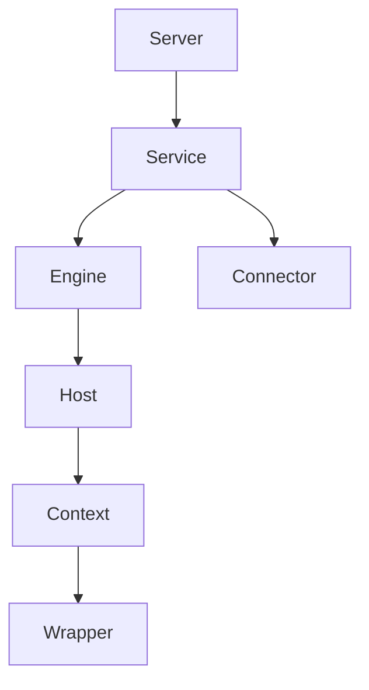
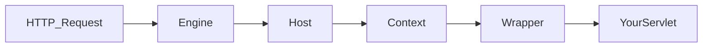
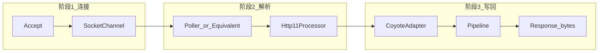
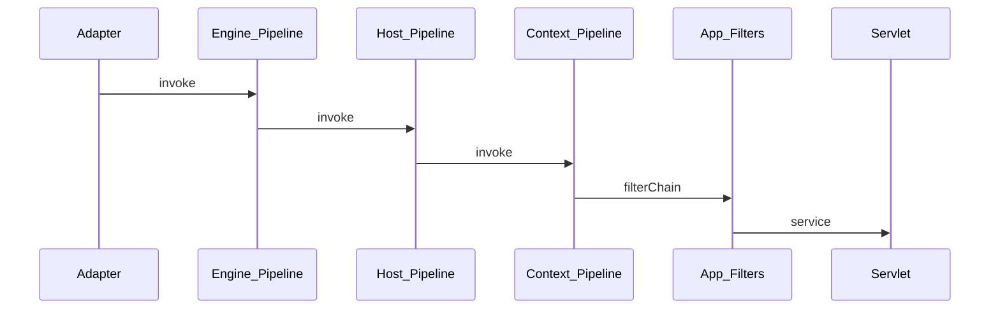
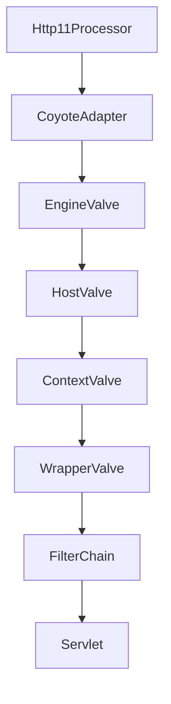

# 第2章 驯猫架构课：Tomcat 内核拆解（正文初稿）

> 对应总纲：**Tomcat 架构** —— 打通请求主链路。读完本章，你应能描述启动生命周期、容器路由、Connector 线程直觉、Pipeline/Valve 模型，并有一份可执行的**断点路线图**。

---

## 本章导读

- **你要带走的三件事**
  1. **`Lifecycle`**：`init → start → stop → destroy` 如何在 `Server` 整棵组件树上递归执行。
  2. **容器四级**：`Engine → Host → Context → Wrapper`，请求如何被「定位到唯一一个 Servlet」。
  3. **Coyote → Catalina 桥梁**：`Processor` 解析 HTTP，`CoyoteAdapter` 把 Coyote 请求交给 `Engine` 的 `Pipeline`。

- **阅读建议**：先跟一遍 **启动**（2.1），再跟一遍 **单次 GET**（2.5），中间用 2.2～2.4 填「地图上的地名」。

---

## 课程版扩展（对应 `优化1.md` 50-60）

> 说明：你给出的“第2章：铲屎官的自我修养”是 **课程排课版**。当前连载已将这部分拆分到第3~5章。  
> 为方便授课，这里给出 **240分钟整合课纲**，可直接按此节奏讲。

### 课程节奏（240分钟）

| 小节 | 时长（分钟） | 详细说明 | 连载对应章节 |
|:---|:---:|:---|:---|
| 项目实战：阻塞式servlet与非阻塞式servlet 的圣战大PK | 30 | 针对阻塞servlet和非阻塞servlet分别做演示 | 第3章（实战） |
| 深入剖析servlet执行原理 | 60 | 单步调试，如何执行到servlet，servlet如何处理请求，servlet如何发送响应，流程图 | 第2章 2.5 + 第3章（原理） |
| 实战案例：基于jsp与el实现商品展示 | 30 | 使用jsp和el前端展示商品信息 | 第4章（实战） |
| 深入剖析jsp与el执行原理 | 60 | 单步调试，jsp如何编译成class，el如何执行，流程图 | 第4章（原理） |
| 实战案例：基于websocket实现贪吃蛇 | 30 | 如何使用websocket做一个贪吃蛇游戏 | 第5章（实战） |
| 深入剖析websocket执行原理 | 30 | 单步调试，websocket执行的各个过程，流程图 | 第5章（原理） |

### 授课组织建议（按 4 小时）

1. **第一段（90 分钟）**：Servlet 实战 30 分钟 + Servlet 原理 60 分钟  
   - 产出：同步/异步对比结论 + 请求链路流程图。
2. **第二段（90 分钟）**：JSP/EL 实战 30 分钟 + JSP/EL 原理 60 分钟  
   - 产出：商品展示页面 + JSP 编译链路断点记录。
3. **第三段（60 分钟）**：WebSocket 实战 30 分钟 + WebSocket 原理 30 分钟  
   - 产出：最小可运行贪吃蛇 + 握手/帧处理流程图。

### 教学提示（避免跑偏）

- 这套 240 分钟课纲偏“**案例+原理双线推进**”，建议把复杂配置前置准备好，课堂以断点与现象讲解为主。
- 若时间压缩到 120 分钟，可保留 3 个实战（各 20 分钟）+ 各原理精简版（各 20 分钟）。

---

## 2.1 启动流程：从 Bootstrap 到 Server 启动完成

### 背景问题

Tomcat 启动日志刷一堆 `Starting Servlet engine`，但源码里**谁先谁后**？改 `server.xml` 为何有时要整进程重启？这些都和 **`Lifecycle` 状态机**有关。

### 核心原理

**1）`Lifecycle` 接口与状态**

组件（`Server`、`Service`、`Engine`、`Host`、`Context`、`Connector` 等）普遍实现 `org.apache.catalina.Lifecycle`。典型状态包括：`NEW`、`INITIALIZING`、`INITIALIZED`、`STARTING`、`STARTED`、`STOPPING`、`STOPPED`、`FAILED` 等（以你本地源码 `LifecycleState` 枚举为准）。

**2）`LifecycleBase`：模板方法统一「套路」**

`org.apache.catalina.util.LifecycleBase` 是大量容器的基类，对外提供 `init()`、`start()`、`stop()`、`destroy()` 等**最终方法**，内部调用子类实现的 `initInternal()`、`startInternal()` 等。

**读法要点**：

- 看到 `start()` 时，盯住 **`startInternal()`** 里是否 **`super.startInternal()`** 以及是否 **`fireLifecycleEvent`**。
- 子组件通常在父组件 `startInternal` 里被 **`start()`**，形成 **树状递归**。

**3）启动顺序（概念层，便于对日志）**

常见直觉（具体以源码为准）：

1. `Server.init/start` → 监听器、全局资源。
2. `Service.start` → `Engine` 与 **多个 `Connector`** 等。
3. `Engine` → `Host` → `Context` → `Wrapper`（应用启动、加载 Servlet）。
4. `Connector` 开始 **bind 端口**，接受连接。

### 源码锚点

| 类/接口 | 作用 |
|--------|------|
| `org.apache.catalina.Lifecycle` | 生命周期契约 |
| `org.apache.catalina.util.LifecycleBase` | 统一状态迁移与监听器触发 |
| `org.apache.catalina.core.StandardServer` | 顶层容器，聚合 `Service` |
| `org.apache.catalina.core.StandardService` | 持有 `Engine` + `Connector[]` |

### 图示建议

**图 2-1：生命周期状态（简化）**

**图 2-2：组件树与启动递归（概念）**

### 实战产出（本节）

**「启动阶段关键回调表」模板**（请在你本机调试时把「实际调用类」填全）：

| 阶段 | 你观察到的日志关键字 | 建议断点类/方法 | 备注 |
|------|----------------------|-----------------|------|
| Server 启动 | `Starting service` | `StandardServer.startInternal` | 顶层入口 |
| Service 启动 | `Starting Servlet engine` | `StandardService.startInternal` | Engine+Connector |
| Host 启动 | `Deploying web` | `Host.startInternal` / 部署逻辑 | 视部署方式 |
| Context 启动 | `Deployment of` | `StandardContext.startInternal` | 应用上下文 |
| Connector bind | `Connector` / `port` | `Connector.startInternal` | 端口监听 |

### 自测练习题（2.1）

1. `FAILED` 状态一般在什么情况下出现？对子组件有何影响？
2. 为何说 `LifecycleBase` 适合用 **模板方法模式** 来理解？
3. `Service` 里没有 `Wrapper`，`Wrapper` 挂在谁下面？

---

## 2.2 容器体系：Engine / Host / Context / Wrapper

### 背景问题

访问 `http://shop.example.com:8080/app/hello` 时，Tomcat 如何决定：**哪个 Host、哪个 Context、哪个 Servlet**？

### 核心原理

**1）四级容器职责（记忆口诀）**

| 容器 | 典型职责 |
|------|----------|
| **Engine** | 接收 **全部** 请求入口；选 **Host**（通常按请求头 `Host` 或默认 Host） |
| **Host** | 虚拟主机；选 **Context**（通常按 **URI 前缀**，即 `Context path`） |
| **Context** | 一个 Web 应用；管理 `web.xml`、类加载器、Session；选 **Wrapper（Servlet）** |
| **Wrapper** | **一个 Servlet** 的包装；负责实例化、初始化、`service` 调用 |

**2）Valve：容器上的「关卡」**

每个容器有 **`Pipeline`**，Pipeline 上挂一串 **`Valve`**。请求进入某容器时，先走该容器 Pipeline，再进入子容器（Engine→Host→Context→Wrapper 的 Valve 链依次执行）。

**3）源码锚点**

| 类 | 作用 |
|----|------|
| `org.apache.catalina.core.StandardEngineValve` | Engine 默认 Valve：解析并选中 **Host** |
| `org.apache.catalina.core.StandardHostValve` | Host 默认 Valve：选中 **Context** |
| `org.apache.catalina.core.StandardContextValve` | Context 默认 Valve：选中 **Wrapper** |
| `org.apache.catalina.core.StandardWrapperValve` | Wrapper 前最后一道：调 **FilterChain → Servlet** |

**读法提示**：在 `StandardEngineValve.invoke` 里找 **`request.getHost()`** 或等价逻辑；在 `StandardHostValve` 里找 **根据 URI 映射 Context**；不要第一遍就陷入 Mapper 的全部细节。

### 图示建议

**图 2-3：域名 + 路径 → Servlet（示意）**

### 实战产出（本节）

**「域名 + 路径到 Servlet 映射演示」** 建议操作：

1. 在本机部署两个应用：`/app-a`、`/app-b`（或不同 Host）。
2. 用 `curl -v` 分别访问，抓 **请求行 + Host 头**。
3. 在 `StandardHostValve`、`StandardContextValve` 打断点，记录 **被选中的 Context path、Servlet name**。
4. 写半页纸：**URL 各段分别对应哪一级容器决策**。

### 自测练习题（2.2）

1. `Context path` 为 `/` 与 `/app` 时，`/app/index.jsp` 会匹配谁？（先凭直觉答，再用实验验证）
2. 一个 `Servlet` 是否一定对应一个 `Wrapper`？
3. `Engine` 默认名常见为 `Catalina`，它在 `server.xml` 里对应哪个元素？

---

## 2.3 Connector 与 ProtocolHandler

### 背景问题

高并发调优总绕不开 **`maxThreads`、`acceptCount`**。若不知道 **NIO 线程在干什么**，参数只能「抄作业」。

### 核心原理

**1）Connector 的职责**

`Connector` 负责 **监听端口、接受连接、把协议处理交给 ProtocolHandler**。对 HTTP/1.1，常见实现为 **`Http11NioProtocol`**（名称随版本可能为 `Http11Nio2Protocol` 等，以源码为准）。

**2）分层直觉**

- **`Endpoint`**（如 `NioEndpoint`）：**Socket 接受、Poller 事件、读写队列** 等与 IO 线程相关。
- **`ProtocolHandler`**：把 Endpoint 的事件 **对接** 到 **Processor**。
- **`Processor`**（如 `Http11Processor`）：解析 **请求行/头/体**，维护 **Keep-Alive**，与 **Adapter** 交互。

**3）源码锚点**

| 类 | 作用 |
|----|------|
| `org.apache.coyote.http11.Http11NioProtocol` | NIO HTTP/1.1 协议入口 |
| `org.apache.coyote.AbstractProtocol` | Endpoint、Handler、连接抽象 |
| `org.apache.tomcat.util.net.NioEndpoint` | NIO 实现细节 |
| `org.apache.coyote.AbstractProcessor` | Processor 基类；与 Request/Response 协作 |

### 图示建议

**图 2-4：连接建立 → 请求解析 → 响应写回（三段式）**

### 实战产出（本节）

- 画 **「三段式流程图」**（可用上图扩展）：在每张图旁写 **1 个线程角色**（如 acceptor、poller、worker），说明「谁阻塞、谁不阻塞」是**近似描述**，以你读的 `NioEndpoint` 为准。

### 自测练习题（2.3）

1. `Processor` 与 `Servlet` 线程一定是同一个吗？在什么模型下容易混淆？
2. Keep-Alive 主要影响 **连接** 还是 **Servlet 实例数量**？
3. 为何调大 `maxThreads` 不一定提高吞吐，反而可能更差？

---

## 2.4 Pipeline / Valve 机制

### 背景问题

Tomcat 有 **Valve**，应用有 **Filter**，都能「横切」请求。线上 Access Log、限流、灰度常挂在 Valve；二者边界不清会导致 **重复执行** 或 **安全漏洞**。

### 核心原理

**1）Pipeline + Valve**

- 每个容器持有 `Pipeline`，`Pipeline.getFirst()` 开始 **`invoke` 链**。
- Valve 可 **`getNext().invoke`** 传递，也可短路返回。

**2）Valve 与 Filter 的边界**

| 维度 | Valve | Filter |
|------|-------|--------|
| 规范 | Tomcat/Catalina 实现细节 | Servlet 规范 |
| 配置 | `server.xml` / `context.xml` 等 | `web.xml` / `@WebFilter` |
| 作用域 | 可挂在 Engine/Host/Context | 应用内，映射 URL |
| 类加载 | 通常 **Tomcat 类路径** | **Web 应用** `WEB-INF/lib` |

**3）源码锚点**

- `org.apache.catalina.core.StandardPipeline`：`addValve`、`getFirst`、`invoke` 相关逻辑。
- 内置示例：`org.apache.catalina.valves.AccessLogValve`（访问日志）。

### 图示建议

**图 2-5：同一请求先后经过 Engine Valve 与 Context Filter（概念）**

### 实战产出（本节）

**自定义 Valve：请求耗时统计（思路）**

1. 继承 `ValveBase`（包名以源码为准，常见 `org.apache.catalina.valves.ValveBase`）。
2. 在 `invoke(Request, Response)` 里 **记录 `t0`**，`getNext().invoke(...)` 后计算 **耗时**，写日志或 Micrometer（若集成）。
3. 在 `server.xml` 的 `Host` 或 `Engine` 下配置 `<Valve className="..."/>`（具体写法查官方示例）。
4. 验收：压测前后对比日志，确认 **每个请求一条**、**不重复统计**。

### 自测练习题（2.4）

1. 把 AccessLogValve 配在 **Engine** 与 **Context** 各有什么观测差异？
2. Valve 里能否直接操作 **`HttpServletRequest`**？需要注意什么？
3. 若 Filter 返回且不调用 `chain.doFilter`，后续 Valve 还会执行吗？（从调用栈思考）

---

## 2.5 请求生命周期与断点路线

### 背景问题

「我跟丢了」是读 Tomcat 最常见的挫折。解决方法是：**固定 URL、固定断点集合、固定观测变量**。

### 核心原理

**1）主链路对象（建议背下来）**

- **Coyote 侧**：`org.apache.coyote.Request` / `Response`（注意与 Servlet API 不是同一个类）。
- **连接器封装**：`org.apache.catalina.connector.Request` / `Response`（Facade 给应用看）。
- **桥梁**：`org.apache.catalina.connector.CoyoteAdapter.service`（或等价命名，把 Coyote 请求送进容器）。

**2）源码锚点**

| 类 | 读什么 |
|----|--------|
| `org.apache.coyote.http11.Http11Processor` | 请求行、请求头解析；与输入缓冲交互 |
| `org.apache.catalina.connector.CoyoteAdapter` | 构造/提交 `Request`，调用 `Engine` Pipeline |

### 图示建议

**图 2-6：从 Processor 到 Servlet（简化调用栈）**

### 实战产出（本节）

**「10 个必打断点清单 + 观测变量表」**（请按你本地 Tomcat 版本微调方法名）

| 序号 | 断点位置（类.方法） | 建议观测变量/问题 |
|------|---------------------|-------------------|
| 1 | `Http11Processor`：解析请求行后 | 方法、URI、协议版本 |
| 2 | `Http11Processor`：解析 Host 相关头 | 虚拟主机解析依据 |
| 3 | `CoyoteAdapter.service` 入口 | 是否新请求、是否异步 |
| 4 | `StandardEngineValve.invoke` | 选中的 Host 名 |
| 5 | `StandardHostValve.invoke` | Context path 映射结果 |
| 6 | `StandardContextValve.invoke` | Wrapper 名称 |
| 7 | `StandardWrapperValve.invoke` | FilterChain 是否构建 |
| 8 | `ApplicationFilterChain.doFilter` 末段 | 即将进入 Servlet |
| 9 | 你的 `HelloServlet.service` | 业务入口确认 |
| 10 | 响应提交前后（如 `Response.finishResponse` 附近） | 是否已 commit |

### 自测练习题（2.5）

1. `CoyoteAdapter` 若注释掉对 `Engine` 的调用，现象是什么？
2. 为何调试时要在 **同一 Context** 下放一个极简 Servlet？
3. `AsyncContext` 开始后，断点落在 `WrapperValve` 与异步线程的关系如何理解？（衔接第3章）

---

## 本章小结

- **启动**：`LifecycleBase` 统一状态机，**树状 start**。
- **路由**：Engine/Host/Context/Wrapper + 各级 **Standard*Valve**。
- **IO**：`NioEndpoint` + `Http11Processor`；**进容器**靠 `CoyoteAdapter`。
- **扩展**：Valve 做容器级横切；Filter 做应用级横切。

---

## 综合自测练习题（本章）

1. 画一张 **完整组件树**（从 `Server` 到你的 Servlet），并标出 **两个 Connector** 时谁共享 `Engine`。
2. 解释 **「Mapper」** 在路由中的作用（可查源码类名 `Mapper` / `MappingData`，用自己的话）。
3. 设计一条 **最短调试路径**：从断点到看到 `Hello World` 输出，至少经过哪些 Valve？

---

## 课后作业

### 必做

1. 提交 **启动关键回调表**（2.1 模板填满）。
2. 提交 **10 断点调试记录** 各 1 行：断点处「你看到的变量值」。
3. 实现 **耗时统计 Valve**（可仅打日志），附 `server.xml` 片段。

### 选做

1. 阅读 `Mapper` 相关类，写 300 字：**URI 是如何变成 Wrapper 的**。
2. 对比 **APR/NIO** 连接器在类名上的差异，列一张「你建议的选型表」。
3. 预习第3章：在 `StandardWrapperValve` 里搜索 **`async`** 关键字，列出 3 个相关分支说明。

---

*本稿为专栏第2章初稿，可与总纲 [`专栏.md`](专栏.md) 对照使用。*
